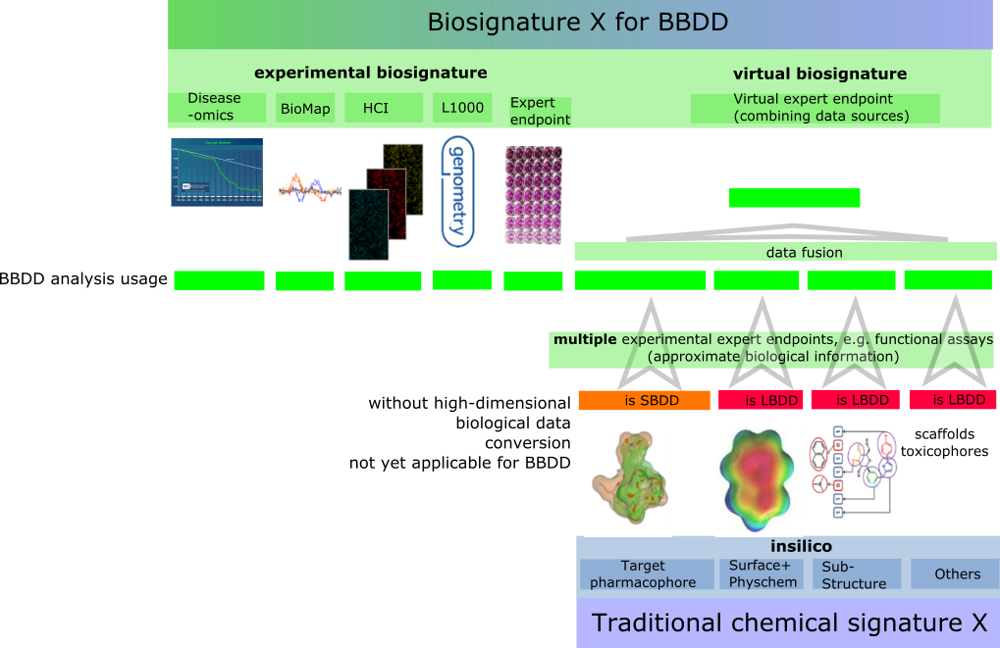
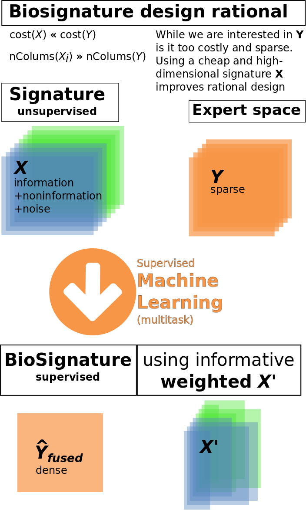
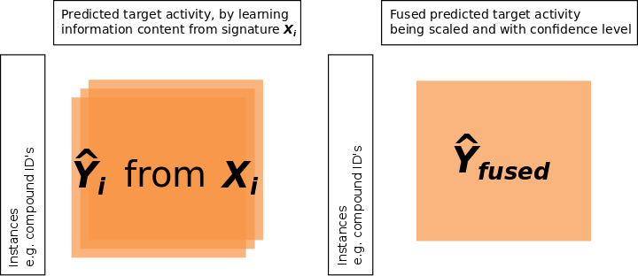
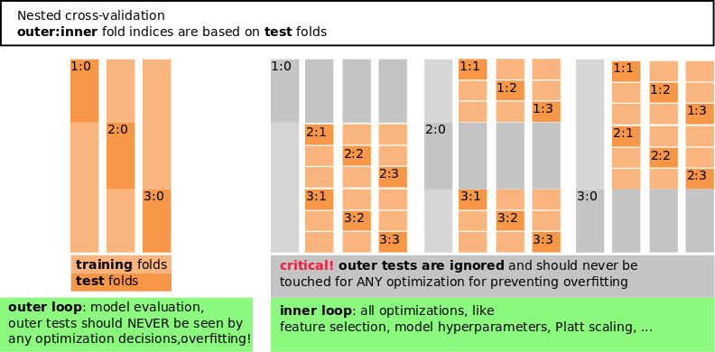
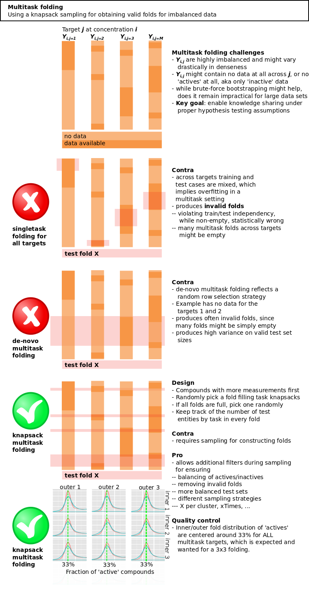
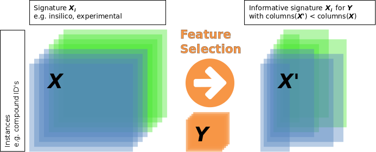

Cite us
=======

[](http://dx.doi.org/10.5281/zenodo.61084)

Contributors
============

[ChemBioBridge](http://chembiobridge.eu) was investigating the rationalization of experimental and in-silico signatures via supervised learning (Unterthiner et al. 2014; Mayr et al. 2015) and data fusion (Yu, Tranchevent, and Moreau 2011; Simm et al. 2015; Arany et al. 2015).

[](http://chembiobridge.eu)

[Exascience](https://github.com/ExaScience) was investigating the algorithm scalability and processing via high-performance computing (Harnie et al. 2015).

[](https://github.com/ExaScience)

-   **Arcadia**: [Andrei Gedich](https://github.com/motoharu-yano), [Ilya Pasechnikov](https://github.com/plobzik), [Alexander Shevnin](https://github.com/santee)
-   **IMEC**: Tom Ashby, [Tom Haber](https://github.com/tomhaber), [Tom Vander Aa](https://github.com/tvandera), Wilfried Verachtert
-   **IDEAconsult**: [Nina Jeliazkova](https://github.com/vedina)
-   **Intel**: [Sergei Osokin](https://github.com/sosokin)
-   **Janssen Pharmaceutica**: [Joerg Kurt Wegner](https://github.com/joergkurtwegner), Hugo Ceulemans, [Vladimir Chupakhin](https://github.com/chupvl), Emmanuel Gustin, Steffen Jaensch, An De Bondt, Jean-Marc Neefs, Hinrich Goehlmann, Jose Felipe Golib Dzib, Hans De Wolf, Pieter Peeters
-   **Openanalytics**: [Marvin Steijaert](https://github.com/msteijaert), [Arunkumar Srinivasan](https://github.com/arunsrinivasan), Laure Cougnaud, Kirsten Vanhoorde
-   **University of Brussels**: Dries Harnie
-   **University of Leuven (ESAT)**: [Prof. Yves Moreau](ttp://homes.esat.kuleuven.be/~bioiuser/person.php?persid=77), Adam Arany, [Jaak Simm](https://github.com/jaak-s)
-   **University of Leuven (IMEC)**: [Prof. Roel Wuyts](http://people.cs.kuleuven.be/~roel.wuyts/)
-   **University of Linz**: [Prof. Sepp Hochreiter](https://en.wikipedia.org/wiki/Sepp_Hochreiter), [Andreas Mayr](http://www.bioinf.jku.at/people/mayr/), [Guenter Klambauer](http://www.bioinf.jku.at/people/klambauer/)

License
=======

**BSD** - **Biosignature and fusion** (Authors/contributors listed above) and **BSD** - **IntelSVM** (based on libSVM, Authors: Chih-Chung Chang and Chih-Jen Lin)

<sub>Redistribution and use in source and binary forms, with or without modification, are permitted provided that the following conditions are met:</sub>

<sub>1. Redistributions of source code must retain the above copyright notice, this list of conditions and the following disclaimer.</sub>

<sub>2. Redistributions in binary form must reproduce the above copyright notice, this list of conditions and the following disclaimer in the documentation and/or other materials provided with the distribution.</sub>

<sub>3. Neither name of copyright holders nor the names of its contributors may be used to endorse or promote products derived from this software without specific prior written permission.</sub>

<sub>THIS SOFTWARE IS PROVIDED BY THE COPYRIGHT HOLDERS AND CONTRIBUTORS \`\`AS IS'' AND ANY EXPRESS OR IMPLIED WARRANTIES, INCLUDING, BUT NOT LIMITED TO, THE IMPLIED WARRANTIES OF MERCHANTABILITY AND FITNESS FOR A PARTICULAR PURPOSE ARE DISCLAIMED. IN NO EVENT SHALL THE REGENTS OR CONTRIBUTORS BE LIABLE FOR ANY DIRECT, INDIRECT, INCIDENTAL, SPECIAL, EXEMPLARY, OR CONSEQUENTIAL DAMAGES (INCLUDING, BUT NOT LIMITED TO, PROCUREMENT OF SUBSTITUTE GOODS OR SERVICES; LOSS OF USE, DATA, OR PROFITS; OR BUSINESS INTERRUPTION) HOWEVER CAUSED AND ON ANY THEORY OF LIABILITY, WHETHER IN CONTRACT, STRICT LIABILITY, OR TORT (INCLUDING NEGLIGENCE OR OTHERWISE) ARISING IN ANY WAY OUT OF THE USE OF THIS SOFTWARE, EVEN IF ADVISED OF THE POSSIBILITY OF SUCH DAMAGE.</sub>

**LGPL** - **Molecule kernels** as used in optional src/Utils/SimilarityMatrix utility (based on ChemCPP, Authors: Jean-Luc Perret, Pierre Mahe, Jean-Philippe Vert)

<sub>This library is free software; you can redistribute it and/or modify it under the terms of the GNU Lesser General Public License as published by the Free Software Foundation; either version 2.1 of the License, or (at your option) any later version.</sub>

     http://www.gnu.org/licenses/lgpl-3.0.en.html

<sub>This library is distributed in the hope that it will be useful, but WITHOUT ANY WARRANTY; without even the implied warranty of MERCHANTABILITY or FITNESS FOR A PARTICULAR PURPOSE. See the GNU Lesser General Public License for more details.</sub>

For more questions about FOSS license compatibilities, please refer to <https://en.wikipedia.org/wiki/License_compatibility>

Introduction
============

Note: Readers preferring a PDF or MS Word version of this README can download the document files from the shared data location [here](https://goo.gl/8FEs2X).

The key goals of this research were to improve the data-driven decision making for drug design and making it more tractable and cost efficient, including liability and safety aspects. Drug design has certainly a need to improve the risk estimations for the *high-dimensional* biological (Arrowsmith and Miller 2013), *high-dimensional* chemical (Arrowsmith et al. 2015), and combined *high-dimensional × high-dimensional* (Wawer et al. 2014) spaces. For being able to call it *rational drug design*, it needs to be data-driven and systematic, ensuring a constant data growth and learning. Here it was decided to

1.  create experimental and in-silico signatures, high-dimensional information for (chemical) probes, e.g. -omics profiles, in-silico chemical physicochemical or substructure profiles, and high-content imaging profiles
2.  apply target (Unterthiner et al. 2014), liability prediction (Mayr et al. 2015) impacting drug saftey windows, as well as data fusion (Yu, Tranchevent, and Moreau 2011; Simm et al. 2015; Arany et al. 2015) of multiple signatures for enabling to rationalize signatures
3.  benchmark and quantify the value of signatures in enriching decisions on gene, protein, assay, and liability/toxicity niveau. And to enable error models for allowing to estimate decision making risks.
4.  scale all methods ensuring big-data analytics capabilities for exponentially growing signature data sets (Harnie et al. 2015)

[Supervised learning](https://en.wikipedia.org/wiki/Supervised_learning) is the method of choice to learn and quantify the relation between an input signature matrix *X* (can be sparse or dense) and an observation matrix *Y* (typically sparse). Each row of *X* represents a single chemical compounds by numeric features. Features can be grouped into different types called "signatures". Compound signatures can be any in-silico or experimental features characterizing a chemical compound, e.g. chemical fingerprints, physicochemical properties, transcriptomics data, high-content imaging data, etc.

Observation features (columns) in *Y* reflect here often dose-response activities in form of IC50's for different genes, proteins, or assays. A value *y*<sub>*i**j*</sub> represents the activity of compound $\\mathbf x\_i$ on a certain gene, protein or assay *j*. The definition of activity is not restricted to compound-protein binding, but can be understood in a broader sense: "Activity" could be also include toxic effects of compounds, e.g. via the [NIH-Tox21](https://ncats.nih.gov/news/releases/2015/tox21-challenge-2014-winners), or any other biological activity associated with chemical compounds.


It is important to note that advantages in *-omics* and *phenomics* have enabled a large-scale *signature* data creation, which can only increase in the upcoming years, since processes are optimized and *experimental signatures* are becoming cheaper.



The creation of signatures enables filling gaps in expert spaces that might be too costly to fill, like toxicity and target activity spaces. The following flow indicates how a combination of signatures with machine learning enriches rational decision making and complementing missing information. By using signatures *X* we can now predict and create a dense $\\hat{Y}$.



The newly available $\\hat{Y}$ enables a **Biosignature Based Drug Design (BBDD)** paradigm, which falls under a general [Drug Design](https://en.wikipedia.org/wiki/Drug_design) paradigm, specifically Computer-Aided Drug Design (CADD). Since multiple signatures *X* are derived from high-dimensional biology experiments (like phenomics or transcriptomics), they enable additional design paradigms that are not accessible via classical CADD design paradigms like *Ligand Based Drug Design (LBDD)* or *Structure Based Drug Design (SBDD)*.

")

From here on we will focus on the supervised learning and data fusion concepts that were used for learning $\\hat{Y}$, how informative signature *X*<sub>*i*</sub> is, and to which $\\hat{Y}\_i|X\_i$ they contribute to. This will also tell us which *X*<sub>*i*</sub> we should use or create if we are interested in a rational design of *Y*<sub>*i*</sub> in relation to the other *Y*<sub>*j* ≠ *i*</sub>:

-   **Single task or pseudo-multi-task**: In a typical machine learning task the relation of a single column vector $\\mathbf y\_j$ of the activity matrix *Y* with the activity values of multiple chemical compounds $\\mathbf x\_i, \\ldots, \\mathbf x\_N$ has to be learned. In order learn the relations between the compounds *X* with all column vectors *Y*, for each column a single machine learning model is learned. There is no leveraging between single targets $\\mathbf y\_i$, even if full matrix *Y* is provided, since machine learning models are trained one-by-one without influencing other tasks. Strictly speaking is this executing a Single-task learning multiple times (one per target), though overall algorithms are optimized to predict full *Y* matrices, also in terms of cross-validation, data handling, etc. It is important to note that we can still apply a true multi-task learning with pseudo multi-task methods as elaborated by (Wicker 2013) by applying a matrix decomposition on *Y* before the learning step. Then we would rather learn the latents in *Y*′ and use the second matrix for reconstructing the original *Y*. Published examples for pseudo multi-task learning are
    -   Bayesian [PIDGIN](https://github.com/lhm30/PIDGIN) (Mervin et al. 2015)
    -   TODO: our own benchmark publication...TBD
-   **Proteochemometrics multi-task (PCM)**: In PCM relations between *y*<sub>*i*</sub> are often modelled by using additional target-target relations like protein sequence information (G. J. P. van Westen et al. 2013; G. J. van Westen et al. 2013; Gerard Jp van Westen et al. 2013). This often leads to a limitation that PCM can only be used for targets of the same enzyme class, since the protein information must be restricted to small molecule binding domains (also being called *active sites* or *drug pockets*).
-   **True multi-task**: A method that learns all relations between compounds *X* and their activites *Y* simultaneously taking correlation structure of *Y* into account. This can lead to an improvement of the overall predictive performance for all targets. Published examples for true multi-task learning are
    -   via [deep learning](https://github.com/untom/binet) (Mayr et al. 2015; Unterthiner et al. 2014; Ramsundar et al. 2015)
    -   via *Y* matrix factorization like [Bayesian Probabilistic Matrix Factorization (BPMF)](https://github.com/ExaScience/bpmf) (Salakhutdinov and Mnih 2008), Binary Matrix Factorization for toxicity prediction (Wicker 2013), or [Macau](https://github.com/jaak-s/BayesianDataFusion.jl) (Simm et al. 2015; Arany et al. 2015)

Installation
============

Linux
-----

### Machine learning algorithms

Installing basic precompiled dependencies, especially BOOST.

``` bash
sudo apt-get install -y g++ cmake \
                        libpthread-stubs0-dev libtbb-dev \
                        lib32z1 lib32z1-dev zlib-bin zlib1g zlib1g-dbg zlib1g-dev \
                        bzip2 bzip2-doc lib32bz2-1.0 lib32bz2-dev libbz2-1.0 \
                        maven doxygen \
                        libboost-all-dev expect-dev 
```

<!-- removed pandoc pandoc-citeproc 
sudo apt-get remove pandoc pandoc-citeproc
-->
Minimal release version without advanced options.

``` bash
# $BIOSIG_DIR is the directory containing the GIT biosignature data fusion package
# docs
# libs
# scripts
# src
export BIOSIG_DIR=`pwd`
cd $BIOSIG_DIR

# Configure and compile - release version (optimized for sparse signatures)
mkdir -p $BIOSIG_DIR/build/make/sparse
cd $BIOSIG_DIR/build/make/sparse
cmake -LH -G "Unix Makefiles" \
          -DCMAKE_BUILD_TYPE:STRING=Release  \
          $BIOSIG_DIR/src/cmake/ 2>&1 | tee cmake_release_sparse_$HOSTNAME\.log
sudo make install 2>&1 | tee make_release_sparse_$HOSTNAME\.log
```

### *Y* data creation

The easiest way to create some test data is using the [ChEMBL20-Docker](http://chembl.blogspot.be/2015/07/mychembl-docker.html) from the EMBL-EBI.

``` bash
#install chembl virtual machine via docker
wget http://ftp.ebi.ac.uk/pub/databases/chembl/VM/Docker/mychembl_20_ubuntu_docker.tar.gz
gunzip mychembl_20_ubuntu_docker.tar.gz 
sudo docker load < mychembl_20_ubuntu_docker.tar 
sudo docker run -p 2222:22 -p 80:80 -p 9612:9612 \
                -t -i chembl/mychembl_20_ubuntu \
                /usr/local/bin/supervisord

#now ensure making connection password'less
echo type the following password if asked: chemblvm
ssh-keygen -t rsa -b 2048

echo type the following password if asked: chemblvm
ssh-copy-id -p 2222 chembl@localhost

echo type the following password if asked: chemblvm
ssh -p 2222 chembl@localhost
```

### *X* data creation

#### In-silico sparse fingerprint signature (2D)

##### JCompoundMapper

JCompoundMapper (Hinselmann et al. 2011) provides popular fingerprinting algorithms for chemical graphs such as depth-first search fingerprints, shortest-path fingerprints, extended connectivity fingerprints, autocorrelation fingerprints (e.g. CATS2D), radial fingerprints (e.g. Molprint2D), geometrical Molprint, atom pairs, and pharmacophore fingerprints.

``` bash
# download JDK1.8 and place in /usr/lib/jvm/
# http://www.oracle.com/technetwork/java/javase/downloads/index.html
export JAVA_HOME=/usr/lib/jvm/jdk1.8.0_65/
cd scripts/java/jcmapper/jcompoundmapperservice
mvn package

#create Ubuntu service
sudo cp -R target /usr/local/share/jcmapper
sudo cp jcompoundmapper.conf /etc/init
sudo service jcompoundmapper start

#if on RHEL6 or RHEL7 check
# jcompoundmapper.service.rhel
```

If the installation of a service would not be possible, e.g. for non-root users, the service can also be started manually (in another terminal window)

``` bash
$JAVA_HOME/bin/java -Xmx4g -XX:hashCode=5 \
     -jar scripts/java/jcmapper/jcompoundmapperservice/target/jcompoundmapperservice-1.0-SNAPSHOT.jar \
     --port 8082 -a DAYLIGHT_INVARIANT_RING -d 6 --removeHydrogens false 
```

The web service should now be running under <http://localhost:8082/>

Another way to check is using the REST service for calculating fingerprints based on SMILES input

``` bash
# fpType – fingerprint types, separated by ‘;’ 
# possible values: DFS, ASP, AP2D, AT2D, CATS2D, 
#     PHAP2POINT2D, ECFP, ECFPVariant, LSTAR, SHED, RAD2D
curl -d 'smiles=N#CCc2ccc1ccccc1c2' -d 'fpType=ECFP;AP2D' "http://localhost:8082/Fingerprints" 
```

[](http://localhost:8082)

##### Openbabel

[Openbabel](http://openbabel.org/) (O’Boyle et al. 2011) is an open-source cheminformatics toolkit, which can be used for chemical fingerprinting.

``` bash
sudo apt-get -y install openbabel libopenbabel-dev python-openbabel libopenbabel-doc
```

##### RDKit

[RDKit](http://www.rdkit.org/) is an open-source cheminformatics toolkit, which can be used for chemical fingerprinting.

``` bash
sudo apt-get -y install python-rdkit librdkit1 rdkit-data librdkit-dev rdkit-doc
```

Windows
-------

The installation was only validated with [Visual Studio 2012](https://www.visualstudio.com/). A free (and untested) alternative might be the free [Visual C++ Build Tools 2015](http://blogs.msdn.com/b/vcblog/archive/2015/11/02/announcing-visual-c-build-tools-2015-standalone-c-tools-for-build-environments.aspx) and [VS community edition](https://www.visualstudio.com/en-us/products/visual-studio-community-vs.aspx).

Open the \*Developer Command Prompt for VS2012".

**Threading Building Blocks (TBB)**

1.  Download the latest [TBB zip file](http://threadingbuildingblocks.org/download#stable-releases)
2.  Extract it somewhere (`C:\Dev\TBB`)
3.  Ensure adding the following environment variables (System-&gt;System properties-&gt; Environment variables):

``` bat
REM: Manuel entry requests VariableName=VariableValue
TBB_INCLUDES=C:\Dev\tbb\include
TBB_LIBS=C:\Dev\tbb\lib\intel64\vc11
```

**CMAKE**

1.  Download and install [CMAKE](http://www.cmake.org/cmake/resources/software.html)
2.  Ensure the cmake binaries are added to the *PATH* environment variables (System-&gt;System properties-&gt; Environment variables), e.g. `PATH=%PATH%;C:\Dev\CMake\bin`

**ZLIB**

1.  Download and install [Zlib](http://www.zlib.net/)
2.  Ensure the zlib binaries are added to the *PATH* environment variables (System-&gt;System properties-&gt; Environment variables)

**BOOST**

1.  Download the latest [boost sources](http://www.boost.org), latest supported version is 1.59 (1.60 is not yet supported).
2.  Unzip it, open the \*Developer Command Prompt for VS2015", go to boost folder and run the following commands:

``` bat
bootstrap.bat
b2 address-model=64 install
```

1.  The BOOST libraries will be compiled and placed as default in `C:\Boost`. The default configuration creates multithreaded static libraries.
2.  Ensure adding the following environment variables (System-&gt;System properties-&gt; Environment variables):

``` bat
REM: Manuel entry requests VariableName=VariableValue
BOOST_ROOT=C:\Boost
BOOST_INCLUDEDIR=%BOOST_ROOT%\include\boost-1_59
BOOST_LIBRARYDIR=%BOOST_ROOT%\lib
```

**Create Makefiles and compile signature project**

Cmake will use these variables to generate project/make files by executing:

``` bat
REM go into source home directory that contains this README
mkdir build\windows
chdir build\windows
C:\Dev\CMake\bin\cmake -DDISABLE_COMPRESSION=ON -G "Visual Studio 11 Win64" ../../src/cmake
```

Now compile the code

-   Open the graphical user interface for Visual Studio 2012 and open the *ALL\_BUILD.vcxproj* project file.
-   Change solution configuration to: Release
-   Run in the menu: BUILD -&gt; Build Solution (F7)

<!---

## Mac OSX

Installing basic precompiled dependencies, especially BOOST.
```bash
brew install boost
brew install tbb
brew install cmake

```

Minimal release version without advanced options.
```bash
# $BIOSIG_DIR is the directory containing the GIT biosignature data fusion package
# docs
# libs
# scripts
# src
export BIOSIG_DIR=`pwd`
cd $BIOSIG_DIR

# Configure and compile - release version (optimized for sparse signatures)
mkdir -p $BIOSIG_DIR/build/make/sparse
cd $BIOSIG_DIR/build/make/sparse
cmake -LH -G "Unix Makefiles" \
-DCMAKE_BUILD_TYPE:STRING=Release \
$BIOSIG_DIR/src/cmake/ 2>&1 | tee cmake_release_sparse_$HOSTNAME\.log
make install 2>&1 | tee make_release_sparse_$HOSTNAME\.log

```
-->
<!---
## Cygwin

STALLED: A Boost-cygwin combo is NOT supported, either the default cygwin boost-devel is not found by our cmake,
or the self-compiled version throws W32_SOCKETS conflicts within BOOST itself

Ensure having the following packages installed: libboost-devel,gcc, patch, cmake, zlib-devel

Fetch gcc, libboost-devel, libboost packages, 
```bash
# installing TBB from source
mkdir -p $HOME/usr/local/
cd $HOME/usr/local/
wget http://threadingbuildingblocks.org/sites/default/files/software_releases/source/tbb42_20140601oss_src.tgz
tar -xzvf tbb42_20140601oss_src.tgz
cd tbb42_20140601oss
wget https://gist.githubusercontent.com/steelbrain/b16cb9bd6fcc4fb5b1b2/raw/0be93cf6ce958df4bc73924f90b2ab5d710f2c7a/tbb.patch
cat tbb.patch | patch -p1
make
#Execute before continuing and add this to .bashrc
export TBB_INCLUDES=$HOME/usr/local/tbb42_20140601oss/include/
export TBB_LIBS=$HOME/usr/local/tbb42_20140601oss/build/cygwin_intel64_gcc_cc4.9.3_newlib_release

```

Install BOOST from source as described in the [BOOST dependency from source](#boost) section.
-->
Usage
=====

General
-------

By default, all projects start a parallel calculation using the number of logical CPUs available, reflecting the current process in accordance with its affinity mask as degree of parallelism. If you want to restrict the number of used CPU's you have to pass the *--maxCores* argument. You can check if an executable supports it by checking via the *--help* argument. Note that you will not see this option if executables are compiled without *Threading Building Blocks (TBB)*.

All executables allow to pass arguments via command line or a special json file format(TODO: refer to template json file) and passed as a *--jsettings* argument. The *--jsettings* argument can also be combined with additional command line arguments. If the two have conflicting values, the command line argument overrules the *--jsettings* argument. If two *different* conflicting arguments are specified an error is thrown, irrespective of the way the arguments are specified (*--jsettings*, command line or both).

Note: If you are using the algorithms within a [VirtualBox](https://www.virtualbox.org/) and [Ubuntu](http://www.ubuntu.com/) we noticed various times that the virtual machine is stalling with multi-threading. We recommend using to start with *--maxCores=1* and check stability of your system first.

Data creation
-------------

### *Y* data creation

We suggest to use for this tutorial the *compound-target-activity* data from the public [ChEMBL](https://www.ebi.ac.uk/chembl/). The details of the *Y* data creation based on ChEMBL20, including all scripts, are explained in the advanced [data normalization](#data-normalization) section.

For simplicity at this point we suggest downloading the normalized data files [here](https://goo.gl/8FEs2X) and then placing them in your *$BIOSIG\_DIR*.

-   *chembl20\_cmpds.sdf* - contains *normalized* unique compounds from ChEMBL20 as SDFile with inchikey as title
-   *chembl20\_cmpd\_target\_activity.tab.txt* - contains *normalized* compound-target-activity triplets, which has the following format:

| inchikey                    | gene     | pxx\_activity | ... |
|:----------------------------|:---------|:--------------|:----|
| AOXGLLSRMBLBSO-WYUMXYHSNA-N | APOBEC3A | 4.0           | ... |
| LIEAUBZBWVCSAC-YGNAZRGANA-N | MC4R     | 6.0           | ... |
| AOXGLLSRMBLBSO-WYUMXYHSNA-N | APOBEC3G | 5.0           | ... |
| CGBRMMMHBXSYHH-LILDFLRNNA-N | GABRB3   | 6.56          | ... |
| ...                         | ...      | ...           | ... |

The default approach is to aggregate *Y* activity data on a *gene* level as well as restricting it to the organisms: human, mouse, and rat. This aggregated data will then be used for judging the information content of signatures. The lower the aggregation level, the more *Y* columns will be investigated, while we might lose overall cross-correlation across those columns, since the overall data existing on compound-assay-activity triplets is typically very sparse (1-2% filled in an overall matrix). Both has pros and cons and will depend on how we want to measure a signature information value, and the information value of a followed *signature data fusion*. The possible aggregation levels are:

-   **L2** (ChEMBL target tree) - contains multiple L3: Kinase, Ligand-gated ion channel, Protease, ...
-   **L3** (ChEMBL target tree) - contains multiple L4: 5HT3 receptor, IP3 receptor, Protein kinase, ...
-   **L4** (ChEMBL target tree) - contains multiple genes: TK protein kinase group, CAMK protein kinase group, NMDA receptor, Chemokine receptor, ...
-   **gene** (preferred for ease of interpretation by biologists) - contains multiple proteins (e.g. one per organism): YWHAE, APOBEC3A, MC4R, GABRB3
-   **protein** - contains multiple assays: P62258, P62259, P62260, ...
-   **assay**: chembl:assay\_id:83907, chembl:assay\_id:39014, ...

### Internal - Create and export *X* data

#### In-silico sparse fingerprint signature (2D)

##### biosigCreateFingerprints via JCompoundMapper service

The already integrated *X* data creation uses a service wrapper for JCompoundMapper (Hinselmann et al. 2011).

It calculates a fingerprint dataset based on a SDFile. Ideally, provided files are normalized, with inchikey as title or SD property entry. For simplicity of this readme using only one data source we use the normalization of ChEMBL as provided. For users that want to mix data sets we refer to the advanced [data normalization](#data-normalization) section.

``` bash
#ensure JCompoundMapper service is running, this should state 'running' with a process ID
sudo service jcompoundmapper status

# fpType – fingerprint types, separated by ‘;’ 
# possible values: DFS, ASP, AP2D, AT2D, CATS2D, 
#     PHAP2POINT2D, ECFP, ECFPVariant, LSTAR, SHED, RAD2D
export fpType=ECFP

# best is logging to a file
biosigCreateFingerprints \
  --compoundsFilePath chembl20_cmpds.sdf \
  --signatureName chembl_jcm_${fpType} \
  --fpType "$fpType" --incremental 0 --storeChemicalData 0 \
  --maxCores 1
```

##### Exporting data to text files

Using the signature data format is all that would be needed for learning activity-relations or predicting target profiles.

Users that might be interested in re-using or sharing a non-binary signature data format can export the data. When exporting sparse fingerprints, only 'on' bits are written by using their hashing identifier indicating their position. Non-existing bits are automatically set to 'off' in processing algorithms.

``` bash
export fpType=ECFP
biosigSignatureConverter \
  --sourceSignatureName chembl_jcm_${fpType} \
  --destSignatureName chembl_jcm_${fpType}_csv \
  --skipEmptyCompounds=1 --storeChemicalData=0 \
  --destType=txt 
```

Export folded fingerprints, e.g. 2048 bits, in a dense 'on'(1)/'off'(0) format. This is somewhat less accurate than a sparse format, since original hashing identifiers are mapped now in a 2024 bit space, which could cause some bit clashes (ties). Still, for a lot of applications like database searches or 'default' machine learning algorithms this format might be easier, since they might have troubles dealing with sparse fingerprints.

``` bash
export fpType=ECFP
biosigSignatureConverter \
  --sourceSignatureName chembl_jcm_${fpType} \
  --destSignatureName chembl_jcm_${fpType}_csv_folded \
  --skipEmptyCompounds=1 --storeChemicalData=0 \
  --foldedFingerprints=1 --destType=txt 
```

The *biosigSignatureConverter* provides advanced options to apply also feature selection algorithms per single-target or multiple-targets, that also would allow re-creating signature datafiles with optimized and filtered feature sets. This becomes especially useful with growing data sizes and training/predicting millions of compounds across thousands of genes.

### External - Load *X* data

#### Loading sparse bitset data

It is also possible to load sparse bitsets from text files

``` text
compoundid1,integerhash34,integerhash98, integerhash18, ...
compoundid2,integerhash1,integerhash98, ...
...
```

So, just for testing you could reload the previously exported text dataset (sparse fingerprints) again as dataset.

``` bash
export fpType=ECFP
biosigSignatureConverter \
  --sourceSignatureName chembl_jcm_${fpType}_csv \
  --destSignatureName chembl_jcm_${fpType}_reloaded \
  --skipEmptyCompounds=1 --storeChemicalData=0 \
  --destType=binary 
```

#### Loading sparse or dense numeric data

We provide here a numeric signature example based on [MOE](https://www.chemcomp.com/) physicochemical properties that have been calculated using the scripts located in [scripts/moe](scripts/moe). For more information about those descriptors check the [MOE reference-descriptors](https://www.chemcomp.com/journal/descr.htm#2D).

The physicochemical signature can be calculated as outline here

``` bash
export filenamebase=chembl20_cmpds
export MOE=/usr/local/moe/
export PATH=\\${PATH}:\\${MOE}/bin

#calculate MOE physical chemical properties
cp $filenamebase.sdf $filenamebase.moe.physchem.sdf
moebatch -load "scripts/moe/moe_gen_desc_2d.svl" \
         -exec "moe_gen_desc['${filenamebase}.moe.physchem.sdf','${filenamebase}.moe.physchem.moe_mdb',0]" \
         -exit

#convert sdf2txt, but skip all non-numeric properties, besides the main compound identifier, e.g. compound_source_id
python scripts/python/signature_utils/sdf2txt.py --sdfile ${filenamebase}.moe.physchem.sdf \
       --molecule_id inchikey \
       --ignore_properties compound_source_id inchi rank nmol
```

Then we can convert the signature into a sparse DAT file format and the corresponding DEF file providing minimum and maximum value ranges for the single features available. As soon as DAT and DEF are existing those can be loaded into the signature binary format.

``` bash
#convert numeric data to signature DAT/DEF input from standard TXT file
#the TXT file can contain NaN,?, or empty entries, which are skipped, thus a sparse numeric format is allowed(!)
python scripts/python/signature_utils/txt2dat.py --basefile chembl20_cmpds.moe.physchem
python scripts/python/signature_utils/dat2def.py --basefile chembl20_cmpds.moe.physchem

# conversion of human-readable numeric database format to binary numeric database
# NOTE: signatures/<srcDbName> has to contain files <srcDbName>.dat.num and <srcDbName>.def.num , SAME(!) names
mkdir -p signatures/chembl_moe_physchem_txt
cp chembl20_cmpds.moe.physchem.dat.num signatures/chembl_moe_physchem_txt/chembl_moe_physchem_txt.dat.num
cp chembl20_cmpds.moe.physchem.def.num signatures/chembl_moe_physchem_txt/chembl_moe_physchem_txt.def.num
biosigSignatureConverter --sourceSignatureName chembl_moe_physchem_txt \
                        --destSignatureName chembl_moe_physchem
```

For your convenience the resulting files can be downloaded [here](https://goo.gl/8FEs2X).

### Load *Y* data

#### Target generator - simple training

If the end user has already done all required sampling, parameter optimization, and validation then an end user might be interested in creating one final model that can be used for creating a predictive signature for novel chemical compounds. Thic chapter will not explain the validation itself, just how one single model can be created. Evaluating algorithm parameters and benchmarking the value of signatures and proteins/genes for which such signatures are informative will be discussed in the advanced usage section.

For creating the final model the activities are written using the target generator. For simplicity we describe in this part of the tutorial only this *simple* case, since we assume we know already all parameters. Clearly, this is not the case, yet, still lets create an unvalidated model here for the sake of simplicity and this tutorial.

``` bash
#Note: here the usable Y input will be in a subdirectory in relation to 
#      the baseDirectoryPath (default: current directory)
biosigTargetsGenerator \
  --signatureName chembl_jcm_ECFP \
  --sampleTargets 1 \
  --samplingSeed 0 \
  --sourceFilePath chembl20_cmpd_target_activity.tab.txt  \
    --compoundIdColumn inchikey  \
    --targetIdColumn target_protein_uniprotac  \
    --activityValueColumn pxx_activity \
  --affinityLevels 7 8 9 \
  --minCompounds 100 \
  --minActive 25 \
  --minInactive 25 \
  --trainOutputDirName activities_chembl20_for_jcmecfp_signature_sampling0  
```

This will write multiple files under *activities\_chembl20\_for\_jcmecfp\_signature\_sampling0/*. The files have the form

-   Each file should be named as “<targetName>\_level<affinity>.train” (e.g. P34975\_level7.train)
-   Each file assigns pairs “InChiKey activity” indicating if a compound is active at this particular affinity level.
    -   9 - 1 nM
    -   8 - 10 nM
    -   7 - 100 nM
    -   6 - 1 *μ*M
    -   5 - 10 *μ*M

Here the example for P34975\_level7.train:

``` text
HVAYCZHHBZEKLI-MCGXCCNXSA-N 1
DHWOEIFEZNBNSB-QHOWBERBSA-N 1
GMKUCUVXZYAWNI-UHFFFAOYSA-N 0
JKCUUGQPSBCVKY-UHFFFAOYSA-N 0
WCNLCIJMFAJCPX-UHFFFAOYSA-N 0
FJQXCDYVZAHXNS-UHFFFAOYSA-N 1
UZHSEJADLWPNLE-PIKADFDJSA-N 0
WUXLCJZUUHIXFY-FFHNEAJVSA-N 0
BXKJGGVENHTVBF-JFDOVZFRSA-N 1
CJSPYRKPIBSDJZ-VMWRSERWSA-N 0
```

Signature evaluation and fusion - Intro
---------------------------------------

### Supervised evaluation

For learning signature relations the following methods are available

<table>
<colgroup>
<col width="38%" />
<col width="8%" />
<col width="9%" />
<col width="13%" />
<col width="5%" />
<col width="25%" />
</colgroup>
<thead>
<tr class="header">
<th align="left">Method</th>
<th align="left"><span class="math inline"><em>I</em></span>nact + <span class="math inline"><em>A</em></span>ct</th>
<th align="left">Numeric allowed</th>
<th align="left">Feature selection cascade</th>
<th align="left">Runtime</th>
<th align="left">Type</th>
</tr>
</thead>
<tbody>
<tr class="odd">
<td align="left">LogOddsScore</td>
<td align="left">No, <span class="math inline"><em>A</em></span>, FP issue</td>
<td align="left">Yes, degenerative bitset</td>
<td align="left">Yes, unsupervised and supervised</td>
<td align="left">x min</td>
<td align="left"><a href="https://en.wikipedia.org/wiki/Inductive_reasoning">inductive</a></td>
</tr>
<tr class="even">
<td align="left"><a href="https://en.wikipedia.org/wiki/Kernel_density_estimation">Kernel density, PRW</a> (across-targets)</td>
<td align="left">Yes, <span class="math inline"><em>A</em> + <em>I</em></span></td>
<td align="left">Yes, degenerative bitset</td>
<td align="left">Yes, unsupervised and supervised</td>
<td align="left">xx h</td>
<td align="left"><a href="https://en.wikipedia.org/wiki/Transduction_(machine_learning)">transductive</a></td>
</tr>
<tr class="odd">
<td align="left"><a href="https://en.wikipedia.org/wiki/Kernel_density_estimation">Kernel density, PRW</a> (per target)</td>
<td align="left">Yes, <span class="math inline"><em>A</em> + <em>I</em></span></td>
<td align="left">Yes, degenerative bitset</td>
<td align="left">Yes, unsupervised and supervised</td>
<td align="left">x h</td>
<td align="left"><a href="https://en.wikipedia.org/wiki/Transduction_(machine_learning)">transductive</a></td>
</tr>
<tr class="even">
<td align="left"><a href="https://en.wikipedia.org/wiki/Logistic_regression">Logistic Regression</a></td>
<td align="left">Yes, <span class="math inline"><em>A</em> + <em>I</em></span></td>
<td align="left">Yes, degenerative bitset</td>
<td align="left">Yes, unsupervised and supervised</td>
<td align="left">x h</td>
<td align="left"><a href="https://en.wikipedia.org/wiki/Inductive_reasoning">inductive</a></td>
</tr>
<tr class="odd">
<td align="left">Naive Bayes</td>
<td align="left">Yes, <span class="math inline"><em>A</em> + <em>I</em></span></td>
<td align="left">Yes, degenerative bitset</td>
<td align="left">Yes, unsupervised and supervised</td>
<td align="left">x min</td>
<td align="left"><a href="https://en.wikipedia.org/wiki/Inductive_reasoning">inductive</a></td>
</tr>
<tr class="even">
<td align="left"><a href="https://en.wikipedia.org/wiki/Support_vector_machine">Support vector machine, SVM</a></td>
<td align="left">Yes, <span class="math inline"><em>A</em> + <em>I</em></span></td>
<td align="left">Yes, degenerative bitset</td>
<td align="left">Yes, unsupervised and supervised</td>
<td align="left">xx h</td>
<td align="left"><a href="https://en.wikipedia.org/wiki/Inductive_reasoning">inductive</a></td>
</tr>
</tbody>
</table>

For clarification, the algorithms might vary in various ways from existing published reference implementations, here some clarifications

-   **LogOddsScore**: the method in (Koutsoukas et al. 2013; Mussa, Mitchell, and Glen 2013; Mussa et al. 2015) is a LogOdds predictor (not a Naive Bayes predictor). Here we use a cascade of additional supervised feature selections as default
    for reducing irrelevant features. For more details see chapter [LogOdds-Score](#logodds-score).
-   **Naive Bayes**: is a Naive Bayes predictor. For more details see chapter [Naive-Bayes](#naive-bayes).
-   **Kernel-Density, Parzen-Rosenblatt-Windows (PRW)**: [Kernel density, PRW](https://en.wikipedia.org/wiki/Kernel_density_estimation) in (Lowe, Glen, and Mitchell 2010; Koutsoukas et al. 2013) uses *A*ctive *Y* data only. As discussed by the Google team evaluating the DUD virtual screening benchmark (Ramsundar et al. 2015) does data using *A* only (and some decoys, not real inactives) render their statistical analysis uninformative. In our analysis we often observed that using *A* alone, rather produces *false positive* (FP) predictors, since such predictors overestimate potential actives (as false positive hits). This is not surprising, since they do simply not know what inactives *I* look like. Our implementation uses *A*ctives and *I*nactives preventing such issues. It uses an unsupervised feature selection as default (can be changed) for reducing irrelevant features. For more details see chapter [Kernel Density Estimation or Parzen-Rosenblatt-Window](#kernel-density-estimation-or-parzen-rosenblatt-window).
    It uses an additional cascade of supervised feature selections as default for reducing irrelevant features. There are two important aspects about PRW:
    -   it is [transductive](https://en.wikipedia.org/wiki/Transduction_(machine_learning)), could therefore allow predictions that are not achievable by any inductive model. On the other hand will we always need to predict using all training data (quality vs speed tradeoff).
    -   it allows using any form of kernel object comparions itself, like other [molecule kernels](#r-similarity-functions-including-molecule-kernels) or data fusion kernels (Yu, Tranchevent, and Moreau 2011)
-   **Logistic-Regression (LR)**: Logistic Regression predictor with underwent performance and numeric robustness optimizations. It uses a combination of multiple feature selection filters (unsupervised and supervised) as default for reducing irrelevant features. For more details see chapter [Logistic-Regression](#logistic-regression-1).
-   **Support Vector Machine (SVM) - Intel scale-up**: uses a refactored libSVM (Chang and Lin 2011). Since integrated, the same feature selection cascade is possible.

### Signature data fusion

"*In research of biology, the amount of data is ever increasing due to the advances in high throughput biotechnologies. These data sets are often representations of a same group of genomic entities projected in various facets. Thus, the idea of incorporating more facets of genomic data in analysis may be beneficial, by reducing the noise, as well as improving statistical significance and leveraging the interactions and correlations between the genomic entities to obtain more refined and higher-level information, which is known as data fusion.*" (Yu, Tranchevent, and Moreau 2011)



-   **nomenclature**
    -   $\\tilde y\_{i,j}$: fusion prediction for compound *i* on target *j*
    -   $\\hat y\_{i,j,m}$: prediction score or probability for compound *i* on target *j* by method *m*
    -   *M*: number of prediction methods
-   **normalization type**
    -   **z-score** (Sastry, Inakollu, and Sherman 2013): Input can be probabilities or scores. Produces scores. Uses all training data as reference set calculating $\\tilde y\_{c,t}=\\frac{1}{M}\\sum\_{m=1}^{M}\\frac{\\hat y\_{i,j,m}-\\overline{\\hat y\_{i,j,.}}}{\\rm{sd}(\\hat y\_{i,j,.})}$ for novel predictions.
    -   **Platt scaling** (Platt 1999): Input can be probabilities or scores. Produces probabilities. A proper benchmarking, parameter derivation, and hypothesis testing is critical for preventing a data fusion overfitting. The parameter derivation should NOT be done on the training data, but a nested inner and outer cross-validation. Those parameters can then be used for normalizing all training data and outcomes. A [platt scaling](scripts\R\R_packages\PlattScaling) R-package has been created by the University of Linz that was used in all our work to validate and derive the proper Platt parameter sets, one per target, which are then used for scaling novel predictions.
-   **fusion type**
    -   **mean**: Input should be probabilities, scores are somewhat workable, though a non-normalization *across* target classes render a further analysis problematic. Produces probabilities if probabilities are given, otherwise scores. $\\tilde y\_{c,t}=\\frac{1}{M}\\sum\_{m=1}^{M}\\hat y\_{i,j,m}$. Does not use any reference data.
    -   **geometric mean**: Input should be probabilities, scores are somewhat workable, though a non-normalization *across* target classes render a further analysis problematic. Produces probabilities if probabilities are given, otherwise scores. $\\tilde y\_{i,j}=\\sqrt\[M\]{\\prod\_{m=1}^{M}\\hat y\_{i,j,m}}$. Does not use any reference data.
    -   **maximum probability**: Input should be probabilities. This will take the probability with the highest confidence, means furthest away from 0.5 (&lt;0.5 inactive, &gt;0.5 active).
    -   **inverse geometric mean**: Input must be probabilities. Produces probabilities. $\\tilde y\_{i,j}=1-\\sqrt\[M\]{\\prod\_{m=1}^{M}(1-\\hat y\_{i,j,m})}$. Does not use any reference data.
    -   **noisy OR**: Input must be probabilities. Produces probabilities. $\\tilde y\_{i,j}=1-\\prod\_{m=1}^{M}(1-\\hat y\_{i,j,m})$. Does not use any reference data.
    -   **bayes like** (University of Linz): Input $\\hat y\_{i,j,m}$ must be probabilities. Produces probabilities and uses all training data as reference set calculating $\\tilde y\_{i,j}=1-\\prod\_{m=1}^{M}\\hat y\_{i,j,m}/(\\prod\_{m=1}^{M} \\hat y\_{i,j,m}+\\prod\_{m=1}^{M}(1-\\hat y\_{i,j,m})(\\frac{g}{1-g})^{M-1})$, where *g* = *p*(*y*<sub>*i**j*</sub> = 1|*j*) is the relative frequency of active compounds.

Signature evaluation and fusion - Traditional insilico signature
----------------------------------------------------------------

### Fetch small molecule drugs for using them as prediction test case

For creating a signature prediction we need to create a *.pred* file containing the compound identifiers that are stored (or have been added) in the binary data format keeping the sparse or dense signature information in form of bitsets or numeric signature features. Here an example for *chembl20\_cmpds\_drugs.pred*

``` text
ADXGNEYLLLSOAR-HXTKINSTNA-N
FIAFUQMPZJWCLV-YJZMAWKGNA-N
IENZQIKPVFGBNW-HPHMPNDVNA-N
PSIFNNKUMBGKDQ-LNNLXFCONA-N
WTDRDQBEARUVNC-NDKGDYFDNA-N
DRHKJLXJIQTDTD-QVUQFMIFNA-N
FELGMEQIXOGIFQ-UHFFFAOYNA-N
```

The resulting files of the following fetching routine have been already prepared and can be downloaded [here](https://goo.gl/8FEs2X)

``` bash
echo ideally this is passwordless now, otherwise enter this password when prompted: chemblvm
scp -P 2222 scripts/python/chembl_data/chembl20_get_cmpd_target_activity_drugs.py chembl@localhost:/home/chembl/
ssh chembl@localhost -p 2222 "/usr/bin/python /home/chembl/chembl20_get_cmpd_target_activity_drugs.py"
scp -P 2222 chembl@localhost:/home/chembl/chembl20_cmpd_target_activity_drugs.raw.tab.txt .
ssh chembl@localhost -p 2222 "rm -v /home/chembl/chembl20_cmpd_target_activity_drugs.raw.tab.txt"

#this will also merge the data from https://www.ebi.ac.uk/chembl/drugstore, e.g. drug names, clinical stage, etc
python scripts/python/chembl_data/chembl20_activities2unique_compounds_drugs.py 

#ensure using Ambit version>=3.0.1
wget https://sourceforge.net/projects/ambit/files/Ambit2/AMBIT%20applications/ambitcli/ambitcli-3.0.2/ambitcli-3.0.2.jar/download -O ambit.jar --no-check-certificate
#normalize and create unique compound inchikey identifiers
java -jar ambit.jar -a standardize -m post -d page=0 -d pagesize=-1  \
     -i chembl20_cmpds_drugs.raw.sdf\
     -o chembl20_cmpds_drugs.ambit.sdf \
     -d tautomers=true -d splitfragments=true -d implicith=true \
     -d smiles=true -d smilescanonical=false -d inchi=true \
     -d stereo=true -d neutralise=true -d isotopes=true

#create text file with normalized inchikey's and all other properties
python scripts/python/signature_utils/sdf2txt.py --sdfile chembl20_cmpds_drugs.ambit.sdf --molecule_id inchikey 

#write the compound identifiers we want to predict, since ChEMBL all of them should be already in the database
python scripts/python/signature_utils/sdffield2txt.py chembl20_cmpds_drugs.ambit.sdf inchikey > chembl20_cmpds_drugs.pred
```

Benchmarking has resulted in selection of the hyper parameters (both method specific hyper parameters and the parameters used for calibration by Platt scaling) that can be downloaded [here](https://goo.gl/8FEs2X) in the subdirectory fusion\_parameters.

### Logistic regression

``` bash
# $BIOSIG_DIR is the directory containing the GIT biosignature data fusion package
# Make sure the chembl20_cmpds_drugs.pred is also placed in this directory
export BIOSIG_DIR=`pwd`
cd $BIOSIG_DIR

#train and write models
#Note: Y input data will require the full explicit path, not just the directory name
## Optimal hyper-parameters biosigLogistic63 can be found in hyper_parameter_selection_report.html
biosigLogisticTrain  \
  --signatureName chembl_jcm_ECFP \
  --trainInputFileType txt \
    --trainInputTxtDirectory activities_chembl20_for_jcmecfp_signature_sampling0 \
  --filtersOrder MinFeatureOccurrence MinFeatureAbsence FisherJoint \
    --featureJointFisherFilterValue 4000 \
    --featureMinOccurrenceThreshold 1 \
    --featureMinAbsenceThreshold 1 \
  --optimizerType fmincg \
    --alpha 10 --beta0 -1 --minCyc 5 --maxCyc 100 --gradEps 0.001 --learningRateEps=0.0009 \
  --outputDir biosigLogistic63_trained_model \
  --maxCores 1

#now predict after loading models
biosigLogisticPredict  \
  --trainedDataDir biosigLogistic63_trained_model \
  --predInputTxtDirectory $BIOSIG_DIR \
  --predInputFileType txt \
  --predInputTxtFileName chembl20_cmpds_drugs.pred \
  --probOutputDirName biosigLogistic63 \
  --predictionSkipUnexisting 1 \
  --maxCores 1
```

### Parzen Rosenblatt

``` bash
# $BIOSIG_DIR is the directory containing the GIT biosignature data fusion package
# Make sure the chembl20_cmpds_drugs.pred is also placed in this directory
export BIOSIG_DIR=`pwd`
cd $BIOSIG_DIR

#Note: Y input data will require the full explicit path, not just the directory name
#Optimal hyper-parameters biosigParzenRosenblatt14 can be found in hyper_parameter_selection_report.html
biosigParzenRosenblatt \
  --signatureName chembl_jcm_ECFP \
  --trainInputFileType txt \
    --trainInputTxtDirectory activities_chembl20_for_jcmecfp_signature_sampling0 \
  --filtersOrder MinFeatureOccurrence MinFeatureAbsence \
    --featureMinOccurrenceThreshold 1 \
    --featureMinAbsenceThreshold 1 \
  --metricType hamming --h 3.6 --normalizationType PerTarget \
  --probOutputDirName biosigParzenRosenblatt14 \
  --predInputTxtDirectory $BIOSIG_DIR \
  --predInputFileType txt \
  --predInputTxtFileName chembl20_cmpds_drugs.pred \
  --predictionSkipUnexisting 1 \
  --maxCores 1
```

### LogOddsScore

``` bash
# $BIOSIG_DIR is the directory containing the GIT biosignature data fusion package
# Make sure the chembl20_cmpds_drugs.pred is also placed in this directory
export BIOSIG_DIR=`pwd`
cd $BIOSIG_DIR

#Note: Y input data will require the full explicit path, not just the directory name
biosigLogOddsScore \
  --signatureName chembl_jcm_ECFP \
  --trainInputFileType txt \
    --trainInputTxtDirectory activities_chembl20_for_jcmecfp_signature_sampling0 \
  --filtersOrder MinFeatureOccurrence MinFeatureAbsence \
    --featureMinOccurrenceThreshold 1 \
    --featureMinAbsenceThreshold 1 \
  --probOutputDirName biosigLogOddsScore \
  --useAbsentFeatureCorrection 1 \
  --predInputTxtDirectory $BIOSIG_DIR \
  --predInputFileType txt \
  --predInputTxtFileName chembl20_cmpds_drugs.pred \
  --predictionSkipUnexisting 1 \
  --maxCores 1
```

### NaiveBayes

``` bash
# $BIOSIG_DIR is the directory containing the GIT biosignature data fusion package
# Make sure the chembl20_cmpds_drugs.pred is also placed in this directory
export BIOSIG_DIR=`pwd`
cd $BIOSIG_DIR

#Note: Y input data will require the full explicit path, not just the directory name
# adding --weightOutputDir biosigNaiveBayes_weights will create an additional directory
# to which the weights of the features are written (the log-likelihood of a feature being present/absent,
# given that the compound is active/inactive on the feature of interest)  
biosigNaiveBayes \
  --signatureName chembl_jcm_ECFP \
  --trainInputFileType txt \
    --trainInputTxtDirectory activities_chembl20_for_jcmecfp_signature_sampling0 \
  --filtersOrder MinFeatureOccurrence MinFeatureAbsence \
    --featureMinOccurrenceThreshold 1 \
    --featureMinAbsenceThreshold 1 \
  --probOutputDirName biosigNaiveBayes \
  --predInputTxtDirectory $BIOSIG_DIR \
  --predInputFileType txt \
  --predInputTxtFileName chembl20_cmpds_drugs.pred \
  --predictionSkipUnexisting 1 \
  --maxCores 1
```

### Data fusion

This section focuses on the data fusion across algorithms, but on one signature only. (Sastry, Inakollu, and Sherman 2013) have shown that a data fusion of rankings from multiple methods using a standard score (Z-score) can significantly improve virtual screening enrichments over any of the single screening methods alone. Here we apply also a simple z-scale data fusion for combining the predictions across all the model types, which capture different aspects of the used ECFP signatures. PRW is a density estimator, while NB is a probabilistic approach, etc.

Since this is executed target by target the scores might be not normalized across targets, thus it might be challenging comparing scores across targets. Nonetheless, might this not be required for certain applications.

``` bash
# $BIOSIG_DIR is the directory containing the GIT biosignature data fusion package
# Make sure the chembl20_cmpds_drugs.pred is also placed in this directory
export BIOSIG_DIR=`pwd`
cd $BIOSIG_DIR

#Note: Y input data will require the full explicit path, not just the directory name
biosigPredictionFusion \
  --signatureName chembl_jcm_ECFP \
  --normalizationType platt \
  --fusionType noisyOR \
  --txtDirs biosigLogistic63 biosigParzenRosenblatt14 biosigLogOddsScore biosigNaiveBayes \
  --plattScaleNormalizationParametersFiles platt_parameters.txt.gz \
  --plattScaleNormalizationParametersMethodNames biosigLogistic63 biosigParzenRosenblatt14 biosigLogOddsScore biosigNaiveBayes \
  --probOutputDirName chembl20_drugs_jcm_ECFP_fusion \
  --probOutputFileType txt \
  --maxCores 1
```

<!---

Visualization as sparse thresholded unpivoted format, e.g. usable with  [Cytoscape](http://www.cytoscape.org/)
```bash
#unpivoted with filter>=0.8
python scripts/python/signature_utils/outdir2txt.py \
  --prediction_out_directory chembl20_drugs_jcm_ECFP_fusion \
  --keep_values_larger 0.8

```

Visualization as profile matrix
```bash
python scripts/python/signature_utils/outdir2txt.py --as_matrix \
  --prediction_out_directory chembl20_drugs_jcm_ECFP_prw > chembl20_drugs_jcm_ECFP_prw.matrix.txt 
python scripts/python/signature_utils/outdir2txt.py --as_matrix \
  --prediction_out_directory chembl20_drugs_jcm_ECFP_nb > chembl20_drugs_jcm_ECFP_nb.matrix.txt 
python scripts/python/signature_utils/outdir2txt.py --as_matrix \
  --prediction_out_directory chembl20_drugs_jcm_ECFP_lr > chembl20_drugs_jcm_ECFP_lr.matrix.txt 
python scripts/python/signature_utils/outdir2txt.py --as_matrix \
  --prediction_out_directory chembl20_drugs_jcm_ECFP_lodds > chembl20_drugs_jcm_ECFP_lodds.matrix.txt 
python scripts/python/signature_utils/outdir2txt.py --as_matrix \
  --prediction_out_directory chembl20_drugs_jcm_ECFP_fusion > chembl20_drugs_jcm_ECFP_fusion.matrix.txt 

git clone https://github.com/lvdmaaten/bhtsne.git
cd bhtsne
g++ sptree.cpp tsne.cpp -o bh_tsne -O2
cp bh_tsne ..
cd ..
cp scripts/c++/bhtsne/bhtsne2.py .

python bhtsne2.py -d 2 -p 40 -r 123 -v -i chembl20_drugs_jcm_ECFP_prw.matrix.txt  -o chembl20_drugs_jcm_ECFP_prw.matrix.tsne.txt 
python bhtsne2.py -d 2 -p 40 -r 123 -v -i chembl20_drugs_jcm_ECFP_nb.matrix.txt  -o chembl20_drugs_jcm_ECFP_nb.matrix.tsne.txt 
python bhtsne2.py -d 2 -p 40 -r 123 -v -i chembl20_drugs_jcm_ECFP_lr.matrix.txt  -o chembl20_drugs_jcm_ECFP_lr.matrix.tsne.txt 
python bhtsne2.py -d 2 -p 40 -r 123 -v -i chembl20_drugs_jcm_ECFP_lodds.matrix.txt  -o chembl20_drugs_jcm_ECFP_lodds.matrix.tsne.txt 
python bhtsne2.py -d 2 -p 30 -r 123 -v -i chembl20_drugs_jcm_ECFP_fusion.matrix.txt  -o chembl20_drugs_jcm_ECFP_fusion.matrix.tsne.txt 

```

```python
import matplotlib.pyplot as plt
import pandas as pd

data_tsne = pd.read_csv('chembl20_drugs_jcm_ECFP_fusion.matrix.tsne.txt', delimiter='\t', na_values=['?','NA','NaN'], keep_default_na=True, index_col=0)
data_drugs = pd.read_csv('chembl20_cmpds_drugs.ambit.txt', delimiter='\t', na_values=['?','NA','NaN'], keep_default_na=True, index_col=0)
data=pd.merge(data_tsne, data_drugs, how='inner', left_index=True, right_index=True,)
#data.iloc[1,:]
#data_brief=data[['synonyms','bhtsne0','bhtsne1']]
data.to_csv('chembl20_drugs_jcm_ECFP_fusion.matrix.tsne.info.txt', sep='\t')

fig=plt.figure()
fig_title=plt.title('ChEMBL drugs')
fig_xlabel=plt.xlabel('tSNE 1')
fig_ylabel=plt.ylabel('tSNE 2')
plt.scatter(data_tsne.iloc[:,0], data_tsne.iloc[:,1])
plt.show()


```
--->
Signature evaluation and fusion - High-dimensional biology signatures
---------------------------------------------------------------------

Put the Wawer (Wawer et al. 2014) imaging and transcriptomics signatures into the context of target relations. The files are provided in [GCT and GCTX](http://support.lincscloud.org/hc/en-us/articles/202105453-GCT-Gene-Cluster-Text-Format-) format, which has also some access functions via the [L1000tools](https://github.com/cmap/l1ktools). Here we use a Python script to convert to a *.DAT* file as required for loading the data into the default pipeline.

The high-content imaging and L1000 transcriptomics signatures have been already prepared and can be downloaded [here](https://goo.gl/8FEs2X). The data preparation is explained in the advanced usage section - [Reading GCT data from the Broad institute](#reading-gct-data-from-the-broad-institute)

``` bash
#Note: here the usable Y input will be in a subdirectory in relation to 
#      the baseDirectoryPath (default: current directory)
biosigTargetsGenerator \
  --signatureName wawer_hci \
  --sampleTargets 1 \
  --samplingSeed 0 \
  --sourceFilePath chembl20_cmpd_target_activity.tab.txt  \
    --compoundIdColumn inchikey  \
    --targetIdColumn target_protein_uniprotac  \
    --activityValueColumn pxx_activity \
  --affinityLevels 7 8 9 \
  --minCompounds 25 \
  --minActive 9 \
  --minInactive 9 \
  --trainOutputDirName activities_chembl20_for_wawerhci_signature_sampling0  

biosigTargetsGenerator \
  --signatureName wawer_l1000transcriptomics \
  --sampleTargets 1 \
  --samplingSeed 0 \
  --sourceFilePath chembl20_cmpd_target_activity.tab.txt  \
    --compoundIdColumn inchikey  \
    --targetIdColumn target_protein_uniprotac  \
    --activityValueColumn pxx_activity \
  --affinityLevels 7 8 9 \
  --minCompounds 25 \
  --minActive 9 \
  --minInactive 9 \
  --trainOutputDirName activities_chembl20_for_wawerl1000_signature_sampling0  
```

``` bash
# $BIOSIG_DIR is the directory containing the GIT biosignature data fusion package
# Make sure the chembl20_cmpds_drugs.pred is also placed in this directory
export BIOSIG_DIR=`pwd`
cd $BIOSIG_DIR

#Note: Y input data will require the full explicit path, not just the directory name
biosigParzenRosenblatt \
  --signatureName wawer_hci \
  --trainInputFileType txt \
    --trainInputTxtDirectory activities_chembl20_for_wawerhci_signature_sampling0 \
  --filtersOrder MinFeatureOccurrence MinFeatureAbsence \
    --featureMinOccurrenceThreshold 1 \
    --featureMinAbsenceThreshold 1 \
  --metricType hamming --h 1.8 --normalizationType PerTarget \
  --probOutputDirName chembl20_drugs_wawerhci_prw \
  --predInputTxtDirectory $BIOSIG_DIR \
  --predInputFileType txt \
  --predInputTxtFileName chembl20_cmpds_drugs.pred \
  --predictionSkipUnexisting 1 \
  --maxCores 1

biosigParzenRosenblatt \
  --signatureName wawer_l1000transcriptomics \
  --trainInputFileType txt \
    --trainInputTxtDirectory activities_chembl20_for_wawerl1000_signature_sampling0 \
  --filtersOrder MinFeatureOccurrence MinFeatureAbsence \
    --featureMinOccurrenceThreshold 1 \
    --featureMinAbsenceThreshold 1 \
  --metricType hamming --h 1.8 --normalizationType PerTarget \
  --probOutputDirName chembl20_drugs_wawerl1000_prw \
  --predInputTxtDirectory $BIOSIG_DIR \
  --predInputFileType txt \
  --predInputTxtFileName chembl20_cmpds_drugs.pred \
  --predictionSkipUnexisting 1 \
  --maxCores 1

#note: the ECFP datafile is used for a fast indexing for enabling the fusion
#Thus, add Wawer compounds to ECFP data ensuring they are available and indexed for a fast look-up
biosigCreateFingerprints \
  --signatureName chembl_jcm_ECFP \
  --fpType ECFP \
  --compoundsFilePath compounds.ambit.sdf \
  --incremental=1 \
  --storeChemicalData=0

#Run data fusion
biosigPredictionFusion \
  --signatureName chembl_jcm_ECFP \
  --normalizationType zscore \
  --fusionType geometricMean \
  --txtDirs chembl20_drugs_wawerhci_prw chembl20_drugs_wawerl1000_prw \
  --probOutputDirName chembl20_drugs_wawer_fusion \
  --probOutputFileType txt \
  --maxCores 1
```

Visualization as profile matrix

``` bash
python scripts/python/signature_utils/outdir2txt.py --as_matrix \
  --prediction_out_directory chembl20_drugs_wawerhci_prw > chembl20_drugs_wawerhci_prw.matrix.txt 
python scripts/python/signature_utils/outdir2txt.py --as_matrix \
  --prediction_out_directory chembl20_drugs_wawerl1000_prw > chembl20_drugs_wawerl1000_prw.matrix.txt 
#python scripts/python/signature_utils/outdir2txt.py --as_matrix \
#  --prediction_out_directory chembl20_drugs_wawer_fusion > chembl20_drugs_wawer_fusion.matrix.txt 

python bhtsne2.py -d 2 -p 40 -r 123 -v -i chembl20_drugs_wawerhci_prw.matrix.txt  -o chembl20_drugs_wawerhci_prw.matrix.tsne.txt 
python bhtsne2.py -d 2 -p 40 -r 123 -v -i chembl20_drugs_wawerl1000_prw.matrix.txt  -o chembl20_drugs_wawerl1000_prw.matrix.tsne.txt 
#python bhtsne2.py -d 2 -p 40 -r 123 -v -i chembl20_drugs_wawer_fusion.matrix.txt  -o chembl20_drugs_wawer_fusion.matrix.tsne.txt 
```

``` python
import matplotlib.pyplot as plt
import pandas as pd

data_tsne = pd.read_csv('chembl20_drugs_wawerhci_prw.matrix.tsne.txt', delimiter='\t', na_values=['?','NA','NaN'], keep_default_na=True, index_col=0)
data_drugs = pd.read_csv('chembl20_cmpds_drugs.ambit.txt', delimiter='\t', na_values=['?','NA','NaN'], keep_default_na=True, index_col=0)
data=pd.merge(data_tsne, data_drugs, how='inner', left_index=True, right_index=True,)
#data.iloc[1,:]
#data_brief=data[['synonyms','bhtsne0','bhtsne1']]
data.to_csv('chembl20_drugs_wawerhci_prw.matrix.tsne.info.txt', sep='\t')

fig=plt.figure()
fig_title=plt.title('ChEMBL drugs')
fig_xlabel=plt.xlabel('tSNE 1')
fig_ylabel=plt.ylabel('tSNE 2')
plt.scatter(data_tsne.iloc[:,0], data_tsne.iloc[:,1])
plt.show()

```

Signature similarity search - Traditional insilico signature
------------------------------------------------------------

### Similarity search

Find nearest compounds in training data. Using this in combination with activity data is basically a nearest neighbor classifier.

``` bash
biosigCompoundSimilarity --signatureName bla \
  --trainInputTxtDirectory <trainInputTxtDirectory>\
  --predInputTxtDirectory <predInputTxtDirectory> \
  --similarityMetric <similarityMetric>
  --mostSimilarCount 1
  --similarityActivityType active
```

Advanced usage
==============

Data normalization
------------------

While data from a single data source is often normalized (to some degree), data normalization is a critical aspect when merging data from multiple data sources, e.g. a public data source like ChEMBL with proprietary assay information from a pharmaceutical company. The following sections highlight the most critical normalization aspects and how they can be solved.

### *Y* data creation

For ChEMBL alone it is still important to normalize compound identifiers as well as target identifiers for ensuring we are aggregating the data properly rather than introducing an artificial redundancy which might lead to overfitting the data or at least a clear underestimation of the variance in the [bias-variance decomposition](https://en.wikipedia.org/wiki/Bias%E2%80%93variance_tradeoff) we want to keep as low as possible. Otherwise we might risk that investiaged signatures might overestimate their performance for future use-cases, which is not helping the overall goal of fusing the best information across all signatures to lower exactly the global decision making risk.

A [Python script](scripts/python/chembl_data/chembl20_get_cmpd_target_activity.py) is used for executing a ChEMBL20 SQL query based on the [ChEMBL20 schema](http://chembl.blogspot.be/2015/01/chembl-20-schema.html).

For your convenience the resulting file(s) can be downloaded [here](https://goo.gl/8FEs2X). Executing the below process will run for &gt;12h.

``` bash
# $BIOSIG_DIR is the directory containing the GIT biosignature data fusion package
# Make sure the chembl20_cmpds_drugs.pred is also placed in this directory
export BIOSIG_DIR=`pwd`
cd $BIOSIG_DIR

#ensure chembl docker is running
sudo docker ps
#this should state chembl/mychembl_20_ubuntu
#if not start container: sudo docker run -p 2222:22 -p 80:80 -p 9612:9612 -t -i chembl/mychembl_20_ubuntu /usr/local/bin/supervisord

#for debugging log into the virtual machine and run within it: ssh chembl@localhost -p 2222
echo ideally this is passwordless now, otherwise enter this password when prompted: chemblvm
#fetch activity triplets: compounds-proteins-activities
scp -p 2222 scripts/python/chembl_data/chembl20_get_cmpd_target_activity.py chembl@localhost:/home/chembl/
ssh chembl@localhost -p 2222 "/usr/bin/python /home/chembl/chembl20_get_cmpd_target_activity.py"
scp -P 2222 chembl@localhost:/home/chembl/chembl20_cmpd_target_activity.raw.tab.txt .
ssh chembl@localhost -p 2222 "rm -v /home/chembl/chembl20_cmpd_target_activity.raw.tab.txt"
#fetch target tree
scp -P 2222 scripts/python/chembl_data/chembl20_get_target_tree.py chembl@localhost:/home/chembl/
ssh chembl@localhost -p 2222 "/usr/bin/python /home/chembl/chembl20_get_target_tree.py"
scp -P 2222 chembl@localhost:/home/chembl/chembl20_target_tree.tab.txt .
ssh chembl@localhost -p 2222 "rm -v /home/chembl/chembl20_target_tree.tab.txt"

#convert activity triplets into unique compounds as SDFile
python scripts/python/chembl_data/chembl20_activities2unique_compounds.py

#ensure using Ambit version>=3.0.1
wget https://sourceforge.net/projects/ambit/files/Ambit2/AMBIT%20applications/ambitcli/ambitcli-3.0.2/ambitcli-3.0.2.jar/download -O ambit.jar --no-check-certificate
#normalize and create unique compound inchikey identifiers
#large files should be normalized in batches, like batch 1,2,3,... 
#we have <500k compounds, so 25x20000cmpds
for batchnumber in {0..24}
do
  echo $batchnumber
  java -jar ambit.jar -a standardize -m post -d page=$batchnumber -d pagesize=20000  \
     -i chembl20_cmpds.raw.sdf\
     -o chembl20_cmpds.ambit.$batchnumber.sdf \
     -d tautomers=true -d splitfragments=true -d implicith=true \
     -d smiles=true -d smilescanonical=false -d inchi=true \
     -d stereo=true -d neutralise=true -d isotopes=true
done

#requires data files from the other advanced usage sections
#especially uniprot.protein.gene.mapping.tab.txt
#aggregation could be done on: ac,gene,L2,L3,L4
python scripts/python/chembl_data/chembl20_normalize_activities_and_compounds.py \
  --aggregate_by gene
```

Two files should now be in your *$BIOSIG\_DIR*

-   *chembl20\_cmpds.sdf* - contains *normalized* unique compounds from ChEMBL20 as SDFile with inchikey as title
-   *chembl20\_cmpd\_target\_activity.tab.txt* - contains *normalized* compound-target-activity triplets, which has the following format:

The resulting triplet file has the following format

| inchikey                    | gene     | pxx\_activity | ... |
|:----------------------------|:---------|:--------------|:----|
| AOXGLLSRMBLBSO-WYUMXYHSNA-N | APOBEC3A | 4.0           | ... |
| LIEAUBZBWVCSAC-YGNAZRGANA-N | MC4R     | 6.0           | ... |
| AOXGLLSRMBLBSO-WYUMXYHSNA-N | APOBEC3G | 5.0           | ... |
| CGBRMMMHBXSYHH-LILDFLRNNA-N | GABRB3   | 6.56          | ... |
| ...                         | ...      | ...           | ... |

### Unique compounds and unique compound identifiers (impacts *X* and *Y*)

Note: Row identifier (small molecule) normalization will impact *X* and *Y* data, and the linkage, thus might it be important to normalize the data as early as possible for facilitating further processing.

This tutorial uses for most parts non-normalized chemical compounds. Specifically we only use compounds as they have been normalized by the EMBL-EBI-ChEMBL team. For all practical applications and for merging compound or activity data sets we do **strongly** recommend to normalize the compound dimension, since all downstream data is linked via the compound dimension.

One recommended way normalizing small molecules is using [Ambit](http://sourceforge.net/projects/ambit/) (Patlewicz et al. 2008) that offers chemoinformatics functionality for compound and toxicity processing. A related project is [ToxTree](http://toxtree.sourceforge.net/) (Jeliazkova and Jeliazkov 2011) for calculating toxicity endpoints.

As discussed by (Sitzmann, Ihlenfeldt, and Nicklaus 2010) are there various scientific challenges with compound tautomerizations, which can be investigated using the provided [test set](data/sin10.tautomer.test.sdf) for checking if compound tautomerization algorithms and programs for calculating a compound identifier will produce the same compound identifier for different tautomeric compounds. The table below shows that the [IUPAC InChIKey](www.iupac.org/inchi/) program will only create 4 identical compound identifiers for this pairwise tautomer test set, while chemically the compounds are identical. The best program for tautomerizing compounds correctly is Ambit with creating 15 (of 21) correct normalized compound InChIKey identifiers.

<table style="width:100%;">
<colgroup>
<col width="52%" />
<col width="12%" />
<col width="21%" />
<col width="13%" />
</colgroup>
<thead>
<tr class="header">
<th align="left">CmpdIDcreator (T=tautomerization, I=InChIKey)</th>
<th align="center">Ambit(T+I)</th>
<th align="center">PipelinePilot(T+I)</th>
<th align="center">InChIKey alone (no <span class="math inline"><em>T</em></span> preprocessing)</th>
</tr>
</thead>
<tbody>
<tr class="odd">
<td align="left"><strong>Total (identical cmpd tautomer ID)</strong></td>
<td align="center"><strong>15</strong></td>
<td align="center"><strong>11</strong></td>
<td align="center"><strong>4</strong></td>
</tr>
<tr class="even">
<td align="left">Rule 1: 1,3 (thio)keto/(thio)enol</td>
<td align="center">1</td>
<td align="center">1</td>
<td align="center">0</td>
</tr>
<tr class="odd">
<td align="left">Rule 2: 1,5 (thio)keto/(thio)enol</td>
<td align="center">1</td>
<td align="center">1</td>
<td align="center">0</td>
</tr>
<tr class="even">
<td align="left">Rule 3: simple (aliphatic) imine</td>
<td align="center">1</td>
<td align="center">1</td>
<td align="center">0</td>
</tr>
<tr class="odd">
<td align="left">Rule 4: special imine</td>
<td align="center">1</td>
<td align="center">1</td>
<td align="center">0</td>
</tr>
<tr class="even">
<td align="left">Rule 5: 1,3 aromatic heteroatom H shift</td>
<td align="center">1</td>
<td align="center">1</td>
<td align="center">1</td>
</tr>
<tr class="odd">
<td align="left">Rule 6: 1,3 heteroatom H shift</td>
<td align="center">1</td>
<td align="center">1</td>
<td align="center">1</td>
</tr>
<tr class="even">
<td align="left">Rule 7: 1,5 (aromatic) heteroatom H shift (1)</td>
<td align="center">1</td>
<td align="center">1</td>
<td align="center">1</td>
</tr>
<tr class="odd">
<td align="left">Rule 8: 1,5 aromatic heteroatom H shift (2)</td>
<td align="center">0</td>
<td align="center">1</td>
<td align="center">1</td>
</tr>
<tr class="even">
<td align="left">Rule 9: 1,7 (aromatic) heteroatom H shift</td>
<td align="center">0</td>
<td align="center">0</td>
<td align="center">0</td>
</tr>
<tr class="odd">
<td align="left">Rule 10: 1,9 (aromatic) heteroatom H shift</td>
<td align="center">1</td>
<td align="center">1</td>
<td align="center">0</td>
</tr>
<tr class="even">
<td align="left">Rule 11: 1,11 (aromatic) heteroatom H shift</td>
<td align="center">1</td>
<td align="center">1</td>
<td align="center">0</td>
</tr>
<tr class="odd">
<td align="left">Rule 12: furanones</td>
<td align="center">1</td>
<td align="center">0</td>
<td align="center">0</td>
</tr>
<tr class="even">
<td align="left">Rule 13: keten/ynol exchange</td>
<td align="center">1</td>
<td align="center">0</td>
<td align="center">0</td>
</tr>
<tr class="odd">
<td align="left">Rule 14: ionic nitro/aci-nitro</td>
<td align="center">1</td>
<td align="center">0</td>
<td align="center">0</td>
</tr>
<tr class="even">
<td align="left">Rule 15: pentavalent nitro/aci-nitro</td>
<td align="center">1</td>
<td align="center">0</td>
<td align="center">0</td>
</tr>
<tr class="odd">
<td align="left">Rule 16: oxim/nitroso</td>
<td align="center">1</td>
<td align="center">0</td>
<td align="center">0</td>
</tr>
<tr class="even">
<td align="left">Rule 17: oxim/nitroso via phenol</td>
<td align="center">1</td>
<td align="center">1</td>
<td align="center">0</td>
</tr>
<tr class="odd">
<td align="left">Rule 18: cyanic/iso-cyanic acids</td>
<td align="center">0</td>
<td align="center">0</td>
<td align="center">0</td>
</tr>
<tr class="even">
<td align="left">Rule 19: formamidinesulfinic acids</td>
<td align="center">0</td>
<td align="center">0</td>
<td align="center">0</td>
</tr>
<tr class="odd">
<td align="left">Rule 20: isocyanides</td>
<td align="center">0</td>
<td align="center">0</td>
<td align="center">0</td>
</tr>
<tr class="even">
<td align="left">Rule 21: phosphonic acids</td>
<td align="center">0</td>
<td align="center">0</td>
<td align="center">0</td>
</tr>
</tbody>
</table>

Here we use the [Ambit client documentation](http://ambit.sourceforge.net/download_ambitcli.html).

**Example**: Process the entire file. Note the *pagesize=-1* option, otherwise a *pagesize=20000* (default) will prevent processing the whole file.

``` bash
#ensure using Ambit version>=3.01
wget https://www.ideaconsult.net/downloads/ambitcli/ambitcli-3.0.1-20151130.jar -O ambit.jar
#ensure TXT file contains SMILES column
sed -i "s%CPD_SMILES%SMILES%g" signature_biological_experimental_wawer_et_al/compounds.txt
#normalize and create unique compound inchikey identifier
java -jar ambit.jar -a standardize -m post -d page=0 -d pagesize=-1  \
     -i signature_biological_experimental_wawer_et_al/compounds.txt\
     -o signature_biological_experimental_wawer_et_al/compounds.ambit.sdf \
     -d tautomers=true -d splitfragments=true -d implicith=true \
     -d smiles=true -d smilescanonical=false -d inchi=true \
     -d stereo=true -d neutralise=true -d isotopes=true 
```

**Example**: Process 20000 compounds (if you decide to split the big file in batches)

``` bash
#batches can be split running batch 1,2,3,...
for batchnumber in {0..24}
do
  echo $batchnumber
  java -jar ambit.jar -a standardize -m post -d page=$batchnumber -d pagesize=20000  \
     -i chembl20_cmpds.sdf\
     -o chembl20_cmpds.ambit.$batchnumber.sdf \
     -d tautomers=true -d splitfragments=true -d implicith=true \
     -d smiles=true -d smilescanonical=false -d inchi=true \
     -d stereo=true -d neutralise=true -d isotopes=true 
done
```

### Targets - proteins and genes (impacts *Y*)

Ensure [BioPython](http://biopython.org/) is installed.

``` bash
wget https://bootstrap.pypa.io/ez_setup.py -O - | sudo python
sudo easy_install -f http://biopython.org/DIST/ biopython
```

Then you can fetch the ExPASy and Uniprot data and extract the entries we need for normalizing proteins and gene identifiers. Note that this is done for all species, we assume you might restrict to human, mouse, and rat species later during the processing, thus taking other organisms along for now does not influence your later analysis, since you might only look up species you are interested in.

``` bash
wget ftp://ftp.expasy.org/databases/enzyme/release/enzclass.txt
wget ftp://ftp.expasy.org/databases/enzyme/release/enzyme.dat
wget ftp://ftp.uniprot.org/pub/databases/uniprot/current_release/knowledgebase/complete/uniprot_sprot.dat.gz
python scripts/python/uniprot_data/uniprot2flat.allspecies.py
```

The result is written in two *uniprot.* files that have been already prepared and could be downloaded [here](https://goo.gl/8FEs2X)

A normalization allows that all activities are normalized to the most recent *Uniprot AC* and *HUGO gene symbol*, since all of them might change over time (roughly 10% per year). If you want to prevent a regular renormlization of activity data it might be better using (less human readable) Entrez identifiers for storing your data, since those can be considered as persistent. The above Python scripts extracts entrez identifiers as well and links them to all current and historic *Uniprot AC*'s or *HUGO gene symbol*'s.

<table style="width:100%;">
<colgroup>
<col width="6%" />
<col width="20%" />
<col width="5%" />
<col width="11%" />
<col width="22%" />
<col width="6%" />
<col width="25%" />
</colgroup>
<thead>
<tr class="header">
<th align="left">ac</th>
<th align="left">acAll</th>
<th align="left">gene</th>
<th align="left">geneAll</th>
<th align="left">organism</th>
<th align="left">entrez</th>
<th align="left">uniprotdescription</th>
</tr>
</thead>
<tbody>
<tr class="odd">
<td align="left">P00325</td>
<td align="left">P00325; A8MYN5; ...</td>
<td align="left">ADH1B</td>
<td align="left">ADH1B; ADH2</td>
<td align="left">Homo sapiens (Human).</td>
<td align="left">125</td>
<td align="left">Alcohol dehydrogenase 1B</td>
</tr>
<tr class="even">
<td align="left">P00326</td>
<td align="left">P00326; Q4PJ18; ...</td>
<td align="left">ADH1C</td>
<td align="left">ADH1C; ADH3</td>
<td align="left">Homo sapiens (Human).</td>
<td align="left">126</td>
<td align="left">Alcohol dehydrogenase 1C</td>
</tr>
<tr class="odd">
<td align="left">P31946</td>
<td align="left">P31946; A8K9K2; ...</td>
<td align="left">YWHAB</td>
<td align="left">YWHAB</td>
<td align="left">Homo sapiens (Human).</td>
<td align="left">7529</td>
<td align="left">14-3-3 protein beta/alpha</td>
</tr>
<tr class="even">
<td align="left">P62258</td>
<td align="left">P62258; B3KY71; ...</td>
<td align="left">YWHAE</td>
<td align="left">YWHAE</td>
<td align="left">Homo sapiens (Human).</td>
<td align="left">7531</td>
<td align="left">14-3-3 protein epsilon</td>
</tr>
</tbody>
</table>

Note: The [EC numbers](https://en.wikipedia.org/wiki/Enzyme_Commission_number) are incomplete, since they do not specify enzymes, but enzyme-catalyzed reactions! In terms of protein grouping this is just one way to group proteins, while uniprot or the ChEMBL target tree are rather a target grouping by protein sequence, which is also incomplete ;)

Data loading and stratification
-------------------------------

### External - Load *X* data (from Openbabel, RDKit)

##### Openbabel

Openbabel (O’Boyle et al. 2011)

``` bash
obabel -isdf chembl20_cmpds.sdf -ofpt -xf FP2 -xs > chembl20_cmpds.openbabel.fp2.tmp.txt
python scripts/python/chembl_data/chembl20_cmpd_to_fingerprint.ob.fp2.py > chembl20_cmpds.openbabel.fp2.txt

# NOTE: signatures/<srcDbName> has to contain the files <srcDbName>.dat.num and <srcDbName>.def.num (SAME NAMES!) 
mkdir -p signatures/chembl_openbabel_fp2_txt
cp chembl20_cmpds.openbabel.fp2.txt signatures/chembl_openbabel_fp2_txt/chembl_openbabel_fp2_txt.txt

echo "Creating FINGERPRINT database chembl_openbabel_fp2 from input file signatures/chembl_openbabel_fp2_txt/chembl_openbabel_fp2_txt.txt"
biosigSignatureConverter --sourceSignatureName chembl_openbabel_fp2_txt --destSignatureName chembl_openbabel_fp2 --destType binary
```

For your convenience the resulting files can be downloaded [here](https://goo.gl/8FEs2X).

##### RDKit

Calculate [Morgan fingerprints](http://rdkit.org/UGM/2012/Landrum_RDKit_UGM.Fingerprints.Final.pptx.pdf) (circular fingerprints) via the RDKit (see [fingerprint documentation](http://rdkit.org/images/GettingStartedInPython.html#fingerprinting-and-molecular-similarity)).

This Python script converts a SDFile into circular fingerprints. The resulting file can be also downloaded [here](https://goo.gl/8FEs2X).

``` bash
python scripts/python/chembl_data/chembl20_cmpd_to_fingerprint.rdkit.py > chembl20_cmpds.rdkit.morgan.txt

# NOTE: signatures/<srcDbName> has to contain files <srcDbName>.dat.num and <srcDbName>.def.num (SAME NAMES!) 
mkdir -p signatures/chembl_rdkit_morgan_txt
cp chembl20_cmpds.rdkit.morgan.txt signatures/chembl_rdkit_morgan_txt/chembl_rdkit_morgan_txt.txt

echo "Creating FINGERPRINT database chembl_rdkit_morgan from input file signatures/chembl_rdkit_morgan_txt/chembl_rdkit_morgan_txt.txt"
biosigSignatureConverter --sourceSignatureName chembl_rdkit_morgan_txt --destSignatureName chembl_rdkit_morgan --destType binary
```

For your convenience the resulting files can be downloaded [here](https://goo.gl/8FEs2X).

### Load *Y* data

#### Target generator - cluster cross-validation with sampling and balancing

The target generator has been put in place for facilitating various aspects of predictive modelling, especially for enabling a multi-task *statistical sampling* and *hypothesis testing* ([bias-variance decomposition](https://en.wikipedia.org/wiki/Bias%E2%80%93variance_tradeoff)) strategies on the data. The target generator is also used for creating data packages enabling high-performance compute paradigms, in which each compute job can calculate the required sampling, and cross-validation data it needs by simple parameters that are provided when calling the target generator.

A nested cross-validation of 3 outer and 3 inner folds will result in 12 different test folds. 3x3 inner and 3 outer test folds. Each applied bootstrapping sampling on top of it will multiply this number, e.g. a 3 times sampled data set will create overall 36 test folds. The most critical separation is that **outer** folds are only used for evaluating the optimizations that will be done in the **inner** folds. The **outer** folds should never be used for any optimization decisions, otherwise any Bias-Variance estimations on especially future applications will be invalid!



The target generator simplifies the process by preparing a

-   **[bootstrap sampling](https://en.wikipedia.org/wiki/Bootstrapping_(statistics))** as an additional element to reduce a data bias and improve the overall estimations of a variance.
-   **filtering**
    -   ensuring a *cluster cross-validation* (CCV) produces valid splits with sufficient actives and inactives by removing all invalid splits, which might e.g. contain no actives at all or compounds without signature data *X* due to the feature selection.
-   **cluster cross-validation (CCV)**
    -   *cluster cross-validation* (CCV) (allows using all data, including chemical series); for preventing a chemical series bias in which e.g. compounds from the same chemical series might end up in a training and test set, which would render variance estimations useless. A brief example is provided in a cluster cross-validation [Excel file](cluster_crossvalidation.xlsx).
    -   a *naive cross-validation* is only applicable for already stratified data sets without chemical series, aka a cluster of signatures belonging to each other, like a chemical chemotype cluster
-   **balancing**
    -   *actives* vs *inactives* balancing (compounds per target). Typical industry data contains 10-1000 times more inactive compounds than active compounds. By creating a balanced stratification we facilitate the supervised learning and compensate the smaller data set sizes by re-sampling especially from the inactives multiple times. Thus the combination of a *balancing* (setting actives vs inactives ratios) is closely related to a *bootstrap sampling* (sampling all data, here under certain actives vs inactives ratio constraints).
    -   *multi-task* balancing across targets: for preventing an overfitting in a multi-task scenario we need to ensure not mixing compounds in train and test folds across targets, since we would overfit. On the other hand, if we do this in a *naive de novo* way, we would use the same compounds for all training folds, and another set of compounds for all test folds. While this could be done for dense *Y* matrices is this not practical for sparse *Y* we are typically observing, since we introduce highly imbalanced data splits across targets. Thus, we need to ensure the number of actives and inactives is somewhat balanced *across* multiple targets. Here the sampling applies a *multi-task floodfilling [knapsack](https://en.wikipedia.org/wiki/Knapsack_problem)* approach. This is also important for improving the variance estimations for *multi-task* machine learning.
-   **multi-task**
    -   this routine ensures valid multi-task nested-cross-validation folds



The *target generator* provides the following options:

-   **affinityLevels**: Affinity levels. Use levels from 5 to 9. Greater or equal expression used for filtering. If multiple levels are provided, 'pseudo targets' will be created with naming convention <targetName>\_level<level>
    -   **minCompounds**: Only keep targets containing at least 'minCompounds'
    -   **minActive**: Only keep targets containing at least 'minActive' active compounds
    -   **minInactive**: Only keep targets containing at least 'minInactive' inactive compounds
    -   **maxActiveInactiveRatio**: Only keep targets that have active to inactive ratio less than 'maxActiveInactiveRatio'. A --maxActiveInactiveRatio 5, means allowing only target with maximally five times the number of actives over inactives, especially for preventing targets that contain actives only (assay issue).
-   **clusterDataPath**: Path to cluster data file
    -   **clusterUsePos**:
        -   If *true* - Use column positions to access cluster data file (if file contains no headers).
            -   **clusterIdColumnPos**: Position of cluster id column in cluster data file
            -   **clusterCompoundIdColumnPos**: Position of compound id column in cluster data file
        -   If *false* - use column (header) names to access cluster data file
            -   **clusterIdColumnName**: Name of cluster id column in cluster data file
            -   **clusterCompoundIdColumnName**: Name of compound id column in cluster data file
    -   **assignClusterIndex**: If true - Assign cluster index to compound that is not present in cluster data. If false - filter out compounds that are not present in cluster data
-   **sampleTargets**: Enable (pseudo) target sampling
    -   **samplingType**: Type of (pseudo) target sampling. This is the most critical parameter for ensuring balancing the data, since especially industry data has typically a huge amount of *I*nactive data points compared to the *A*ctives. Possible values:
        -   **nRandom**: samplingNum random compounds
        -   **keepRatio**: select samplingNum random compounds such that *A*ctive/*I*nactive ratio remains constant across all targets, even if more *A*ctives might be available.
        -   **xTimes** (recommended): use all *A*ctives and at most *samplingXTimesNum* as much *I*nactives
            -   samplingXTimesNum: Maximum ratio of inactive vs active compounds, e.g. 2 takes two times the amount of inactive compounds compared to the active compounds
        -   **nPerCluster**: samplingNum compounds per cluster
    -   **samplingSeed**: Seed that is used for sampling. Since we stratify the data for ensuring it is more balanced it is strongly recommended to run the data straficiation and evaluation multiple times with different random generator seeds. We neither want a bias due to imbalanced data, nor a bias due to a single run on a stratified balanced data set. Best is to sample and stratify multiple times.
-   **foldTargets**: Enable target folding
    -   **foldingSeed**: Seed that is used for folding
    -   **foldsNumber**: Number of folds. Should contain array of positive integers of the form: outerFolds innerFolds, e.g. 3 5. We assume all analysis is done in a nested cross-validation for preventing overfitting by a data bias AND parameter optimization (including feature selection, data fusion, etc).
        -   **foldIndexes**: Specify outer:inner index pairs for folds that should be selected. If not defined all outerFolds\*innerFolds as defined by foldsNumber will be written. For example a *--foldsNumber* 3 5; causes a 3times outer fold coupled with a 5times inner folds, resulting in all those combinations 1:0 1:1 1:2 1:3 1:4 1:5 2:0 2:1 2:2 2:3 2:4 2:5 3:0 3:1 3:2 3:3 3:4 3:5 that will be written. If you want only the outerFolds written, define *--foldIndexes* 1:0 2:0 3:0. If you want only the innerFolds for fold 2 written, define *--foldIndexes* 2:1 2:2 2:3 2:4 2:5.
    -   **foldDataTypes**: Types of folded data to select. Specify train, test or us both arguments. Default is writing training and testing data. Possible arguments: train, test, or train test.
    -   **minFoldedCompounds**: Only write target for a fold if both train and test set for that fold contain at least 'minFoldedCompounds' compounds
    -   **minFoldedActive**: Only write target for a fold if both train and test set for that fold contain at least 'minFoldedActive' active compounds
    -   **minFoldedInactive**: Only write target for a fold if both train and test set for that fold contain at least 'minFoldedInactive' inactive compounds
-   **calculateStats**: Enables calculation of various folding stats instead of generating targets. Is based on target generator output
    -   **statsOutputPath**: Output path for folding stats results

Example of a stratified sampled cluster cross-validation (CCV) for multi-task (multiple targets) mining. The prepared cluster-cross-validation signatures can be downloaded [here](https://goo.gl/8FEs2X).

``` bash
MIN_CMPDS_TOTAL=100
MIN_CMPDS_ACTIVE=25
MIN_CMPDS_INACTIVE=25
FOLDS_OUTER=3
FOLDS_INNER=3

for TARGET in ac gene L2 L3 L4
do
for IMBALANCE in 5
do
for SIGNATURE in chembl_jcm_ECFP chembl_moe_physchem chembl_jcm_AP2D chembl_openbabel_fp2 chembl_rdkit_morgan wawer_hci wawer_l1000transcriptomics
do
  DIRNAME=${SIGNATURE}_${TARGET}_${IMBALANCE}_${MIN_CMPDS_TOTAL}_${MIN_CMPDS_ACTIVE}_${MIN_CMPDS_INACTIVE}_${FOLDS_OUTER}_${FOLDS_INNER}
  echo "creating stratified sampled cluster cross-validation (CCV) for multi-task (multiple targets) mining for signature $SIGNATURE"
  echo creating ccv_${DIRNAME}
  mkdir -p ccv_${DIRNAME}/train/
  mkdir -p ccv_${DIRNAME}/test/
  for SEED in {0..3}
  do
    echo "for preventing a data selection bias, we are using a statistical sampling with seed $SEED"
    echo calculating ccv_${DIRNAME}
    biosigTargetsGenerator \
    --signatureName $SIGNATURE \
    --sourceFilePath chembl20_cmpd_target_activity.$TARGET.tab.txt \
     --compoundIdColumn inchikey \
      --targetIdColumn $TARGET \
      --activityValueColumn pxx_activity \
      --affinityLevels 5 6 7 8 9 \
    --sampleTargets 1 \
      --samplingSeed $SEED \
      --maxActiveInactiveRatio $IMBALANCE \
    --foldTargets 1 \
      --foldingSeed $SEED \
      --foldsNumber $FOLDS_OUTER $FOLDS_INNER \
      --foldDataTypes train test \
    --trainOutputDirName ccv_${DIRNAME}/train/sample_$SEED \
    --predOutputDirName ccv_${DIRNAME}/test/sample_$SEED \
    --minCompounds $MIN_CMPDS_TOTAL \
    --minActive $MIN_CMPDS_ACTIVE \
    --minInactive $MIN_CMPDS_INACTIVE \
    --clusterDataPath chembl20_cmpds.clustered.janssen.txt \
      --clusterUsePos 0 \
      --clusterIdColumnName cluster_0.7 \
      --clusterCompoundIdColumnName InChIKey \
    --maxCores 1 > ccv_${DIRNAME}.txt
  done
done
done
done
```

#### Target generator - Create clustering for preventing overfitting by chemical series

For this tutorial the Janssen clustering *chembl20\_cmpds.clustered.janssen.txt.gz* can be downloaded [here](https://goo.gl/8FEs2X), though for other data sets users have to provide their own clustering.

##### Complete-linkage clustering

Note: This method scales cubic with *O*(*n**C**o**m**p**o**u**n**d**s*<sup>3</sup>), is thus 'slow'. As example, on 450k ChEMBL compounds this method runs multiple days!

The smallest distance between clusters determines at which points they are combined. This method is recursively combining all compounds that are within a certain distance from each other. For more details see [Complete-linkage clustering](https://en.wikipedia.org/wiki/Complete-linkage_clustering). This clustering is also called farthest neighbour clustering.

``` bash
biosigClusterSignature \
  --signatureName chembl_jcm_ECFP \
  --metric="tanimoto_bitset,foldingSize=1024" \
  --output=chembl_jcm_ECFP_clustering --threshold 0.7
```

<!---
```bash
#Cluster compounds (RDKit, does NOT work for 480k ChEMBL compounds)
python scripts/python/chembl_data/chembl20_cluster_compounds.py > chembl20_cmpds.clustering.txt

```
-->
##### Latent Dirichlet Allocation (LDA) clustering

Note: This method scales linear with *O*(*n**T**o**p**i**c**s*), is thus 'fast'. As example, on 450k ChEMBL compounds this method runs a few minutes!

One large-scale clustering method that can be used is [Latent-Dirichlet-Allocation](https://en.wikipedia.org/wiki/Latent_Dirichlet_allocation) (LDA) (Blei, Ng, and Jordan 2003). Here we use the [LDA from vowpal wabbit](https://github.com/JohnLangford/vowpal_wabbit/wiki/lda.pdf).

``` bash
#Cluster compounds (Vopwal wabbit via online LDA topic weights and cluster assignments afterwards)
sudo apt-get install libboost-program-options-dev
sudo apt-get install libboost-python-dev
cd /usr/local/share
sudo git clone git://github.com/JohnLangford/vowpal_wabbit.git
cd vowpal_wabbit
sudo make test install

python scripts/python/signature_utils/csvbits2vw.py \
    --basefile signatures/chembl_jcm_ECFP_csv/chembl_jcm_ECFP_csv \
    --namespace jcm_ECFP

#Uses vowpal wabbit to derive latent topics via online Local Dirichlet Allocations
export vw_file_path=signatures/chembl_jcm_ECFP_csv
export vw_file_base=chembl_jcm_ECFP_csv
export num_latents=1500
#We expect to see at most 2^NUMBER_OF_BITS features, Tranlates to vw option -b 
#vw uses the hashing trick, i.e. hashes all features. The default vw option is -b 18, i.e. 2^18 unique features.
#If the molecular fingerprints are already hashed, e.g. in 1024 bits, set the NUMBER_OF_BITS to 10.
#For Morgan fingerprints the default option of 18 works better.
export number_of_bits=18
export num_compounds=`wc -l < signatures/chembl_jcm_ECFP_csv/chembl_jcm_ECFP_csv.vw`
vw  ${vw_file_path}/${vw_file_base}.vw \
    --lda ${num_latents} --lda_D $num_compounds \
    --lda_alpha 0.1 --lda_rho 0.1 --passes 2 \
    --minibatch 256 --power_t 0.5 --initial_t 1 -b ${number_of_bits} \
    --cache_file ${vw_file_path}/vw_lda_${vw_file_base}.cache \
    --readable_model ${vw_file_path}/vw_lda_topics${num_latents}_${vw_file_base}.txt \
    -f ${vw_file_path}/vw_lda_topics${num_latents}_${vw_file_base}.model

#Each line corresponds to a compound, each column corresponds to a LDA topic weight
vw ${vw_file_path}/${vw_file_base}.vw \
   -i ${vw_file_path}/vw_lda_topics${num_latents}_${vw_file_base}.model \
   -t --cache_file ${vw_file_path}/vw_lda_${vw_file_base}.cache \
   -p ${vw_file_path}/vw_lda_topics${num_latents}_predictions_${vw_file_base}.txt

#Assign clusters based on top one, two, or three LDA topics with thei heighest weights
python scripts/python/vowpal_wabbit/ldatopic2cluster.py \
   --basefile ${vw_file_path}/vw_lda_topics${num_latents}_predictions_${vw_file_base} \
   --use_num_topics_for_clustering 3
```

Signature feature selection
---------------------------

[Feature selection](https://en.wikipedia.org/wiki/Feature_selection) techniques are used for three reasons:

-   simplification of machine learning models to make them easier to interpret by researchers/users, as well as allowing more informative similarity searches
-   shorter training times for machine learning models
-   enhanced generalization by reducing overfitting



-   **unsupervised** (uses *X* signature information, only)
    -   **ShannonEntropy** Shannon entropy models the information content of a feature. It allows removing uninformative features, e.g. constant features.
-   **supervised** (uses *Y* target information and *X* signature information)
    -   **MinFeatureOccurrence**: min occurrences filter threshold (positive integer). Removes features that have too little occuring bits. Only features that have a minimum number of &lt;filter value&gt; 'on' bits on ACTIVE compounds on ANY of the targets (in the trainset) are included.
    -   **MinFeatureAbsence**: min absence filter threshold (positive integer). Removes features that have too many occuring bits. Only features that have a minimum number of &lt;filter value&gt; 'off' bits on ACTIVE compounds on ANY of the targets (in the trainset) are included.
    -   **LogOddsScore**:
        -   weightThreshold: LogOddsScore filter threshold. Features must have greater or equal weight to be filtered
        -   useAbsentFeatureCorrection:Parameter for LogOddsScore prefilter. Specifies if absent feature correction should be used.
        -   weightOutputDirPath: Directory (full path) in which files are written with weights of LogOddsScore.
    -   **Fisher**:
        -   Applies [Fisher's exact test](https://en.wikipedia.org/wiki/Fisher%27s_exact_test) for all target-feature combinations, comparing active/inactive labels in trainset with occurence of feature. Based on the resulting p-value and the value of FisherFilterValue (see below), a feature can be selected. Note that feature selection is performed for each target individually; for cross-target applications FisherJoint should be used instead.
        -   FisherFilterValue: TEXT Note: Fisher acts per target The filters values do the following:
            -   Filter value&lt;0: include all features in current train set
            -   0&lt;=filter value&lt;1: p-value filter
            -   filter value&gt;1 : include at most <filter value> features (lowest p-values).
    -   **FisherJoint**:
        -   JointFisherFilterValue: Fisher filter value (with merged features set). Filters features for each target, then merges them in one set

Platt scaling for probabilistic outputs, confidence estimation and applicability domain
---------------------------------------------------------------------------------------

Platt scaling (Platt 1999) has been proposed as a method to map predictions of Support Vector Machines to probabilistic outputs. However, Platt scaling can generally be used to map continuous values $\\mathbf{\\hat{y}}$ (predictions) for instances from two classes $\\mathbf t$ (active and inactive compounds) to probabilities. The basic idea is to use a sigmoid $\\frac{1}{1+\\exp(A\\ \\hat y\_i+B)}$ to map $\\mathbf y$ to \[0, 1\] and adjust the shape of the sigmoid to maximize the likelihood:

$$
 \\min \_{A,B} - \\sum \_{i=1} ^N t\_i \\log \\left(\\frac{1}{1+\\exp(A\\ \\hat y\_i+B)} \\right)
  + (1- t\_i) \\log \\left(1-\\left(\\frac{1}{1+\\exp(A\\ \\hat y\_i+B)} \\right) \\right)
$$

In order to obtain unbiased probabilities, the fitting of the model parameters *A* and *B* has to be performed on an independent data set, such as an hold-out set.

Reading GCT data from the Broad institute
-----------------------------------------

``` bash
#Download the data as part of the supplement of the article at http:dx.doi.org/10.1073/pnas.1410933111
#Uncompress and rename the directory to signature_biological_experimental_wawer_et_al

#ensure using Ambit version>=3.01
wget https://www.ideaconsult.net/downloads/ambitcli/ambitcli-3.0.1-20151130.jar -O ambit.jar
#ensure TXT file contains SMILES column
sed -i "s%CPD_SMILES%SMILES%g" signature_biological_experimental_wawer_et_al/compounds.txt
#normalize and create unique compound inchikey identifier
java -jar ambit.jar -a standardize -m post -d page=0 -d pagesize=-1  \
     -i signature_biological_experimental_wawer_et_al/compounds.txt\
     -o signature_biological_experimental_wawer_et_al/compounds.ambit.sdf \
     -d tautomers=true -d splitfragments=true -d implicith=true \
     -d smiles=true -d smilescanonical=false -d inchi=true \
     -d stereo=true -d neutralise=true -d isotopes=true 
python scripts/python/signature_utils/sdf2txt.py \
  --sdfile signature_biological_experimental_wawer_et_al/compounds.ambit.sdf \
  --molecule_id inchikey 

#convert high-content-imaging signatures
python scripts/python/signature_utils/gct2txt.py \
   --basefile signature_biological_experimental_wawer_et_al/mc.profiles_n30439x812
python scripts/python/signature_utils/gct2dat.py  \
   --basefile signature_biological_experimental_wawer_et_al/mc.profiles_n30439x812
python scripts/python/signature_utils/replace_cmpd_id.py \
   --basefile signature_biological_experimental_wawer_et_al/mc.profiles_n30439x812 \
   --idfile signature_biological_experimental_wawer_et_al/compounds.ambit.txt \
   --from_id_name broad_cpd_id \
   --to_id_name inchikey
mv signature_biological_experimental_wawer_et_al/mc.profiles_n30439x812.inchikey.dat.num signature_biological_experimental_wawer_et_al/mc.profiles_n30439x812.dat.num
python scripts/python/signature_utils/dat2def.py \
   --basefile signature_biological_experimental_wawer_et_al/mc.profiles_n30439x812

#convert L1000 transcriptomics signatures
python scripts/python/signature_utils/gct2txt.py \
   --basefile signature_biological_experimental_wawer_et_al/ge.profiles_n21983x977
python scripts/python/signature_utils/gct2dat.py \
   --basefile signature_biological_experimental_wawer_et_al/ge.profiles_n21983x977
python scripts/python/signature_utils/replace_cmpd_id.py \
   --basefile signature_biological_experimental_wawer_et_al/ge.profiles_n21983x977 \
   --idfile signature_biological_experimental_wawer_et_al/compounds.ambit.txt \
   --from_id_name broad_cpd_id \
   --to_id_name inchikey
mv signature_biological_experimental_wawer_et_al/ge.profiles_n21983x977.inchikey.dat.num signature_biological_experimental_wawer_et_al/ge.profiles_n21983x977.dat.num
python scripts/python/signature_utils/dat2def.py \
   --basefile signature_biological_experimental_wawer_et_al/ge.profiles_n21983x977

# conversion of human-readable numeric database format to binary numeric database
# NOTE: signatures/<srcDbName> has to contain the files <srcDbName>.dat.num and <srcDbName>.def.num , SAME(!) names
mkdir -p signatures/wawer_hci_txt
mv signature_biological_experimental_wawer_et_al/mc.profiles_n30439x812.dat.num signatures/wawer_hci_txt/wawer_hci_txt.dat.num
mv signature_biological_experimental_wawer_et_al/mc.profiles_n30439x812.def.num signatures/wawer_hci_txt/wawer_hci_txt.def.num
mkdir -p signatures/wawer_l1000transcriptomics_txt
mv signature_biological_experimental_wawer_et_al/ge.profiles_n21983x977.dat.num signatures/wawer_l1000transcriptomics_txt/wawer_l1000transcriptomics_txt.dat.num
mv signature_biological_experimental_wawer_et_al/ge.profiles_n21983x977.def.num signatures/wawer_l1000transcriptomics_txt/wawer_l1000transcriptomics_txt.def.num

biosigSignatureConverter --sourceSignatureName wawer_hci_txt --destSignatureName wawer_hci
biosigSignatureConverter --sourceSignatureName wawer_l1000transcriptomics_txt --destSignatureName wawer_l1000transcriptomics

TARGET=gene
for SIGNATURE in wawer_hci wawer_l1000transcriptomics
do
  echo "creating stratified sampled cluster cross-validation (CCV) for multi-task (multiple targets) mining for signature $SIGNATURE"
  mkdir -p ccv_${SIGNATURE}_${TARGET}/train/
  mkdir -p ccv_${SIGNATURE}_${TARGET}/test/
  for SEED in {0..2}
  do
    echo "for preventing a data selection bias, we are using a statistical sampling with seed $SEED"
    biosigTargetsGenerator \
    --signatureName $SIGNATURE \
    --sourceFilePath chembl20_cmpd_target_activity.tab.txt \
     --compoundIdColumn inchikey \
      --targetIdColumn $TARGET \
      --activityValueColumn pxx_activity \
      --affinityLevels 5 6 7 8 9 \
    --sampleTargets 1 \
      --samplingSeed $SEED \
      --maxActiveInactiveRatio 5 \
    --foldTargets 1 \
      --foldingSeed $SEED \
      --foldsNumber 3 3 \
      --foldIndexes 1:0 1:1 1:2 1:3 2:0 2:1 2:2 2:3 3:0 3:1 3:2 3:3 \
      --foldDataTypes train test \
    --trainOutputDirName ccv_${SIGNATURE}_${TARGET}/train/sample_$SEED \
    --predOutputDirName ccv_${SIGNATURE}_${TARGET}/test/sample_$SEED \
    --minCompounds 9 \
    --minActive 3 \
    --minInactive 3 \
    --clusterDataPath chembl20_cmpds.clustered.janssen.txt \
      --clusterUsePos 0 \
      --clusterIdColumnName cluster_0.7 \
      --clusterCompoundIdColumnName InChIKey \
    --maxCores 1
  done
done
```

The prepared cluster cross-validation data for the Wawer signatures can be downloaded [here](https://goo.gl/8FEs2X).

Advanced options
================

Installation
------------

This covers additional topics like installing

-   dependencies from source, e.g. enterprise non-root users
-   enable optimized code for dense signatures, most often derived from numeric input data
-   enable debugging and stack trace options
-   C++ compiler flags

### Threading building blocks (TBB)

Threading building blocks ([TBB](https://www.threadingbuildingblocks.org)) is being used for splitting compute jobs over the available CPU's per compute node (multi-threading).

``` bash
#Set path and version you want to use
export DEPENDENCY_PATH=$HOME/usr/local
export DEPENDENCY_TBB=tbb43_20150611oss

#Create directories and download TBB
mkdir -p ${DEPENDENCY_PATH}
cd ${DEPENDENCY_PATH}
DEPENDENCYFILE=$DEPENDENCY_TBB\_lin.tgz
wget "https://www.threadingbuildingblocks.org/sites/default/files/software_releases/linux/$DEPENDENCYFILE" --no-check-certificate --continue --tries=0 --read-timeout=20
tar xvzf $DEPENDENCYFILE
cd $DEPENDENCY_TBB/bin
#Patching in proper paths
txt_old=SUBSTITUTE_INSTALL_DIR_HERE
txt_new=${DEPENDENCY_PATH}/${DEPENDENCY_TBB}
sourcing_file=tbbvars.sh
echo Patching tbbvars.sh: setting SUBSTITUTE_INSTALL_DIR_HERE with ${sourcing_file}
sed -i "s%${txt_old}%${txt_new}%g" ${sourcing_file}
sourcing_file=tbbvars.csh
echo Patching tbbvars.csh: setting SUBSTITUTE_INSTALL_DIR_HERE with ${sourcing_file}
sed -i "s%${txt_old}%${txt_new}%g" ${sourcing_file}
chmod 755 tbbvars.sh

#Execute before continuing and add this to .bashrc
export DEPENDENCY_PATH=$HOME/usr/local
export DEPENDENCY_TBB=tbb43_20150611oss
export TBB_ROOT=${DEPENDENCY_PATH}/${DEPENDENCY_TBB}/
export TBB_LIBRARY=${TBB_ROOT}/lib/intel64/gcc4.1/
export TBB_LIBS=${TBB_ROOT}/lib/intel64/gcc4.1/
export TBB_INCLUDES=${TBB_ROOT}/include
export LD_LIBRARY_PATH=$TBB_LIBRARY:$LD_LIBRARY_PATH
${TBB_ROOT}/bin/tbbvars.sh intel64
```

### BOOST

[Boost libraries](http://www.boost.org) are required for ensuring platform independency over Windows and Linux systems by also enabling some scientific functions. Previously the GNU scientific library (GSL) was used, that is not platform indedendent.

Users with an older Linux distributions with a BOOST version below 1.54.0, or users without root access, can install BOOST manually from source.

In most cases ZLIB is already installed, though, if there might be any issues or errors mentioning ZLIB or BOOST:IOSTREAM then install ZLIB from source, and ensure setting the *ZLIB\_SOURCE* path.

<!---
Cygwin users might wanna add *-sNO_BZIP2=1 --without-python* right after the *./bjam* command, otherwise 
there might be issues creating BOOST:IOSTREAM and quite some Python library binding errors.
-->
<!---
```bash
#Set path and version you want to use
export DEPENDENCY_ZLIB=zlib-1.2.8
export DEPENDENCY_PATH=$HOME/usr/local

#Create directories and download soure code
mkdir -p ${DEPENDENCY_PATH}
cd ${DEPENDENCY_PATH}
wget http://www.zlib.net/$DEPENDENCY_ZLIB.tar.gz --continue --tries=0 --read-timeout=20
tar --gz -xf $DEPENDENCY_ZLIB.tar.gz
cd $DEPENDENCY_ZLIB/
#Configure and compile
CFLAGS='-mstackrealign -fPIC -O3'
./configure --prefix=${DEPENDENCY_PATH}/$DEPENDENCY_ZLIB 
make -j4 PREFIX=${DEPENDENCY_PATH}/$DEPENDENCY_ZLIB/ install
make test                # run test suite.

#Execute before continuing and add this to .bashrc
#For BOOST-ZLIB dependency see also http://www.boost.org/doc/libs/1_60_0/libs/iostreams/doc/installation.html
export DEPENDENCY_ZLIB=zlib-1.2.8
export DEPENDENCY_PATH=$HOME/usr/local
#setting ZLIB_ROOT is critical for BOOST
export ZLIB_ROOT=${DEPENDENCY_PATH}/${DEPENDENCY_ZLIB}
export ZLIB_SOURCE=${ZLIB_ROOT}
export ZLIB_INCLUDE=${ZLIB_ROOT}/include
export ZLIB_LIBRARY=${ZLIB_ROOT}/lib
export LD_LIBRARY_PATH=$ZLIB_LIBRARY:$LD_LIBRARY_PATH

#since we will use a static BOOST we need to define a static zlib explicitely via ZLIB_BINARY, 
#otherwise defining ZLIB_ROOT would be sufficient and cmake can resolve the rest
export ZLIB_BINARY=${ZLIB_ROOT}/lib/libz.a

```
-->
<!---
If you are using Python or Numpy ensure defining the corresponding ENV variables for enabling BOOST to find them
```bash
export PYTHONBASE=/usr/local/lib/python2.7
export PYTHON_NUMPY_INCLUDE_PATH=/usr/local/lib/python2.7/site-packages/numpy/core/include
export PYTHONPATH=$PYTHONBASE/site-packages:$PYTHONPATH
```
-->
``` bash
#Set path and version you want to use
export DEPENDENCY_PATH=$HOME/usr/local
export DEPENDENCY_BOOST=boost_1_60_0

#Prerequisites on Ubuntu
##does not work properly, can't figure, use local zlib with ZLIB* environment 
##  to ensure BOOST:iostream is working properly
##sudo apt-get install -y zlib1g-dev libbz2-dev python-dev
#Create directories and download source code
mkdir -p ${DEPENDENCY_PATH}
cd ${DEPENDENCY_PATH}
wget -c "http://downloads.sourceforge.net/project/boost/boost/1.60.0/$DEPENDENCY_BOOST.tar.gz"
tar -xzvf $DEPENDENCY_BOOST.tar.gz
cd ${DEPENDENCY_BOOST}
#Configure and compile (this will take a while)
./bootstrap.sh \
   --prefix=${DEPENDENCY_PATH} \
   --libdir=${DEPENDENCY_PATH}/lib \
   --with-libraries=all 
./bjam --build-dir=build --layout=system  address-model=64 \
       cflags=-fPIC cxxflags=-fPIC link=static \
       -a -d+2 install  2>&1 | tee bjam_$HOSTNAME\.log
#Check if all is all right, this should state the boost version
export BOOST_ROOT=${DEPENDENCY_PATH}/${DEPENDENCY_BOOST}
export BOOST_INCLUDEDIR=${DEPENDENCY_PATH}/include
grep BOOST_VERSION $BOOST_INCLUDEDIR/boost/version.hpp

#Execute before continuing and add this to .bashrc
export DEPENDENCY_PATH=$HOME/usr/local
export DEPENDENCY_BOOST=boost_1_60_0
export BOOST_ROOT=${DEPENDENCY_PATH}/${DEPENDENCY_BOOST}
export BOOST_INCLUDEDIR=${DEPENDENCY_PATH}/include
export BOOST_LIBRARYDIR=${DEPENDENCY_PATH}/lib
export LD_LIBRARY_PATH=$BOOST_LIBRARYDIR:$LD_LIBRARY_PATH
```

### Enable debugging and optimized code for dense data

Create three different sets of executables:

-   optimized for sparse input data
-   optimized for dense input data
-   debug code

``` bash
# $BIOSIG_DIR is the directory containing the GIT biosignature data fusion package
# docs
# libs
# scripts
# src
export BIOSIG_DIR=`pwd`
cd $BIOSIG_DIR

## optimized for sparse input data ##
# Configure and compile - release version (optimized for sparse signatures)
mkdir -p $BIOSIG_DIR/build/make/sparse
cd $BIOSIG_DIR/build/make/sparse
cmake -G "Unix Makefiles" \
          -DCMAKE_BUILD_TYPE:STRING=Release \
          -DCMAKE_INSTALL_PREFIX=$BIOSIG_DIR/build/binaries/sparse \
          $BIOSIG_DIR/src/cmake/ 2>&1 | tee cmake_release_sparse_$HOSTNAME\.log
make -j 4 install 2>&1 | tee make_release_sparse_$HOSTNAME\.log

## optimized for dense input data ##
# Configure and compile - release version (optimized for dense signatures)
mkdir -p $BIOSIG_DIR/build/make/dense
cd $BIOSIG_DIR/build/make/dense
cmake -G "Unix Makefiles" \
          -DCMAKE_BUILD_TYPE:STRING=Release \
          -DENABLE_BITSET_FEATURE_VECTOR=ON \
          -DENABLE_INTRINSIC=ON \
          -DCMAKE_INSTALL_PREFIX=$BIOSIG_DIR/build/binaries/dense \
          $BIOSIG_DIR/src/cmake/ 2>&1 | tee cmake_release_dense_$HOSTNAME\.log
make -j 4 install 2>&1 | tee make_release_dense_$HOSTNAME\.log

## debug code ##
# Configure and compile - debug version (it is handy to keep them side by side)
mkdir -p $BIOSIG_DIR/build/make/debug
cd $BIOSIG_DIR/build/make/debug
cmake -LH -G "Unix Makefiles" \
          -DCMAKE_BUILD_TYPE:STRING=Debug \
          -DENABLE_STACKTRACE=ON \
          -DCMAKE_INSTALL_PREFIX=$BIOSIG_DIR/build/binaries/debug \
          $BIOSIG_DIR/src/cmake/ 2>&1 | tee cmake_debug_sparse_$HOSTNAME\.log
make -j 4 install 2>&1 | tee make_debug_sparse_$HOSTNAME\.log

# now softlink all binaries to be found in ONE directory
sudo ln -sfnv $BIOSIG_DIR/build/binaries/sparse/bin/* /usr/local/bin
#create temporary function for creating symlinks with a file prefix, e.g. dense_* or debug_* 
function createSymLink () {
  targetDirName=$3
  linkName=$1/$2_$(basename $targetDirName)
  sudo ln -s -f $targetDirName $linkName
}
export -f createSymLink
find $BIOSIG_DIR/build/binaries/dense/bin/* -exec bash -c 'createSymLink /usr/local/bin/ dense {}' \;
find $BIOSIG_DIR/build/binaries/debug/bin/* -exec bash -c 'createSymLink /usr/local/bin/ debug {}' \;
```

Note that the debug version should really only be used if there are any issues with the execution for tracing errors, bugs, etc. It is much slower (up to 10times).

### C++ compiler flags

-   \*\*\_WINDOWS\*\* - enables code that should be compiled on windows
-   \*\*\_DEBUG\*\* - enables code that should be compiled in debug build

-   **PARALLEL** - enables tbb dependent code
-   **USE\_HDF5** - enables hdf5 dependent code
-   **USE\_OECHEM** - enables oechem dependent code

-   **USE\_HIREDIS** - enables hiredis dependent code
-   **ENABLE\_HIREDIS\_ASYNC** - enables hiredis async client (proto and not used)

-   **ENABLE\_STACKTRACE** - enables code that dumps stacktrace
-   **NTDDI\_VERSION &lt; NTDDI\_WINXP** - enables (under windows) code that dumps stacktrace
-   **HAVE\_EXECINFO\_H** - enables (under linux) code that dumps stacktrace

-   **HAVE\_GREGSET\_T** - enables (under linux) dumping of additional information when handling segfault
-   **HAVE\_SIGINFO\_T\_SI\_BAND** - enables (under linux) dumping of additional information when handling segfault

-   **PROFILE\_HEAP** - enables memory profiling code
-   **PROFILE\_HEAP\_DETAILED** - enables detailed memory profiling code

-   **ENABLE\_PREDICTION\_RANGE\_CACHE** - enables code that caches pred range
-   **ENABLE\_TARGET\_RANGE\_CACHE** - enables code that caches train range

-   **GZIP** - enables code that uses gzip compression (otherwice BZIP2)
-   **USE\_COMPRESSION** - enables code that uses compression
-   **USE\_EXTERNAL\_COMPRESSION** - enables code that uses external compression

-   **LOGISTIC\_NO\_CACHE\_CALCULATION** - enables caching of results in fisher filter

-   **FDAPI\_NOCRTREDEFS** - disables (under windows) some hiredis functions that conflit with windows sockets

-   **BOOST\_NO\_EXCEPTIONS** - enables user defined throw for boost exceptions

-   **ENABLE\_INTRINSIC** - enables intrinsic code that depends on sse asm instructions
-   **ENABLE\_BITSET\_FEATURE\_VECTOR** - enable the use of bitset for internal representation of features (TRUE for dense data such as shape; FALSE in other cases); requires also that ENABLE\_INTRINSIC=TRUE

-   **SSE3** - enables sse3 optimizations in the code (currently disabled)
-   **SSE41** - enables sse41 optimizations in the code (currently disabled)
-   **SSE42** - enables sse42 optimizations in the code (currently disabled)

-   **ENABLE\_HDF5\_LOG** - debug macro that enables hdf5 wrapper logging
-   **ENABLE\_SCOPED\_LOG** - debug macro that enables hdf5 wrapper logging

Enable additional functionalities
---------------------------------

### Enable IntelSVM (LibSVM derived)

Intel has created a scaled-up version of LibSVM (Chang and Lin 2011), since the [original version](https://github.com/sosokin/libsvm) was using the [Intel C++ compiler](https://software.intel.com/en-us/intel-compilers) with newer compiler statements, this version here is also compatible with older compiler generations (like most enterprise users might be on).

``` bash
# $BIOSIG_DIR is the directory containing the GIT biosignature data fusion package
export BIOSIG_DIR=`pwd`
cd $BIOSIG_DIR

#IntelSVM
mkdir -p $BIOSIG_DIR/build/make/intelsvm
cd $BIOSIG_DIR/build/make/intelsvm
cmake $BIOSIG_DIR/libs/intel-libsvm/cmake \
      -G "Unix Makefiles" \
      -DCMAKE_BUILD_TYPE:STRING=Release

#This will place
#Installing: /usr/local/lib/libIntelSvmLib.a
#Installing: /usr/local/include/svm.h
sudo make install

export INTELSVMLIB_INCLUDES=/usr/local/include/
export INTELSVMLIB_LIBS=/usr/local/lib/

mkdir -p $BIOSIG_DIR/build/make/sparse_with_svm
cd $BIOSIG_DIR/build/make/sparse_with_svm
cmake -G "Unix Makefiles" \
          -DUSE_SVM=ON \
          -DCMAKE_BUILD_TYPE:STRING=Release \
          -DCMAKE_INSTALL_PREFIX=$BIOSIG_DIR/build/binaries/sparse_with_svm \
          $BIOSIG_DIR/src/cmake/ 2>&1 | tee cmake_release_sparse_with_svm_$HOSTNAME\.log
make -j 4 install 2>&1 | tee make_release_sparse_with_svm_$HOSTNAME\.log

```

### R similarity functions, including molecule kernels (ChemCPP derived)

Note: The 'similarity' R package works only under Windows!

The integrated molecule kernels have been initially published by [ChemCPP](http://chemcpp.sourceforge.net/html/index.html) and [RChemCPP](http://www.bioinf.jku.at/software/Rchemcpp/) (Klambauer et al. 2015) and [reference manual](http://www.bioinf.jku.at/software/Rchemcpp/kernels.pdf). Since *molecule kernels* are based on a [structured data mining](https://en.wikipedia.org/wiki/Structure_mining) paradigm they require additional compute capacity for calculating similarities. Thus, they might not be suitable for multi-task on large data sets in low compute performance environments. For further computational details we refer to the original scientific articles:

-   Marginalized graph kernel (Kashima, Tsuda, and Inokuchi 2003)
-   Substree kernel (Ralaivola et al. 2005)
-   Spectrum kernel (Ralaivola et al. 2005)

Even in high-performance computing environments they might be challenging and [inductive logic programming (ILP)](https://en.wikipedia.org/wiki/Inductive_logic_programming) approaches like [Fminer2](https://github.com/amaunz/fminer2) might be more suitable. In general, we would only recommend to evaluate *molecule kernels* for small-scale multi-task data sets and using less compute intense insilico signatures as pre-filter.

Anyhow, for enabling molecule kernels (structured graph mining) the OEChem toolkit from [Openeye](http://www.eyesopen.com/) must be present as well as the [R project](https://www.r-project.org/) for statistical computing. For using *OE\_CHEM* ensure the corresponding environment variables are set and obtain a valid license, which should be straightforward for [academic partners](http://www.eyesopen.com/academic).

``` bash
export OE_TOOLKIT_BASE=/usr/local/openeye/toolkits/2014.Oct.2/redhat-RHEL6-g++4.4-x64/
# must contain ‘openeye.h’ file
export OE_INCLUDES=$OE_TOOLKIT_BASE/include
# must contain ‘oesystem.lib’ or ‘liboesystem.so’ files
export OE_LIBS=$OE_TOOLKIT_BASE/lib/
# point to valid license file
export OE_LICENSE=/etc/openeye/oe_license.txt
```

If both development library dependencies are fullfilled they will be enabled by using the following CMAKE options

``` bash
USE_OECHEM=TRUE
USE_R_SIMILARITY_BINDING=TRUE
```

Here some usage examples from command line

``` bash
biosigSimilarity --lookupSignatureName=chembl_jcm_ECFP --querySignatureName=chembl_jcm_ECFP \
           --metric="tanimoto" --outputPath=chembl_jcm_ECFP_similarity_sparse \
           --maxQuerySize=100 

biosigSimilarity --lookupSignatureName=chembl_jcm_ECFP --querySignatureName=chembl_jcm_ECFP \
           --metric="tanimoto_bitset,foldingSize=1024" --outputPath=chembl_jcm_ECFP_similarity_rehashed1024bits \
           --maxQuerySize=100 

biosigSimilarity --lookupSignatureName=chembl_jcm_ECFP --querySignatureName=chembl_jcm_ECFP \
           --metric="tanimoto_bitset,foldingSize=2048" --outputPath=chembl_jcm_ECFP_similarity_rehashed2048bits \
           --maxQuerySize=100 

#requires OEChem dependency for storing molecular graphs
biosigSimilarity --lookupSignatureName=chembl_molgraph --querySignatureName=chembl_molgraph \
           --metric="sd2gram" --outputPath=_molgraph_similarity_kernel \
           --maxQuerySize=100 

biosigSimilarity --lookupSignatureName=chembl_molgraph --querySignatureName=chembl_molgraph \
           --metric="sd2gramSpectrum" --outputPath=_molgraph_similarity_kernelSpectrum \
           --maxQuerySize=100 

biosigSimilarity --lookupSignatureName=chembl_molgraph --querySignatureName=chembl_molgraph \
           --metric="sd2gramSubtree" --outputPath=_molgraph_similarity__kernelSubtree \
           --maxQuerySize=100 

biosigSimilarity --lookupSignatureName=chembl_molgraph_jcm_ECFP --querySignatureName=chembl_molgraph_jcm_ECFP \
           --metric="sd2gram;prefiltering=0.5,tanimoto" --outputPath=chembl_molgraph_jcm_ECFP_similarity_kernel_with_tanimoto_prefilter \
           --maxQuerySize=100 

biosigSimilarity --lookupSignatureName=chembl_molgraph_jcm_ECFP --querySignatureName=chembl_molgraph_jcm_ECFP \
           --metric="sd2gramSpectrum;prefiltering=0.5,tanimoto" --outputPath=chembl_molgraph_jcm_ECFP_similarity_kernelSpectrum_with_tanimoto_prefilter \
           --maxQuerySize=100 

biosigSimilarity --lookupSignatureName=chembl_molgraph_jcm_ECFP --querySignatureName=chembl_molgraph_jcm_ECFP \
           --metric="sd2gramSubtree;prefiltering=0.5,tanimoto" --outputPath=chembl_molgraph_jcm_ECFP_similarity_kernelSubtree_with_tanimoto_prefilter \
           --maxQuerySize=100 
```

Writing results in different formats
------------------------------------

### TEXT (Optimizing IO performance)

The default option for writing target folders and training/prediction probabilities/scores are *text* files. If this is executed with proper data stratification, stochastic sampling, and cross-validation this will write a lot of data for testing the [bias-variance tradeoff](https://en.wikipedia.org/wiki/Bias%E2%80%93variance_tradeoff) for the signature at hand, and for allowing to evaluate their quality for informing multi-task decisions across multiple targets.

For ensuring this does not become an input-output bottleneck writing queues have been established. Massive file writing is slow, and could turn otherwise into a bottleneck in processing. Therefore, file writing is taking care of by one or more separate writing queues (multi-threaded). These threads take care of file writing, while other threads can simultaneously continue their calculations. They can be enabled by:

-   LogisticTrain: *outputUseWriteQueue*
-   Prediction algorithms (LR, LogOdds, PRW, ...): *probOutputUseWriteQueue*
-   TargetsGenerator: *nTargetQueues* and *nPredQueues*
    -   Especially for the target generator additional options have been established, for supporting the high data volumes that are created temporarily for creating and evaluating the different steps in a nested cross-validation. If the number of jobs in the queue reaches its maximum (*targetQueuesMaxAmount*), the other threads can no longer send write jobs to the queue. Other threads have to wait until the number of write jobs in the queue has been lowered to *targetQueuesMinAmount*.

Here an example for a writing queue

``` text
#Q - identifier of write queue
#T - number of jobs that have to be written (queue occupancy)
2015-Jul-31 10:38:09 - THREAD 7f538863b700: [Q:0 T:38 N:gene1_level5]: Finished
2015-Jul-31 10:38:09 - THREAD 7f5388e3c700: [Q:0 T:112 N:gene143_level5]: Finished
2015-Jul-31 10:38:09 - THREAD 7f5388e3c700: [Q:0 T:269 N:gene982_level5]: Finished
2015-Jul-31 10:38:09 - THREAD 7f538863b700: [Q:0 T:152 N:gene2_level5]: Finished
...
2015-Jul-31 10:38:19 - THREAD 7f5388e3c700: [Q:0 T:2635 N:gene1_level6]: Finished
2015-Jul-31 10:38:19 - THREAD 7f538863b700: [Q:0 T:1253 N:gene982_level8]: Finished
2015-Jul-31 10:38:19 - THREAD 7f5388e3c700: [Q:0 T:2698 N:gene2_level7]: Finished
2015-Jul-31 10:38:19 - THREAD 7f538863b700: [Q:0 T:1271 N:gene982_level7]: Finished
...
2015-Jul-31 10:41:23 - THREAD 7f5388e3c700: [Q:0 T:4 N:gene4554_level5]: Finished
2015-Jul-31 10:41:23 - THREAD 7f5388e3c700: [Q:0 T:3 N:gene9678_level5]: Finished
2015-Jul-31 10:41:23 - THREAD 7f5388e3c700: [Q:0 T:2 N:gene999_level5]: Finished
2015-Jul-31 10:41:23 - THREAD 7f5388e3c700: [Q:0 T:1 N:gene867_level5]: Finished
2015-Jul-31 10:41:23 - THREAD 7f5388e3c700: [Q:0 T:0 N:gene42_level5]: Finished
```

Besides of a text output two additionally supported result formats are HDF5 and Redis (Harnie et al. 2015, see Figure 3). All formats have distinct advantages and users can chose what might be best for their use-case at hand. Of course, user could decide to use one format for some data format for certain parts of the signature evaluation process, and yet again other formats the other parts of the process. All formats provide input and output functionality. 

### HDF5 (Hierarchical Data Format version 5)

Signature results are by default written as **multiple** text files, though for exchanging them it might be convinent to write them in a **single** [HDF5 format](https://www.hdfgroup.org/HDF5/), since access is possible from [R](https://www.bioconductor.org/packages/3.3/bioc/html/rhdf5.html), [Python](http://www.h5py.org/), and [Java](https://www.hdfgroup.org/products/java/). Unfortunately does HDF5 not allowing multi-threading, thus a global write lock causes 5times lower write speeds in comparison to text files (Harnie et al. 2015, see Figure 3). Still, one advantage of HDF5 is that it allows accessing row and column element by their name, this means it is easy extracting particular submatrices of overall predicted signatures. This alone, and the benefit of having one large file for all predictions has proven useful. For enabling it use the following CMAKE option

``` bash
USE_HDF5=TRUE
```

``` bash
#Set path and version you want to use
export DEPENDENCY_PATH=$HOME/usr/local
export DEPENDENCY_HDF5=hdf5-1.8.16

#Create directories and download source code
cd ${DEPENDENCY_PATH}
wget http://www.hdfgroup.org/ftp/HDF5/current/src/$DEPENDENCY_HDF5.tar.gz --continue --tries=0 --read-timeout=20
tar -xzvf $DEPENDENCY_HDF5.tar.gz
cd $DEPENDENCY_HDF5/

#Configure and compile (this will take a while)
./configure --prefix=${DEPENDENCY_PATH} --enable-cxx=yes
make -j4
make check                # run test suite.
sudo make install
make check-install        # run install test suite.

#Execute before continuing and add this to .bashrc
export HDF5_ROOT=${DEPENDENCY_PATH}/
export HDF5_LIBRARIES=${DEPENDENCY_PATH}/lib/
export HDF5_INCLUDE_DIRS=${DEPENDENCY_PATH}/include/
export HDF5_DIFF_EXECUTABLE=${DEPENDENCY_PATH}/bin/h5diff
```

### Redis

A [Redis in-memory](http://redis.io/) output format (dictionary, key-value store) is as fast in writing as a text format (Harnie et al. 2015, see Figure 3). The only disadvantage to keep in mind is that sufficient main memory is available, since it is an in-memory database. Thus, for real 'big data' analytics the data needs to be separated across compute nodes (with their own memory), or results should be only kept temporarily. Data access is possible via [R](https://cran.r-project.org/web/packages/rredis/index.html), [Python](https://pypi.python.org/pypi/redis), or [Java](http://redis.io/clients#java). Or, if a distribution of Redis is not possible then it might be better to write larger data volumes to multiple text files or a single HDF5 file.

For enabling it use the following CMAKE option

``` bash
USE_HIREDIS=TRUE
```

The easiest way to install it is using the precompiled packages (e.g. Ubuntu)

``` bash
# hiredis C++ client
sudo apt-get install libhiredis-dev 
# redis server
sudo apt-get install redis-server 

#Execute before continuing and add this to .bashrc
#For preventing write time-outs the best is disabling background safe errors
redis-cli CONFIG SET save "3600 1"
redis-cli CONFIG SET stop-writes-on-bgsave-error no
```

Signature data structure and metric usage
-----------------------------------------

The signature data structure enables storing and using the following data objects

-   **binary input**
    -   bitsets (sparse)
    -   bitsets (dense, folded, e.g. 2048 bits), automatically created from (sparse) bitsets
    -   molecules, if using biosigCreateFingerprints and having OEChem installed.
-   **numeric input**
    -   encoded as degenerative dense bitsets. All feature selection methods for binary input apply and can be used.
    -   numeric (as double floating points)

The usage of the different signature data input types enables the following similarity metrics that can be e.g. used with kernel density estimates (Parzen-Rosenblatt-Window) or SVM's as precomputed kernels.

-   **bitsets or numeric degenerative bitsets**
    -   sparse
        -   jaccard distance: $f(A,B)=\\frac{|A\\cdot B|}{|A|+|B|-|A\\cap B|}$
        -   hamming distance: *f*(*A*, *B*)=|*A*|+|*B*|−2 ⋅ |*A* ∩ *B*|
        -   tanimoto distance: $f(A,B)=\\frac{|A\\cdot B|}{|A|^2+|B|^2-A\\cdot B}$
    -   dense (via folding of sparse, e.g. re-hashing sparse to 2048 dense bits)
        -   "jaccard\_bitset,foldingSize=2048"
        -   "hamming\_bitset,foldingSize=2048"
        -   "tanimoto\_bitset,foldingSize=2048"
-   **numeric (as double)**
    -   l1norm\_numeric
    -   l2norm\_numeric
-   **molecules**
    -   molecule kernels
        -   moleculeCounts
        -   "external,externalMetricPath=/home/user/distance\_metric.bin;useAlternative=yes,hamming"
        -   "external,externalMetricPath=/home/user/similarity\_metric.bin;useAlternative=yes,tanimoto"
        -   "sd2gram;prefiltering=0.8,tanimoto"
        -   "sd2gramSpectrum;prefiltering=0.8,tanimoto"
        -   "sd2gramSubtree;prefiltering=0.8,tanimoto"

")

The following chart explains the numeric data structure via chunks of data per molecule. It is *important* that chunks that correspond to same molecule have the *same* order of eleemnts where each element corresponds to parameter that is linked to this molecule.

")

**numeric.idx.bin** - this binary file has a central role for the numeric binary database. It contains a list of indexes per molecule. Each index points to several chunks of metadata that is linked to a molecule. This molecule index can be versioned and extended easily for allowing to add any additional metadata. This can be seen in the binary database, which has reached version 5 recently.

The current numeric database version includes the following metadata for the degenerative bit encoding of numerics:

-   **numeric.mst.bin** - this binary file is organized as list of chunks with *variable* length. Each chunk represents a byte array which is actually a character array. This array is actually molecule string id. The array *is not* terminated with a NULL byte.
-   **numeric.pid.bin** - this binary file is organized as a list of chunks with *variable* length. Each chunk represents a uint32\_t array. Each uint32\_t value represents id of parameter that is linked to the molecule. This list of ids is sorted in ascending order. This ensures a faster loading of a numeric binary database.
-   **numeric.bit.bin** - this binary file is organized as list of chunks with *variable* length. Each chunk represents a bitset array. Each bitset has VARIABLE length and is stored as array of uint32\_t blocks. Each bitset corresponds to degenerate encoded value of parameter that is linked to the molecule.
-   **numeric.dbl.bin** - this binary file is organized as list of chunks with *variable* length. Each chunk represents a double array. Each double corresponds to value of parameter that is linked to the molecule.
-   **numeric.fts.bin** - this binary file is organized as list of chunks with *variable* length. Each chunk represents a uint32\_t array. Each uint32\_t represents a bit index. This array is a feature vector. Basically standard sparse feature vector. This array is not vital for the database but allows *faster* loading of numeric binary database. This array is sorted in ascending order, which is a critical design decision, since all compute metrics rely on the fact that feature vectors are sorted.

The current numeric database version includes additionally the following metadata for providing the numeric information as double floating points:

-   **numeric.def.bin** - this is a second vital structure that is used by numeric binary database. It is a list of index records where each records describes numeric parameter. Index contains:
    -   pid - this is id of parameter
    -   bitsize - this is a size in bits that is required to represent this parameter in degenerate encoding
    -   min value - minimum value of numeric parameter that defines range of values for parameter
    -   max value - maximum value of numeric parameter that defines range of values for parameter
    -   strOffset and length - offset that is used to access parameter string id data
    -   entropy - this is Shannon entropy of parameter that can be used for filtering
-   **numeric.pst.bin** - this binary file is organized as list of chunks with VARIABLE length. Each chunk represents a byte array which is actually character array. This array is actually parameter string id. Array IS NOT terminated with NULL byte.

As it was already explained, each bitset has variable length. This depends on the number of bits that are used to encode a corresponding numeric value. The bitsize is not fixed, which allows a different number of bits for each numeric value. For reading the corresponding bitsets you have to read a chunk from numeric.pid.bin first and obtain the list of the numeric value identifiers. Then you can use this id to access the numeric value index for obtaining the index record of the corresponding numeric value. The numeric value index contains the bitsize, which enables to read the corresponding bitset from numeric.bit.bin. Mind that bitsets are stored as a list of uint32\_t blocks.

Documentation
-------------

### Command line options

Each command line provides *--help* statements. If the help is edited the [crc](https://en.wikipedia.org/wiki/Cyclic_redundancy_check) code describing the command line options needs to be rerun. This also enables users to check if runtime parameters have changed since they created a process flow, which migh require certain process changes.

### README

The README is created via [R Markdown](http://rmarkdown.rstudio.com/) and all images have been created with [Inkscape](https://inkscape.org/en/).

``` bash
# First time: install rmarkdown and its dependencies first
sudo apt-get install -y r-base-core texlive-latex-extra
wget https://github.com/jgm/pandoc/releases/download/1.17.0.2/pandoc-1.17.0.2-1-amd64.deb
sudo dpkg  -i pandoc-1.17.0.2-1-amd64.deb
sudo R --silent -e "chooseCRANmirror(graphics=FALSE, ind=42); \
 install.packages('rmarkdown', dependencies = TRUE)"

# Create HTML from R markdown file
cd docs
Rscript -e "rmarkdown::render('README.Rmd',output_format='all')"
```

### C++/Boost API

The C++/BOOST API documentation is created via Doxygen

``` bash
cd doxygen
rm -rf TargetPrediction_beta-doc
doxygen TargetPrediction_beta-config
```

Algorithm details
=================

LogOdds
-------

### Introduction

Sepp Hochreiter suggested log-odds-scores as a fast method for target prediction. Log-odds-scores are very popular in Bioinformatics. They are used to derive PAM or [BLOSUM](http://en.wikipedia.org/wiki/BLOSUM) substitution [(scoring) matrices](http://en.wikipedia.org/wiki/Substitution_matrix). Log-odds-scores based algorithms have been suggested in chemoinformatics (Koutsoukas et al. 2013; Nigsch et al. 2008; Mussa, Mitchell, and Glen 2013; Mussa et al. 2015). We have improved these algorithms by introducing priors on model parameters in a full Bayesian framework.

### Log Odds Scoring in Bioinformatics

The log-odds score *S*<sub>*i**j*</sub> for amino acid *i* and *j* is

$$
S\_{ij}=\\frac{1}{\\lambda}\\log\\left(\\frac{p\_{ij}}{q\_i q\_j}\\right)
$$

Here, *p*<sub>*i**j*</sub> is the probability of two amino acids *i* and *j* replacing each other in a homologous sequence, and *q*<sub>*i*</sub> and *q*<sub>*j*</sub> are the background probabilities of finding the amino acids *i* and *j* in any protein sequence. The factor *λ* is a scaling factor, set such that the matrix contains easily computable integer values. For sequence alignment, the alignment score for sequences **x** and **y** is computed by summing up the scores per alignment position. Thus, the log-odds score of an alignment of length *L* can be considered as a likelihood-ratio:

\begin{eqnarray*}
 S(\mathbf{x},\mathbf{y})&=&\sum_{k=1}^{L}S_{x_k,y_k} \\
  &=& \dfrac{1}{\lambda}\log\left(\prod_{k=1}^{L}\frac{p_{x_k,y_k}}{q_{x_k} q_{y_k}}\right) \\
  &=& \frac{1}{\lambda}\log\left(\frac{\prod_{k=1}^{L}p_{x_k,y_k}}{\prod_{k=1}^{L}q_{x_k} \prod_{k=1}^{L}q_{y_k}} \right) \\
  &=& \frac{1}{\lambda}\log \left(\frac{p(\mathbf{x},\mathbf{y})}{q(\mathbf{x})q(\mathbf{y})}\right).
\end{eqnarray*}
Note the a likelihood ratio test cannot be applied because it requires nested models: one model extends another model by adding more parameters. The likelihood *p*(**x**, **y**) is a model that assumes dependencies between **x** and **y**, while *q*(**x**)*q*(**y**) does not assume such dependencies. Thus, the likelihood ratio assesses how well an alignment can be explained with a sequence-dependence model vs. a sequence-independence model.

### Log Odds Scoring for Target Prediction

The target-feature dependence model likelihood is divided by the target-feature independence model likelihood. The likelihood ratio considers for each feature the ratio of its appearance in active compounds divided the ratio of its appear- ance in all compounds. Therefore, a feature that is observed in every compound is not viewed as target indicative. On the other hand, a feature which is rare but appears often in the target is considered as target indicative. The odds of how often more a feature *j* is observed in actives of target *i* than by choosing it randomly for each compound that is active is:

$$
\\frac{p(i,j)}{p(i)p(j)}.
$$

We reformulate this odds as a conditional probability:

$$
\\frac{p(i|j)}{p(i)}.
$$

To compute the odds, we estimate two probabilities:

-   *p*(*i*|*j*): the probability that a compound is active on target *i* given only compounds that contain feature *j* and
-   *p*(*i*): the probability of compound being active on target *i* given all com- pounds.

or both probabilities of being active, we assume a Bernoulli distribution. The maximum likelihood estimation for the success probability of a Bernoulli distribution is the number of successes divided by the number of trials or, equiv- alently, the mean success.

We have following counts:

-   *N*<sub>*i**j*</sub> number of compounds that are active on target *i* and contain feature *j*.
-   *N*<sub>*i*</sub> number of compounds that are active on target *i*.
-   *N*<sub>*j*</sub> number of compounds that contain feature *j*.
-   *N* number of compounds under consideration.

The maximum likelihood estimates for the Bernoulli experiments give:

$$
p(i|j) = \\frac{N\_{ij}}{N\_i}
$$

and

$$
p(i) = \\frac{N\_{i}}{N}.
$$

We now regularize these estimates by introducing a prior and using the posterior as estimate in a Bayesian framework. Regularization is in particular necessary for *p*(*i*|*j*). For this value we often have only few counts which leads to a high variance of the estimates.

The conjugate prior of the Bernoulli distribution is the beta distribution with *α* and *β* as parameters. The posterior parameters of a beta prior and a Bernoulli likelihood with *N*<sub>*s*</sub> for the success counts and *N* for the total counts are:

$$
\\hat{\\alpha} = N\_s + \\alpha
$$

and

$$
\\hat{\\beta} = \\beta + N - N\_s .
$$

The posterior success probability is

$$
p(x=1) = \\frac{\\hat{\\alpha}}{\\hat{\\alpha}+\\hat{\\beta}}  = \\frac{N\_s + \\alpha}{N+\\alpha+\\beta} .
$$

We now apply these posterior to our two estimates, which gives

$$
p(i|j) = \\frac{N\_{ij}+\\alpha}{N\_{j}+\\alpha+\\beta}
$$

and

$$
p(i) = \\frac{N\_{i}+\\alpha\_{i}}{N+\\alpha\_{i}+\\beta\_{i}}.
$$

In the following we set *α*<sub>*i*</sub> = 0 and *β*<sub>*i*</sub> = 0 as *p*(*i*) needs regularization less than *p*(*i*|*j*). The expected value of *p*(*i*|*j*) averaged over all features is

$$
\\sum\_{j}p(i)p(i|j) = \\sum\_{j}p(i,j) = p(i) \\approx \\frac{N\_i}{N} .
$$

The mean value of a beta distribution is

$$
\\frac{\\alpha}{\\alpha+\\beta}.
$$

We do not know how often a target active compound appears in all com- pounds that contain feature *j*. An uninformative guess is that the percentage of target active compounds of compounds having feature *j* is the same as the percentage of target active compound of all compounds. On average this guess is optimal. We set the mean of the prior to the expected value (over all features) of *p*(*i*|*j*):

$$
\\frac{N\_i}{N} = \\frac{\\alpha}{\\alpha+\\beta},
$$

which gives

$$
\\beta = \\alpha \\left( \\frac{N}{N\_i} - 1 \\right).
$$

We obtain:

$$
p(i|j) = \\frac{N\_{ij}+\\alpha}{N\_{j}+\\alpha\\frac{N}{N\_{i}}}.
$$

The odds score is

\begin{eqnarray*}
\frac{p(i|j)}{p(i)} & = & \frac{N_{ij}+\alpha}{\left(N_{j}+\alpha\frac{N}{N_{i}}\right)(N_{i}/N)} \\
 & = & \frac{N_{ij}N + \alpha N}{N_{j} N_{i} + \alpha N} . 
\end{eqnarray*}
The scores have to be computed for *x*<sub>*j*</sub> = 1 and for *x*<sub>*j*</sub> = 0. If feature *j* is present in a new compound then the score for *x*<sub>*j*</sub> = 1 have to be used, otherwise the score for *x*<sub>*j*</sub> = 0. The odds scores are:

\begin{eqnarray*}
\frac{p(i|x_{j}=1)}{p(i)} & = & \frac{N_{ij} N + \alpha N}{N_{j} N_{i} + \alpha N} \\
\frac{p(i|x_{j}=0)}{p(i)} & = & \frac{(N_{i}-N_{ij})N + \alpha_{0} N}{(N-N_{j})N_{i} + \alpha_{0} N} 
\end{eqnarray*}
The log odds scores are

\begin{eqnarray*}
S(i,x_{j}=1) &=& \log\frac{p(i|x_{j}=1)}{p(i)}\\
S(i,x_{j}=0) &=& \log\frac{p(i|x_{j}=0)}{p(i)}
\end{eqnarray*}
The score for *x*<sub>*j*</sub> = 0 can be very important. A particular feature might be absent in compounds that are active on a target but otherwise often observed. In this case the missing feature is very indicative for active compounds. The final score for *L* features is

$$
S(\\mathbf{x},\\omega\_{i}) = \\sum\_{k=1}^{L}\[x\_{j}S(i,x\_{j}=1)+(1-x\_{j})S(i,x\_{j}=0)\].
$$

### Issues and Simplifications

#### Issues

Issues with this scoring scheme:

-   for the likelihood we assumed all features to be independent from each other: dependent features contribute the same information multiple times but dependent features might be more relevant or more reliable
-   all features have to be known to make a score: this increases the computa- tional complexity; if future compounds introduce new features, all scores have to be redone with the new features
-   inactives must be measured to be inactive: compounds that are not mea- sured should not be considered as being inactive

A feature can be removed from the model if the corresponding odds scores are equal to 1 which gives a log odds score of 0.

#### Using Only Features Observed in Active Compounds

Here we reduce the computational complexity and know all features based on the active target set. We focus on features that are present in at least one compound that is active on the target, that is, *N*<sub>*i**j*</sub> &gt; 0.

For *N*<sub>*i**j*</sub> = 0, we assume that *N*<sub>*j*</sub>*N*<sub>*i*</sub> = 0 which results in

\begin{eqnarray*}
\frac{p(i|x_{j}=1)}{p(i)} & = & 1 \\
\frac{p(i|x_{j}=0)}{p(i)} & = & 1 
\end{eqnarray*}
For a log scoring scheme, these values do not contribute and can be skipped. The assumption *N*<sub>*j*</sub>*N*<sub>*i*</sub> = 0 implies that if a feature is not observed in the active compounds, either the feature is too seldom observed or there are too few compounds that are active.

However, we miss a feature that makes a compound inactive. A feature may not be observed in the actives because this feature leads to inactivity. Furthermore, large compounds with many features are less penalized. Since it has several drawbacks, we do not prefer this approach.

#### Using Only Features Present in a New Compound

Here we reduce the computational complexity and allow to include new features on the fly. We score a new compound by only using features that are present in this compound.

##### Neglecting Features that are Not Present

We set

$$
\\frac{p(i|x\_{j}=0)}{p(i)} = 1 .
$$

This corresponds to

*α*<sub>0</sub> → ∞

for the *α*<sub>0</sub> of the prior.

A feature that was seldom observed in active compounds and is absent in the current compound does not contribute positively. Compounds are in general not considered as being similar to each other because they lack the same features. In contrast, compounds are similar if they share the same features. More relevant, a feature that is very indicative of active compounds but missing in the current compound does not contribute negatively. The missing feature does only affect the score by a missing positive value.

##### Zero Compound Offset

An approach that is more correct is to compute the offset to the zero compound *x*<sup>0</sup> , that is the compound without features.

The score for the zero compound is

$$
S(x^{0},\\omega\_{i}) = \\sum\_{k=1}^{L}S(i,x\_{j}=0) .
$$

The score for another compound **x** differs from the zero compound score *S*(**x**<sup>0</sup>, *ω*<sub>*i*</sub>) by adding for each feature *j* that is present in **x**:

*S*(*i*, *x*<sub>*j*</sub> = 1)−*S*(*i*, *x*<sub>*j*</sub> = 0).

The score is

$$
S(\\mathbf{x},\\omega\_{i}) = S(\\mathbf{x}^{0},\\omega\_{i}) + \\sum\_{k=1}^{L}x\_{j}\[S(i,x\_{j}=1)-S(i,x\_{j}=0)\] .
$$

We can rank scores by

$$
S = \\sum\_{k=1}^{L}x\_{j}\[S(i,x\_{j}=1)-S(i,x\_{j}=0)\] .
$$

For a classification, we assume that the scores on the active compounds follow a normal distribution and the scores on the inactive compounds follow also a normal distribution. Since the scores are not optimized by an algorithm (in contrast to alignment scores), the normal assumption is justified.

We can derive a Bayes optimal classifier using the discriminant function:

\begin{eqnarray*}
&-&\frac{1}{2}(\sigma_{1}^{-2}-\sigma_{0}^{-2})S^{2} \\
&+&(\sigma_{1}^{-2}\mu_{1}-\sigma_{0}^{-2}\mu_{0})S \\
&-&\frac{1}{2}\sigma_{1}^{-2}\mu_{1}^{2}+\frac{1}{2}\sigma_{0}^{-2}\mu_{0}^{2} \\
&-&\ln\sigma_{1}+\ln\sigma_{0} \\
&+&\ln p(\omega_{i})-\ln(1-p(\omega_{i})),
\end{eqnarray*}
where *μ*<sub>1</sub> and *σ*<sub>1</sub><sup>2</sup> are the mean and variance of the score of active compounds, and *μ*<sub>0</sub> and *σ*<sub>0</sub><sup>2</sup> the mean and variance of the score of inactive compounds.

Kernel Density Estimation
-------------------------

Kernel Density Estimation, aka Parzen-Rosenblatt-Window

### Introduction

We want to create a matrix with predicted activity of M compounds on L targets:

\begin{equation*}
 p(\mathrm{target}|\mathrm{compound}) =
 \begin{pmatrix}
  p(\omega_1|x_1) & p(\omega_1|x_2) & \cdots & p(\omega_1|x_M)\\
  p(\omega_2|x_1) & p(\omega_2|x_2) & \cdots & p(\omega_2|x_M) \\
  \vdots  & \vdots  & \ddots & \vdots  \\
  p(\omega_L|x_1) & p(\omega_L|x_2) & \cdots & p(\omega_L|x_M)
 \end{pmatrix}
\end{equation*}
According to (Koutsoukas et al. 2013), we can estimate *p*(*ω*<sub>*α*</sub>|**x**<sub>**i**</sub>) in the following way. The class-conditional probability density is assumed to be equal to

\begin{equation*}
 p( \mathbf{x_i}|\omega_\alpha) = \frac{1}{ N_{\omega_{\alpha}} } \sum_{ \mathbf{x_j} \in
 \omega_\alpha} K( \mathbf{x_i}, \mathbf{x_j}; h ),
\end{equation*}
with *N*<sub>*ω*<sub>*α*</sub></sub> the number of compounds in the training set that are active on target *α*. *K*(**x**<sub>**i**</sub>, **x**<sub>**j**</sub>; *h*) is a kernel function with window size (bandwidth) *h*, for example a Gaussian kernel:
$$
K( \\mathbf{x\_i}, \\mathbf{x\_j}; h ) = \\frac{1}{h \\sqrt{2 \\pi } } 
\\exp \\left(-\\frac{\\mathrm{d}( \\mathbf{x\_i}, \\mathbf{x\_j})^2}{2 h^2}  \\right).
$$
 The function *d*(**x**<sub>**i**</sub>, **x**<sub>**j**</sub>)<sup>2</sup> can be any metric that describes the distance between two compounds *i* and *j*, for example the Hamming distance for bit vectors (in the case of chemical fingerprints) or an L1//L2 vector norm if **x**<sub>**i**</sub> and **x**<sub>**j**</sub> contain real numbers.

With the above, the probability of interest can be derived using Bayes' theorem:
$$
 p(\\omega\_\\alpha |  \\mathbf{x\_i})=\\frac{p(\\omega\_\\alpha)  p( \\mathbf{x\_i}|\\omega\_\\alpha)}{p( \\mathbf{x\_i})}
$$

The remaining question is now, how to calculate the prior probability *p*(*ω*<sub>*α*</sub>) and the probability of the test data *p*(**x**<sub>**i**</sub>). This question can be answered in several ways. The biosigParzenRosenblatt program allows three approaches. These approaches are refered to as normalization types, because the above equation can be rewritten as the sum of the Gaussian-smoothed distances from the compound of interest to all active compounds in the train set for target of interest, divided by a normalization term. In addition to the "None" variant, yielding the un-normalized sum of distances, two other alternative are available, named "PerTarget" and "CrossTarget".

### cross-target normalization (active compounds only)

In (Koutsoukas et al. 2013), prior class probability was assumed to be equivalent to the proportion of molecules in that class for the training set: $p(\\omega\_\\alpha)=\\frac{N\_{\\omega\_{\\alpha}}}{N},$ where *N* refers to total number of instances in the training set and $p( \\mathbf{x\_i})=\\sum\_{\\beta=1}^{L} p(\\omega\_\\beta) p( \\mathbf{x\_i} | \\omega\_\\beta)=\\sum\_{\\beta=1}^{L} \\frac{N\_{\\omega\_{\\beta}}}{N} p( \\mathbf{x\_i}|\\omega\_\\beta) .$ The latter follows directly from Bayes' theorem under the assumption that the probability that **x**<sub>**i**</sub> is active summed over all *L* targets is 1: $\\sum\_{\\beta=1}^{L} p(\\omega\_\\beta | \\mathbf{x\_i})=\\sum\_{\\beta=1}^{L} \\frac{p(\\omega\_\\beta) p( \\mathbf{x\_i}|\\omega\_\\beta)}{p( \\mathbf{x\_i})} =1.$

The above formulations for *p*(*ω*<sub>*α*</sub>) and *p*(**x**<sub>**i**</sub>) are not applicable in our case for the following reasons. Firstly, the *p*(**x**<sub>**i**</sub>) is chosen in such a way that the summed probability over all targets for that compound is 1. This implies that each compound is active on exactly one target, which is in general not the case for our applications. Secondly, above formulations assumes that the same *N* can be used for all targets. This would be the case if the train set is a full matrix (i.e., if all compounds in the train set are measured for all targets of interest). However, this seems to be invalid for the sparse case.

The cross-target normalization, normalizes the local kernel density using a reference density that is calculated across targets. However, while doing so, only information about active compounds is included, while discarding all knowledge about inactive compounds.

### Single target normalization (active and inactive compounds)

Because of the limitations of the cross-target normalization, also another normalization was implemented, that does take into account the inactive data. In this case, we assume that the prior probability is equal to the fraction of all training compounds measured for this particular target that was found to be active: $p(\\omega\_\\alpha)=\\frac{N\_{\\omega\_\\alpha}}{N\_{\\omega\_\\alpha} + N\_{\\neg \\omega\_\\alpha}}.$ Note that this corresponds with the definition above, if *N* is calculated for each target separately (this is different from our current implementation in which *N* is not explicitely calculated as it is assumed to be the same thing in the numerator and denominator and hence divided away). This corresponds to the sparse case in which different compounds may be measured on different targets.

Along the same way of reasoning, we also base our estimate for the probability of the data on all available training data for this specific target and thus obtain a different *p*(**x**<sub>**i**</sub>) for each target:

\begin{eqnarray*}
p( \mathbf{x_i}) &=& p(\omega_\alpha) p( \mathbf{x_i}|\omega_\alpha)+ p(\neg \omega_\alpha)
P( \mathbf{x_i}|\neg \omega_\alpha)\\
&=&
\frac{N_{\omega_\alpha}}{N_{\omega_\alpha} +
N_{\neg \omega_\alpha}}
\frac{1}{N_{\omega_\alpha}} \sum_{ \mathbf{x_j} \in
 \omega_\alpha} K( \mathbf{x_i}, \mathbf{x_j}; h )
 \\
&& +
 \frac{N_{\neg \omega_\alpha}}{N_{\omega_\alpha} +
N_{\neg \omega_\alpha}}
 \frac{1}{N_{\neg \omega_\alpha}}
 \sum_{ \mathbf{x_j} \notin \omega_\alpha} K( \mathbf{x_i}, \mathbf{x_j}; h ) \\
&=&
\frac{1}{N_{\omega_\alpha} +
N_{\neg \omega_\alpha}} \sum_{ \mathbf{x_j} \in (\omega_\alpha \cup \neg \omega_\alpha)}
K( \mathbf{x_i}, \mathbf{x_j}; h ) .
\end{eqnarray*}
Combining the above yields:

\begin{eqnarray*}
 p(\omega_\alpha |  \mathbf{x_i}) &=& \frac{N_{\omega_\alpha}}{N_{\omega_\alpha} +
N_{\neg \omega_\alpha}} 
\frac{\sum_{ \mathbf{x_j} \in
 \omega_\alpha} K( \mathbf{x_i}, \mathbf{x_j}; h )}{ N_{\omega_{\alpha}} } 
 / \left(\frac{\sum_{ \mathbf{x_j} \in (\omega_\alpha \cup \neg \omega_\alpha)}
K( \mathbf{x_i}, \mathbf{x_j}; h )}{N_{\omega_\alpha} +
N_{\neg \omega_\alpha}}  \right) \\
&=& \frac{\sum_{ \mathbf{x_j} \in
 \omega_\alpha} K( \mathbf{x_i}, \mathbf{x_j}; h ) }{
 \sum_{ \mathbf{x_j} \in (\omega_\alpha \cup \neg \omega_\alpha)} K( \mathbf{x_i}, \mathbf{x_j}; h)}.
\end{eqnarray*}
In other words, the predicted probability for a compound **x**<sub>**i**</sub> to be active on a target *α* is equal to the sum of the Gaussian-smoothed distances from **x**<sub>**i**</sub> to all active compounds in the train set for target *α*, divided by the of the Gaussian-smoothed distances from **x**<sub>**i**</sub> to all active and inactive train compounds for target *α*.

For further details and references see also Wikipedia:[Kernel Density Estimation or Parzen-Rosenblatt-Window](https://en.wikipedia.org/wiki/Kernel_density_estimation)

Naive-Bayes
-----------

### Introduction

Here we derive a Naive Bayes approach for the prediction of compound-target activity. Other than Koutsoukas et al. 2013 and the PhD thesis of Robert Lowe, we want to use both active and inactive data. As the derivation in the aforementioned paper and phd thesis only deals with active data, some of the symbols and probabilities may have a slightly different meaning.

The output we want to create is a matrix with predictions for M compounds and L targets:
$$
 p(\\mathrm{target}|\\mathrm{compound}) =
 \\begin{pmatrix}
  p(\\omega\_1|x\_1) & p(\\omega\_1|x\_2) & \\cdots & p(\\omega\_1|x\_M)\\\\
  p(\\omega\_2|x\_1) & p(\\omega\_2|x\_2) & \\cdots & p(\\omega\_2|x\_M) \\\\
  \\vdots  & \\vdots  & \\ddots & \\vdots  \\\\
  p(\\omega\_L|x\_1) & p(\\omega\_L|x\_2) & \\cdots & p(\\omega\_L|x\_M)
 \\end{pmatrix}
$$

If the scores in this matrix are all probabilities, it is sufficient to calculate this matrix per row . The way in which we estimate the probabilities based on the per-target data is very similar to that for our alternative Parzen-Rosenblatt approach (with *per-target normalization*).

### Naive Bayes based on all active and inactive data for a given target

Here we derive a naive Bayes prediction for a query compound with the binary feature vector **x** = (*x*<sub>1</sub>, …, *x*<sub>*j*</sub>) on a target *n*. Using Bayes' theorem we can write:

\begin{eqnarray*}
 p(\omega_n | \mathbf{x}) 
 %= p(\omega_n | x_1, \ldots, x_j)
 &=&
 \frac{p(\omega_n) p(\mathbf{x} | \omega_n )}{p(\mathbf{x})}. 
 %\\&=&
 %\frac{p(\omega_n) \prod_{i=1}^{j}
%\left( x_i p(x_i=1|\omega_n) + (1-x_i)
%p(x_i=0|\omega_n)\right)}{p(\mathbf{x})} .
\end{eqnarray*}
If we want to use this as a classifier (predict only one target for a given compound), we can combine the predictions for all target (the entire matrix shown above) and use argmax<sub>*ω*<sub>*n*</sub></sub>*p*(*ω* = *ω*<sub>*n*</sub>|**x**). Using the \`naive' assumption of conditional independence we can fill in:

$$
 p(\\mathbf{x} | \\omega\_n ) = p(x\_1, \\ldots, x\_j | \\omega\_n) = \\prod\_{i=1}^{j}
 \\left( x\_i p(x\_i=1|\\omega\_n) + (1-x\_i) p(x\_i=0|\\omega\_n) \\right).
$$

<!---
Note, for further reference, that also 

$$
 p(\mathbf{x} | \neg \omega_n ) = p(x_1, \ldots, x_j |\neg \omega_n) =
 \prod_{i=1}^{j} x_i p(x_i=1|\neg \omega_n) + (1-x_i) p(x_i=0|\neg \omega_n).
$$
-->
The probability of the data (*evidence*) is calculated as

<!--
on all available training data for this
specific target and thus use a different $p( \mathbf{x})$ for each target:
-->
\begin{eqnarray*}
p( \mathbf{x}) &=&
 p(\omega_n) p( \mathbf{x}|\omega_n)+ (1-p(\omega_n)) p( \mathbf{x}|\neg \omega_n)\\
&=& 
\frac{N_{\omega_n}}{N} p(\mathbf{x}|\omega_n)
+
\frac{N_{\neg \omega_n}}{N} p(\mathbf{x}|\neg \omega_n).
\end{eqnarray*}
Recall that the training is performed on the present target *n* only. Therefore, we define the following counts:

-   *N*<sub>*ω*<sub>*n*</sub></sub> is the number of compounds that are active on target *n*
-   *N*<sub>¬*ω*<sub>*n*</sub></sub> is the number of compounds that are inactive on target *n*
-   *N* = *N*<sub>*ω*<sub>*n*</sub></sub> + *N*<sub>¬*ω*<sub>*n*</sub></sub> is the total number of data points available for target *n*
-   *N*<sub>*i*, *ω*<sub>*n*</sub></sub> is the number of compounds that are active on target *n* and contain feature *i*
-   *N*<sub>*i*, ¬*ω*<sub>*n*</sub></sub> is the number of compounds that are inactive on target *n* and contain feature *i*
-   *N*<sub>*i*</sub> = *N*<sub>*i*, *ω*<sub>*n*</sub></sub> + *N*<sub>*i*, ¬*ω*<sub>*n*</sub></sub> is the number of compounds that are measured for target *n* and contain feature *i*

Similarly, also the counts for compounds without feature *i* are defined

-   *N*<sub>¬*i*, *ω*<sub>*n*</sub></sub> = *N*<sub>*ω*<sub>*n*</sub></sub> − *N*<sub>*i*, *ω*<sub>*n*</sub></sub> is the number of compounds that are active on target *n* and do not contain feature *i*
-   *N*<sub>¬*i*, ¬*ω*<sub>*n*</sub></sub> = *N*<sub>¬*ω*<sub>*n*</sub></sub> − *N*<sub>*i*, ¬*ω*<sub>*n*</sub></sub> is the number of compounds that are inactive on target *n* and do not contain feature *i*
-   *N*<sub>¬*i*</sub> = *N*<sub>¬*i*, *ω*<sub>*n*</sub></sub> + *N*<sub>¬*i*, ¬*ω*<sub>*n*</sub></sub> is the number of compounds that are measured for target *n* and do not contain feature *i*

For the probabilities *p*(*x*<sub>*i*</sub>|*ω*<sub>*n*</sub>) and *p*(*ω*<sub>*n*</sub>) we assume a Bernoulli distribution. The maximum likelihood estimate for such a distribution is equal to the sample mean of the available data. Hence,

$$
  p(x\_i = 1 | \\omega\_n) = \\frac{N\_{i,\\omega\_n}}{N\_{\\omega\_n}} , 
$$

<!---
$$
\begin{equation}
  p(x_i = 0 | \omega_n) = \frac{N_{\omega_n}-N_{i,\omega_n}}{N_{\omega_n}} ,
\end{equation}
$$
-->
$$
   p(x\_i = 1) = \\frac{N\_i}{N},
$$

<!---
$$
   p(x_i = 0) = \frac{N-N_i}{N},
$$
-->
and

$$
  p(\\omega\_n) = \\frac{N\_{\\omega\_n}}{N}.
$$

Due to the limited number of data points, the maximum likelihood estimate may overfit the probabilities *p*(*x*<sub>*i*</sub>|*ω*<sub>*n*</sub>) for some features. To avoid this, we use a smoothing approach using a prior distribution. Because the likelihood is a Bernoulli distribution, we will use its conjugate prior, which is a beta distribution. Given a prior distribution with mean *α*/(*α* + *β*), we obtain a posterior distribution:

$$
  p(x\_i = 1 | \\omega\_n) = \\frac{N\_{i,\\omega\_n}+\\alpha}{N\_{\\omega\_n} + \\alpha +
  \\beta}.
$$

<!---
Using the above equation for $p(\omega_n)$ as a prior, we find 
-->
Using the above equation for *p*(*x*<sub>*i*</sub> = 1) as a prior, we find

$$
  \\frac{\\alpha}{\\alpha + \\beta}= \\frac{N\_i}{N}.
$$

and thus

$$
  \\beta = \\alpha \\left(\\frac{N}{N\_i} - 1\\right) .
$$

We further choose *α* = 1, which corresponds to adding one pseudo count to *N*<sub>*i*, *ω*<sub>*n*</sub></sub>. This yields

$$
  p(x\_i =1 | \\omega\_n) = 
  \\frac{N\_{i,\\omega\_n}+1}{N\_{\\omega\_n} + \\frac{N}{N\_i}} =
  \\frac{N\_{i,\\omega\_n} N\_i + N\_i}{N\_{\\omega\_n} N\_i + N}.
$$

With a similar approach, we derive

$$
  p(x\_i =0 | \\omega\_n) = 
  \\frac{N\_{\\neg i,\\omega\_n} N\_{\\neg i} + N\_{\\neg i}}{N\_{\\omega\_n} N\_{\\neg i} +
  N},
$$

$$
  p(x\_i =1 | \\neg \\omega\_n) = 
   \\frac{N\_{i,\\neg \\omega\_n} N\_i + N\_i}{N\_{\\neg \\omega\_n} N\_i + N},
$$

$$
  p(x\_i =0 | \\neg \\omega\_n) = 
  \\frac{N\_{\\neg i,\\neg \\omega\_n} N\_{\\neg i} + N\_{\\neg i}}{N\_{\\neg \\omega\_n}
  N\_{\\neg i} + N}.
$$

<!---
A similar approach can be used to smooth the expression for $p(x_i)$. We
assume \ldots and thus find

$$
  p(x_i) = \frac{N_i+1}{N + 2}.
$$

We assume that the prior probability is equal to the fraction of all training compounds measured
for this particular target that was found to be active:
\[p(\omega_n)=\frac{N_{\omega_n}}{N_{\omega_n} +
N_{\neg \omega_n}}=\frac{N_{\omega_n}}{N},\]
with $N_{\omega_n}$ the number of compounds that were measured for target $n$
and were found to be active, $N_{\neg \omega_n}$ the inactive compounds for
target $n$ and $N=N_{\omega_n}+N_{\neg \omega_n}$ the total number of data
points available for target $n$.

For further usage, we also define:
\[p(\neg \omega_n)=\frac{N_{\neg \omega_n}}{N_{\omega_n} +
N_{\neg \omega_n}}.\]

Along the same way of reasoning, we can also base our estimate for 
-->
Combining the above we find the following:

\begin{eqnarray*}
 p(\omega_n | \mathbf{x}) 
 &=&
 \frac{N_{\omega_n} p(\mathbf{x} | \omega_n )}{
 N_{\omega_n} p(\mathbf{x}|\omega_n)
+
N_{\neg \omega_n} p(\mathbf{x}|\neg \omega_n)
} 
,
\end{eqnarray*}
with

$$
 p(\\mathbf{x} | \\omega\_n ) =  
 \\prod\_{i=1}^{j} \\left(
  x\_i \\frac{N\_{i,\\omega\_n} N\_i + N\_i}{N\_{\\omega\_n} N\_i + N}
 + (1-x\_i) \\frac{N\_{\\neg i,\\omega\_n} N\_{\\neg i} + N\_{\\neg i}}{N\_{\\omega\_n} N\_{\\neg i} +
  N}
  \\right)
$$

and

$$
 p(\\mathbf{x} | \\neg \\omega\_n ) =  
 \\prod\_{i=1}^{j} \\left(
  x\_i  \\frac{N\_{i,\\neg \\omega\_n} N\_i + N\_i}{N\_{\\neg \\omega\_n} N\_i + N}
 + (1-x\_i) \\frac{N\_{\\neg i,\\neg \\omega\_n} N\_{\\neg i} + N\_{\\neg i}}{N\_{\\neg \\omega\_n}
  N\_{\\neg i} + N}
  \\right).
$$

We assume that the train data for target *n* only provides information about the features that are present in some (but not all) of the compounds of the train set. Therefore, we define the feature vector **x** for a new query compound in such a way that it only contains features for which 0 &lt; *N*<sub>*i*</sub> = *N*<sub>*i*, *ω*<sub>*n*</sub></sub> + *N*<sub>*i*, ¬*ω*<sub>*n*</sub></sub> &lt; *N*. As a result, features in the query compound that are absent in the train data are omited from vector **x** and do not influence the posterior probability. Note that this also prevents the occurence of zero terms (features *i* for which *p*(*x*<sub>*i*</sub>|*ω*<sub>*n*</sub>)=0) in the products.

To increase numerical stability, we can rewrite the above as:

\begin{eqnarray*}
 p(\omega_n | \mathbf{x}) 
 &=& 1 / \left( \frac{N_{\omega_n} p(\mathbf{x}|\omega_n) + N_{\neg \omega_n} p(\mathbf{x}|\neg \omega_n) }{N_{\omega_n} p(\mathbf{x} | \omega_n )}\right)\\
 &=& 1 / \left(1 + \frac{N_{\neg \omega_n} p(\mathbf{x}|\neg \omega_n)}{N_{\omega_n} p(\mathbf{x} | \omega_n )}\right)\\
 &=& 1 / \left( 1 + \exp (Q)\right) \nonumber ,
\end{eqnarray*}
with

\begin{eqnarray*}
 Q&=& \log \left(\frac{N_{\neg \omega_n} p(\mathbf{x}|\neg
 \omega_n)}{N_{\omega_n} p(\mathbf{x} | \omega_n )} \right) \nonumber \\
 &=& \log(N_{\neg \omega_n}) - \log(N_{\omega_n}) + \nonumber \\
 && \sum_{i=1}^{j} \log \left(
  x_i  \frac{N_{i,\neg \omega_n} N_i + N_i}{N_{\neg \omega_n} N_i + N}
 + (1-x_i) \frac{N_{\neg i,\neg \omega_n} N_{\neg i} + N_{\neg i}}{N_{\neg \omega_n}
  N_{\neg i} + N} \right) - \nonumber \\
 && \sum_{i=1}^{j} \log \left(
  x_i \frac{N_{i,\omega_n} N_i + N_i}{N_{\omega_n} N_i + N}
 + (1-x_i) \frac{N_{\neg i,\omega_n} N_{\neg i} + N_{\neg i}}{N_{\omega_n} N_{\neg i} +
  N}  \right) \nonumber \\
\end{eqnarray*}
<!---
 We estimate the probability that a compound with a feature $i$ is active on
 target $n$ to be equal to the fraction observed in the experimental data,
 smoothed using a Laplace correction (adding one pseudo
 observation such that in the limit of no
 available evidence, the probility is equal to $p(\omega_n)$):


\begin{eqnarray*}
  p(x_i|\omega_n)&=&
  \frac{N_{i,\omega_n}+1}{N_{\omega_n}+p(\omega_n)^{-1}}
   \\
  &=&
   \frac{p(\omega_n) (N_{i,\omega_n}+1 )}{p(\omega_n) N_{\omega_n}+1}
   \\
  &=&
  \frac{\frac{N_{\omega_n}}{N} (N_{i,\omega_n}+1 )}{\frac{N_{\omega_n}}{N}
  N_{\omega_n}+1}
  \\
 &=&
  \frac{\frac{N_{\omega_n}}{N} (N_{i,\omega_n}+1 )}{\frac{N_{\omega_n}}{N}
  N_{\omega_n}+1}
  \\
  &=&
  \frac{N_{\omega_n} (N_{i,\omega_n}+1 )}{(N_{\omega_n})^2+N} 
  .
\end{eqnarray*}

 Here $N_{i,\omega_n}$ is the number of compounds with feature $i$ that were
 measured as active for target $n$, $N_{i,\neg \omega_n}$ is the number of
 compounds with feature $i$ that were measured as inactive for target $n$ and
 $N_i=N_{i,\omega_n}+N_{i,\neg \omega_n}$ is the total number of
 compounds with feature $i$ that were measured for target $n$.
 Similarly, we can also derive

  \begin{equation}
  p(x_i|\neg \omega_n)=
   \frac{N_{\neg \omega_n} (N_{i,\neg \omega_n}+1 )}{(N_{\neg \omega_n})^2+N} .
  \end{equation}
$ 
 Combining the above, we obtain


\begin{eqnarray*}
  p(\omega_n | \mathbf{x}) &=&  \frac{p(\omega_n) p(\mathbf{x} | \omega_n )}{p(\mathbf{x})} \\
  &=& \left(\frac{N_{\omega_n}}{N} p(\mathbf{x} | \omega_n ) \right) / 
  \left(
 \frac{N_{\omega_n}}{N} p(\mathbf{x}|\omega_n)
 +
 \frac{N_{\neg \omega_n}}{N} p(\mathbf{x}|\neg \omega_n)
 \right)  \\
  &=& \frac{N_{\omega_n} p(\mathbf{x} | \omega_n )}{
 N_{\omega_n} p(\mathbf{x}|\omega_n)
 +
 N_{\neg \omega_n} p(\mathbf{x}|\neg \omega_n)
 }  \\
  &=& \frac{N_{\omega_n} \prod_{i=1}^{j} p(x_i|\omega_n)}{
 N_{\omega_n} \prod_{i=1}^{j} p(x_i|\omega_n)
 +
 N_{\neg \omega_n} \prod_{i=1}^{j} p(x_i|\neg \omega_n)
 } \\
   &=& \frac{N_{\omega_n} \prod_{i=1}^{j} \frac{N_{\omega_n} (N_{i,\omega_n}+1 )}{(N_{\omega_n})^2+N} }{
 N_{\omega_n} \prod_{i=1}^{j} \frac{N_{\omega_n} (N_{i,\omega_n}+1 )}{(N_{\omega_n})^2+N} 
 +
 N_{\neg \omega_n} \prod_{i=1}^{j} \frac{N_{\neg \omega_n} (N_{i,\neg \omega_n}+1 )}{(N_{\neg \omega_n})^2+N}
 }
  \\
  &=& \frac{
  \frac{(N_{\omega_n})^2
  }{(N_{\omega_n})^2+N} \prod_{i=1}^{j}(N_{i,\omega_n}+1 ) }{
 \frac{(N_{\omega_n})^2
 }{(N_{\omega_n})^2+N} \prod_{i=1}^{j} (N_{i,\omega_n}+1 ) +
 \frac{(N_{\neg \omega_n})^2 }{(N_{\neg \omega_n})^2+N} \prod_{i=1}^{j} (N_{i,\neg \omega_n}+1
 )} .
\end{eqnarray*}

 
 Open question: how to include the features from the test-set that are not
 present on query compound $\mathbf{x}$. Should we rephrase the first equation to
 something like the following?


\begin{eqnarray*}
  p(\omega_n | \mathbf{x}) &=& p(\omega_n | x_1, \ldots, x_j,\neg x_{j+1},
  \ldots, \neg x_m) \\
  &=&
   \frac{p(\omega_n)}{p(\mathbf{x})} \prod_{i=1}^{j} p(x_i|\omega_n)
   \prod_{i=j+1}^{k} p(\neg x_i|\omega_n) \\
   &=&
   \frac{p(\omega_n)}{p(\mathbf{x})} \prod_{i=1}^{j} p(x_i|\omega_n)
   \prod_{i=j+1}^{k} (1-p(x_i|\omega_n))
\end{eqnarray*}
-->
Logistic-Regression
-------------------

### Model

We assume the two classes "Active" and "Inactive". We want to assign that class to a compound **x**, that is more likely. Therefore, if we are given Probability(Class=Active|Compound x) and Probability(Class=Inactive|Compound x), the term $\\frac{\\textrm{Probability(Class=Active|Compound x)}}{\\textrm{Probability(Class=Inactive|compound x)}}$ can be used as a decision criterion, whether we consider a compound as active or inactive. Here the threshold is at 1. If we are in log space, the term is $\\log\\frac{\\textrm{Probability(Class=Active|Compound x)}}{\\textrm{Probability(Class=Inactive|compound x)}}$ and the threshold is at 0.

On the other side we can use the linear discriminant function ${\\textstyle \\textrm{w}\_{0}}+\\mathbf{w}^{T}\\mathbf{x}$ with parameters **w** for the feature weights and w<sub>0</sub> for a bias weight to decide whether a compound is active or inactive. If the function gives a positive value, we consider a compound to be active, in the case of a negative value to be inactive.

If we combine both sides, we get the core assumption of our logistic regression model:

$\\log\\frac{\\textrm{Probability(Class=Active|Compound x)}}{\\textrm{Probability(Class=Inactive|compound x)}}={{w}\_{0}}+\\mathbf{w}^{T}\\mathbf{x}$ .

Since we assume only two classes, the probabilities sum to 1 and we can write this as

$\\log\\frac{\\textrm{Probability(Class=Active|Compound x)}}{\\textrm{1-Probability(Class=Active|compound x)}}={{w}\_{0}}+\\mathbf{w}^{T}\\mathbf{x}$.

Solving this equation for Probability(Class=Active|Compound x) gives

$\\textrm{Probability(Class=Active|Compound x)}=\\frac{e^{{{w}\_{0}}+\\mathbf{w}^{T}\\mathbf{x}}}{1+e^{{{w}\_{0}}+\\mathbf{w}^{T}\\mathbf{x}}}$.

### Regularization and Simplification

In order to get simple models (avoid to overfit the parameters for the special dataset), we assume a Gaussian prior density on the feature weights **w**. From the model selection point of view, a better prior assumption may be a Laplacian density, since the (conditional) maximum a posteriori solution would lead to a sparse vector **w**, however algorithms with Laplacian prior densities tend to need much longer for convergence than algorithms with Gaussian prior densities because of additive updates instead of multiplicative ones.

In order to "simulate" somehow an algorithm with a Laplacian density, we don't optimize for the negative bias weight. Instead we treat it like a hyperparameter. If we assume imbalanced data as well as features that do not cause negative effects on the score of behaviour, we have two advantages: First the bigger class should be automatically correct. Second, if we initialize the weights with zero, the idea is, that the algorithm learns only positive weights and keeps the negative ones at zero.

### Model fitting

In logistic regression, usually the conditional likelihood of the data with *N* data points is maximized:

$\\prod\_{i=1}^{N}\\textrm{Probability(Class=Class}\_{i} \\textrm{|Compound } \\mathbf{x}\_i \\textrm{)}$

This is equivalent to maximizing:

$\\sum\_{i=1}^{N}\\log(\\textrm{Probability(Class=Class}\_{i} \\textrm{|Compound } \\mathbf{x}\_i \\textrm{)})$

Using 1 for activite compounds, we get
\begin{eqnarray*}
\log{\textstyle \left(\textrm{Probability(Class=1|Compound x)}\right)}\\
 = \textrm{Class}*\log{\textstyle \left(\textrm{Probability(Class=1|Compound x)}\right)}
\end{eqnarray*}
Using 0 for inactive compounds, we get

\begin{eqnarray*}
\log{\textstyle \left(\textrm{Probability(Class=0|Compound x)}\right)}\\
 = \textrm{(1-Class)}*\log{\textstyle \left(\textrm{1-Probability(Class=1|Compound x)}\right)}
\end{eqnarray*}
Since one of the log-terms evaluates to zero for a given compound, we can write above sum by:

\begin{eqnarray*}
 & L= & \sum_{i=1}^{N}\log(\textrm{Probability(Class=Class}_{i} \textrm{|Compound } \mathbf{x}_{i} \textrm{)})=\\
 &  & \sum_{i=1}^{N}\textrm{Class}_{i} \textrm{}*\log{\textstyle \left(\textrm{Probability(Class}_{i} \textrm{=1|Compound } \mathbf{x}_{i} \textrm{)}\right)}+\\
 &  & \sum_{i=1}^{N}\textrm{(1-Class}_{i} \textrm{)}*\log{\textstyle \left(\textrm{1-Probability(Class}_{i} \textrm{=1|Compound } \mathbf{x}_{i} \textrm{)}\right)}\\
\end{eqnarray*}
Using above probability description

$\\textrm{Probability(Class=1|Compound x)}=\\frac{e^{{{w}\_{0}}+\\mathbf{w}^{T}\\mathbf{x}}}{1+e^{{{w}\_{0}}+\\mathbf{w}^{T}\\mathbf{x}}}$

and

\begin{eqnarray*}
\textrm{Probability(Class=0|Compound x)} & = & 1-\textrm{Probability(Class=1|Compound x)} \\
 & = & \frac{1}{1+e^{{{w}_{0}}+\mathbf{w}^{T}\mathbf{x}}},
\end{eqnarray*}
the sum results in

\begin{eqnarray*}
 & L= & \sum_{i=1}^{N}\log(\textrm{Probability(Class=Class}_{i} \textrm{|Compound x}_{i} \textrm{)})=\\
 &  & \sum_{i=1}^{N}\textrm{Class}_{i}*({{w}_{0}}+\mathbf{w}^{T}\mathbf{x}_i)-\log(1+e^{{{w}_{0}}+\mathbf{w}^{T}\mathbf{x}_i})\\
\end{eqnarray*}
If we further include our Gaussian prior assumption on the features and also consider, that maximization of the log-likelihood is equivalent to minimization of the negative log-likelihood, we have to minimize the objective:

\begin{eqnarray*}
 & O=- & \sum_{i=1}^{N}\textrm{Class}_{i}*({{w}_{0}}+\mathbf{w}^{T}\mathbf{x}_i)+\log(1+e^{{{w}_{0}}+\mathbf{w}^{T}\mathbf{x}_i})-\frac{1}{2}\alpha\mathbf{w}^{T}\mathbf{w}\\
\end{eqnarray*}
Here *α* serves as a weight for the prior assumption.

The maximizing parameter for *O* can be obtained by standard numeric optimization procedures, for example gradient descent algorithms. The partial derivative of *O* with respect to the parameters is:

\begin{eqnarray*}
 & \frac{\partial O}{\partial w_{j}} & =\sum_{i=1}^{N} {x}_{ij}\textrm{(Probability(Class=1|Compound } \mathbf{x}_{i} \textrm{)}-\textrm{Class}_{i} \textrm{)}-\alpha w_{j}
\end{eqnarray*}
### Avoidance of overfitting

In order to avoid overfitting, statistical learning theory more or less states, that on the one hand the parameters have to be regularized to obtain a model from a less complex model class. On the other hand the number of features (dimensionality) influences model class complexity. This suggests to apply feature selection before fitting a logistic regression model to the data and has the additional advantage of higher computational performance in the optimization procedure.

Glossary
========

-   **Chemo-gen-omics** (Chemogenomics): Wikipedia defines chemogenomics as the systematic screening against drug target families, thus strictly speaking does it often refer rather to *Chemoassaypanel* (dense) or (random) *Chemoassaydata* (very sparse, 2% of a matrix are filled). There is little -omics in this aspect, since the selection of assays is typically heavily biased towards the availability of assay panels (expensive) or availability of assay data. Pre-defined drug targets and assays (hundreds of proteins) does not reflect true [-omics](https://en.wikipedia.org/wiki/Omics), which aims at the collective characterization of probes that translate into the structure, function, and dynamics of an organism (e.g. covering 22k genes, thousands of proteins). And we should add that the aim is to do this systematically measuring dense signatures. There are only a few recent examples in which true *-omics* experiments are utilized by chemical probing (Lamb et al. 2006; Verbist et al. 2015; McArt and Zhang 2011; Khan et al. 2014), such analysis can be called *Chemogenomics*. We have to be clear that while *-omics* measures much more signature features than assay panel signatures is it not unbiased. We are for example restricted by the cell line being used, therefore the gene and proteins being expressed, the timepoint we read-out a biological response, etc. If high-content imaging (HCI) data is getting used then the term *Chemophenomics* applies (Ljosa et al. 2013), also here the amount of signature features is typically magnitudes larger than assay panel signatures. Finally, depending on the type of questions being asked *X* and *Y* signatures are interchangeable or can be fused in multiple ways. The typical approach for drug design is to use any *X* signature available (in-silico or experimental) and then to predict a sparse *Y* assay signature in which the data is often aggregated on protein and gene level for reducing the sparseness.
-   **Data fusion**: "*In research of biology, the amount of data is ever increasing due to the advances in high throughput biotechnologies. These data sets are often representations of a same group of genomic entities projected in various facets. Thus, the idea of incorporating more facets of genomic data in analysis may be beneficial, by reducing the noise, as well as improving statistical significance and leveraging the interactions and correlations between the genomic entities to obtain more refined and higher-level information, which is known as data fusion.*" (Yu, Tranchevent, and Moreau 2011)

Related projects
================

**True multi-task**

-   One-against-all: [Vowpal Wabbit](https://github.com/JohnLangford/vowpal_wabbit)
-   One-against-all: [BIDMach](https://github.com/BIDData/BIDMach/wiki/Benchmarks)
-   Factorization: [Macau](https://github.com/jaak-s/BayesianDataFusion.jl) (Simm et al. 2015; Arany et al. 2015)
-   Factorization: [BPMF - Bayesian Probabilistic Matrix Factorization](https://github.com/ExaScience/bpmf) (Salakhutdinov and Mnih 2008)
-   Deep learning: [binet](https://github.com/untom/binet) (Unterthiner et al. 2014; Ramsundar et al. 2015)

<!---
* ???SCALABLE???
* Boosting - [MultiBoost](https://github.com/AppStat/MultiBoost) [@BBC+2012]  
* Kernels - [Shogun](https://github.com/shogun-toolbox/shogun)
* Factorization - [KBMF - Kernelized Bayesian Matrix Factorization](https://github.com/mehmetgonen/kbmf) [@gk14; @go12]  
-->
<!---
* Unsupervised learning - Deep learning - [RNF - Rectified Factor Networks](https://github.com/untom/librfn)  
-->
**Proteochemometrics multi-task (PCM)**

-   [camb - chemistry aware model builder](https://github.com/cambDI/camb)

**Pseudo multi-task**

-   [PIDGIN](https://github.com/lhm30/PIDGIN) (Mervin et al. 2015)
-   [BioSEA](https://github.com/accsc/BIOSEA) (Cortes Cabrera et al. 2016)

**Single-task**

-   Big data analytics
    -   [MADlib](https://github.com/apache/incubator-madlib) is now part of [MADlib: Big Data ML](http://madlib.incubator.apache.org/) in SQL for Data Scientists. [Video lecture](https://www.youtube.com/watch?v=FpaV79SV-D4) explaining design. It works on [Greenplum](https://github.com/greenplum-db) (parallel PostgreSQL), [PostgreSQL](https://github.com/postgres/postgres), as well as the Hadoop version of Greenplum, named [HAWQ](https://github.com/apache/incubator-hawq-site)
        -   [PyMADlib](https://github.com/pivotalsoftware/pymadlib)

<!---
*???SCALABLE???
* Molecule mining (structured data mining)
    * [RChemCPP](http://www.bioinf.jku.at/software/Rchemcpp/) [@kwm+15]
    * [ChemmineR](https://github.com/girke-lab/ChemmineR)
    * [Fminer2](https://github.com/amaunz/fminer2)
-->
**Collaborations**

-   [QSTAR](http://www.qstar-consortium.org) (finished)
-   [EU H2020 Excape](http://excape-h2020.eu/) (ongoing)
-   Exaptation (ongoing)

Bibliography
============

Arany, A., J. Simm, P. Zakeri, T. Haber, J. K. Wegner, V. Chupakhin, H. Ceulemans, and Y. Moreau. 2015. “Highly Scalable Tensor Factorization for Prediction of Drug-Protein Interaction Type.” *ArXiv E-Prints*, December. <http://arxiv.org/abs/1512.00315>.

Arrowsmith, Cheryl H., James E. Audia, Christopher Austin, Jonathan Baell, Jonathan Bennett, Julian Blagg, Chas Bountra, et al. 2015. “The Promise and Peril of Chemical Probes.” *Nat Chem Biol* 11 (8). Structural Genomics Consortium, University of North Carolina at Chapel Hill, Chapel Hill, North Carolina, USA.: 536–41. doi:[10.1038/nchembio.1867](https://doi.org/10.1038/nchembio.1867).

Arrowsmith, John, and Philip Miller. 2013. “Trial Watch: Phase Ii and Phase Iii Attrition Rates 2011-2012.” *Nat Rev Drug Discov* 12 (8): 569. doi:[10.1038/nrd4090](https://doi.org/10.1038/nrd4090).

Blei, David M., Andrew Y. Ng, and Michael I. Jordan. 2003. “Latent Dirichlet Allocation.” *J. Mach. Learn. Res.* 3 (March). JMLR.org: 993–1022. <http://dl.acm.org/citation.cfm?id=944919.944937>.

Chang, Chih-Chung, and Chih-Jen Lin. 2011. “LIBSVM: A Library for Support Vector Machines.” *ACM Transactions on Intelligent Systems and Technology* 2 (3): 27:1–27:27. doi:[10.1145/1961189.1961199](https://doi.org/10.1145/1961189.1961199).

Cortes Cabrera, Alvaro, Daniel Lucena-Agell, Mariano Redondo-Horcajo, Isabel Barasoain, J Fernando DÃaz, Bernhard Fasching, and Paula M Petrone. 2016. “Aggregated Compound Biological Signatures Facilitate Phenotypic Drug Discovery and Target Elucidation.” *ACS Chem Biol*, August. doi:[10.1021/acschembio.6b00358](https://doi.org/10.1021/acschembio.6b00358).

Harnie, Dries, Alexander Vapirev, Jörg Kurt Wegner, Andrey Gedich, Marvin Steijaert, Roel Wuyts, and Wolfgang De Meuter. 2015. “Scaling Machine Learning for Target Prediction in Drug Discovery Using Apache Spark.” In *Proceedings of the 15th Ieee/Acm International Symposium on Cluster, Cloud and Grid Computing*, 871–79. IEEE. <https://soft.vub.ac.be/~dharnie/private/PID3612761.pdf>.

Hinselmann, G., L. Rosenbaum, A. Jahn, N. Fechner, and A. Zell. 2011. “JCompoundMapper: An Open Source Java Library and Command-Line Tool for Chemical Fingerprints.” *J Cheminform* 3 (1). University of Tübingen, Center for Bioinformatics Tübingen (ZBIT), Sand 1, 72076 Tübingen, Germany. georg.hinselmann@uni-tuebingen.de.: 3. doi:[10.1186/1758-2946-3-3](https://doi.org/10.1186/1758-2946-3-3).

Jeliazkova, Nina, and Vedrin Jeliazkov. 2011. “AMBIT Restful Web Services: An Implementation of the Opentox Application Programming Interface.” *J Cheminform* 3. Ideaconsult Ltd,, Angel Kanchev Str 4, Sofia 1000, Bulgaria. jeliazkova.nina@gmail.com.: 18. doi:[10.1186/1758-2946-3-18](https://doi.org/10.1186/1758-2946-3-18).

Kashima, H., K. Tsuda, and A. Inokuchi. 2003. “Marginalized Kernels Between Labeled Graphs.” In *The 20th International Conference on Machine Learning (ICML2003)*. Washington, DC, USA. <http://www.ics.uci.edu/~welling/teatimetalks/kernelclub04/icml2003.pdf>.

Khan, Suleiman A., Seppo Virtanen, Olli P. Kallioniemi, Krister Wennerberg, Antti Poso, and Samuel Kaski. 2014. “Identification of Structural Features in Chemicals Associated with Cancer Drug Response: A Systematic Data-Driven Analysis.” *Bioinformatics* 30 (17). Department of Information; Computer Science, Helsinki Institute for Information Technology HIIT, Aalto University, 00076 Espoo, Institute for Molecular Medicine Finland FIMM, University of Helsinki, 00014 Helsinki, School of Pharmacy, Faculty of Health Sciences, University of Eastern Finland, 70211 Kuopio; Department of Computer Science, Helsinki Institute for Information Technology HIIT, University Of Helsinki, 00014 Helsinki, Finland Department of Information; Computer Science, Helsinki Institute for Information Technology HIIT, Aalto University, 00076 Espoo, Institute for Molecular Medicine Finland FIMM, University of Helsinki, 00014 Helsinki, School of Pharmacy, Faculty of Health Sciences, University of Eastern Finland, 70211 Kuopio; Department of Computer Science, Helsinki Institute for Information Technology HIIT, University Of Helsinki, 00014 Helsinki, Finland.: i497–i504. doi:[10.1093/bioinformatics/btu456](https://doi.org/10.1093/bioinformatics/btu456).

Klambauer, Günter, Martin Wischenbart, Michael Mahr, Thomas Unterthiner, Andreas Mayr, and Sepp Hochreiter. 2015. “Rchemcpp: A Web Service for Structural Analoging in Chembl, Drugbank and the Connectivity Map.” *Bioinformatics* 31 (20). Institute of Bioinformatics, Johannes Kepler University Linz, Altenbergerstr. 69, 4040 Linz, Austria.: 3392–4. doi:[10.1093/bioinformatics/btv373](https://doi.org/10.1093/bioinformatics/btv373).

Koutsoukas, A., R. Lowe, Y. K. Motamedi, H. Y. Mussa, W. Klaffke, J. B. O. Mitchell, R. C. Glen, and A. Bender. 2013. “In Silico Target Predictions: Defining a Benchmarking Dataset and Comparison of Performance of the Multiclass Naive Bayes and Parzen-Rosenblatt Window.” *J. Chem. Inf. Model.* 53: 1957–66. doi:[10.1021/ci300435j](https://doi.org/10.1021/ci300435j).

Lamb, J., E. D. Crawford, D. Peck, J. W. Modell, I. C. Blat, M. J. Wrobel, J. Lerner, et al. 2006. “The Connectivity Map: Using Gene-Expression Signatures to Connect Small Molecules, Genes, and Disease.” *Science* 313 (5795). Broad Institute of Massachusetts Institute of Technology; Harvard University, Cambridge, MA 02142, USA. justin@broad.mit.edu: 1929–35. doi:[10.1126/science.1132939](https://doi.org/10.1126/science.1132939).

Ljosa, Vebjorn, Peter D. Caie, Rob Ter Horst, Katherine L. Sokolnicki, Emma L. Jenkins, Sandeep Daya, Mark E. Roberts, et al. 2013. “Comparison of Methods for Image-Based Profiling of Cellular Morphological Responses to Small-Molecule Treatment.” *J Biomol Screen* 18 (10). 1Broad Institute of MIT; Harvard, Cambridge, MA, USA.: 1321–9. doi:[10.1177/1087057113503553](https://doi.org/10.1177/1087057113503553).

Lowe, R., R. C. Glen, and J. B. O. Mitchell. 2010. “Predicting Phospholipidosis Using Machine Learning.” *Mol Pharm* 7. Unilever Centre for Molecular Science Informatics, Department of Chemistry, University of Cambridge, Lensfield Road, Cambridge, CB2 1EW, U.K.,; Centre for Biomolecular Sciences, University of St Andrews, North Haugh, St Andrews, Scotland, KY16 9ST, U.K. doi:[10.1021/mp100103e](https://doi.org/10.1021/mp100103e).

Mayr, Andreas, Günter Klambauer, Thomas Unterthiner, and Sepp Hochreiter. 2015. “DeepTox: Toxicity Prediction Using Deep Learning.” *Frontiers in Environmental Science* 3 (80). doi:[10.3389/fenvs.2015.00080](https://doi.org/10.3389/fenvs.2015.00080).

McArt, Darragh G., and Shu-Dong Zhang. 2011. “Identification of Candidate Small-Molecule Therapeutics to Cancer by Gene-Signature Perturbation in Connectivity Mapping.” *PLoS One* 6 (1). Centre for Cancer Research; Cell Biology, Queen’s University Belfast, Belfast, United Kingdom.: e16382. doi:[10.1371/journal.pone.0016382](https://doi.org/10.1371/journal.pone.0016382).

Mervin, Lewis H., Avid M. Afzal, Georgios Drakakis, Richard Lewis, Ola Engkvist, and Andreas Bender. 2015. “Target Prediction Utilising Negative Bioactivity Data Covering Large Chemical Space.” *J Cheminform* 7. Department of Chemistry, Centre for Molecular Informatics, University of Cambridge, Lensfield Road, Cambridge, CB2 1EW UK.: 51. doi:[10.1186/s13321-015-0098-y](https://doi.org/10.1186/s13321-015-0098-y).

Mussa, Hamse Y., David Marcus, John B O. Mitchell, and Robert C. Glen. 2015. “Verifying the Fully Laplacianised Posterior Naïve Bayesian Approach and More.” *J Cheminform* 7. Department of Chemistry, Centre for Molecular Informatics, Lensfield Road, Cambridge, England CB2 1EW UK.: 27. doi:[10.1186/s13321-015-0075-5](https://doi.org/10.1186/s13321-015-0075-5).

Mussa, Hamse Y., John Bo Mitchell, and Robert C. Glen. 2013. “Full Laplacianised Posterior Naive Bayesian Algorithm.” *J Cheminform* 5 (1). Unilever Centre for Molecular Science Informatics, Department of Chemistry, Lensfield Road, Cambridge, CB2 1EW, UK. hym21@cam.ac.uk.: 37. doi:[10.1186/1758-2946-5-37](https://doi.org/10.1186/1758-2946-5-37).

Nigsch, Florian, Andreas Bender, Jeremy L. Jenkins, and John B O. Mitchell. 2008. “Ligand-Target Prediction Using Winnow and Naive Bayesian Algorithms and the Implications of Overall Performance Statistics.” *J Chem Inf Model* 48 (12). Unilever Centre for Molecular Science Informatics, Department of Chemistry, University of Cambridge, Lensfield Road, Cambridge CB2 1EW, United Kingdom.: 2313–25. doi:[10.1021/ci800079x](https://doi.org/10.1021/ci800079x).

O’Boyle, Noel M., Michael Banck, Craig A. James, Chris Morley, Tim Vandermeersch, and Geoffrey R. Hutchison. 2011. “Open Babel: An Open Chemical Toolbox.” *J Cheminform* 3. University of Pittsburgh, Department of Chemistry, 219 Parkman Avenue, Pittsburgh, PA 15217, USA. geoffh@pitt.edu.: 33. doi:[10.1186/1758-2946-3-33](https://doi.org/10.1186/1758-2946-3-33).

Patlewicz, G., N. Jeliazkova, R. J. Safford, A. P. Worth, and B. Aleksiev. 2008. “An Evaluation of the Implementation of the Cramer Classification Scheme in the Toxtree Software.” *SAR QSAR Environ Res* 19 (5-6). European Commission, DG Joint Research Centre, Institute for Health; Consumer Protection, Ispra, Italy. patlewig@hotmail.com: 495–524. doi:[10.1080/10629360802083871](https://doi.org/10.1080/10629360802083871).

Platt, John C. 1999. “Probabilistic Outputs for Support Vector Machines and Comparisons to Regularized Likelihood Methods.” In *ADVANCES in Large Margin Classifiers*, 61–74. MIT Press. <http://citeseerx.ist.psu.edu/viewdoc/summary?doi=10.1.1.41.1639>.

Ralaivola, Liva, Sanjay J. Swamidass, Hiroto Saigo, and Pierre Baldi. 2005. “Graph Kernels for Chemical Informatics.” *Neural Netw* 18 (8). School of Information; Computer Sciences, University of California, Irvine, CA 92697-3425, USA.: 1093–1110. doi:[10.1016/j.neunet.2005.07.009](https://doi.org/10.1016/j.neunet.2005.07.009).

Ramsundar, Bharath, Steven Kearnes, Patrick Riley, Dale Webster, David Konerding, and Vijay Pande. 2015. “Massively Multitask Networks for Drug Discovery.” In *International Conference on Machine Learning (Icml) 2015*. International Conference on Machine Learning (Icml). <http://arxiv.org/abs/1502.02072>.

Salakhutdinov, Ruslan, and Andriy Mnih. 2008. “Bayesian Probabilistic Matrix Factorization Using Markov Chain Monte Carlo.” In *Proceeding Icml ’08 Proceedings of the 25th International Conference on Machine Learning*, 880–87. doi:[10.1145/1390156.1390267](https://doi.org/10.1145/1390156.1390267).

Sastry, G Madhavi, V S Sandeep Inakollu, and Woody Sherman. 2013. “Boosting Virtual Screening Enrichments with Data Fusion: Coalescing Hits from Two-Dimensional Fingerprints, Shape, and Docking.” *J Chem Inf Model* 53 (7). Schrödinger, Sanali Infopark 8-2-120/113, Banjara Hills, Hyderabad 500034, Andhra Pradesh, India.: 1531–42. doi:[10.1021/ci300463g](https://doi.org/10.1021/ci300463g).

Simm, J., A. Arany, P. Zakeri, T. Haber, J. K. Wegner, V. Chupakhin, H. Ceulemans, and Y. Moreau. 2015. “Macau: Scalable Bayesian Multi-relational Factorization with Side Information using MCMC.” *ArXiv E-Prints*, September. <http://arxiv.org/abs/1509.04610>.

Sitzmann, M., W.–D. Ihlenfeldt, and M. C. Nicklaus. 2010. “Tautomerism in Large Databases.” *J Comput Aided Mol Des* 24 (6-7). Chemical Biology Laboratory, Center for Cancer Research, National Cancer Institute, National Institutes of Health, DHHS, NCI-Frederick, 376 Boyles St., Frederick, MD 21702, USA.: 521–51. doi:[10.1007/s10822-010-9346-4](https://doi.org/10.1007/s10822-010-9346-4).

Unterthiner, T., A. Mayr, G. Klambauer, M. Steijaert, H. Ceulemans, J. K. Wegner, and S. Hochreiter. 2014. “Deep Learning as an Opportunity in Virtual Screening.” In *Workshop on Deep Learning and Representation Learning (Nips2014)*. <https://goo.gl/WXnHGS>.

van Westen, G. J. P., A. Hendriks, J. K. Wegner, A. P. IJzerman, H. W. T. van Vlijmen, and A. Bender. 2013. “Significantly Improved Hiv Inhibitor Efficacy Prediction Employing Proteochemometric Models Generated from Antivirogram Data.” *PLoS Comput Biol* 9: e1002899. doi:[10.1371/journal.pcbi.1002899](https://doi.org/10.1371/journal.pcbi.1002899).

van Westen, G. J., R. F. Swier, J. K. Wegner, Adriaan P. Ijzerman, H. W. van Vlijmen, and A. Bender. 2013. “Benchmarking of Protein Descriptor Sets in Proteochemometric Modeling (Part 1): Comparative Study of 13 Amino Acid Descriptor Sets.” *J Cheminform* 5 (1): 41. doi:[10.1186/1758-2946-5-41](https://doi.org/10.1186/1758-2946-5-41).

van Westen, Gerard Jp, Remco F. Swier, Isidro Cortes-Ciriano, Jörg K. Wegner, John P. Overington, Adriaan P. Ijzerman, Herman Wt van Vlijmen, and Andreas Bender. 2013. “Benchmarking of Protein Descriptor Sets in Proteochemometric Modeling (Part 2): Modeling Performance of 13 Amino Acid Descriptor Sets.” *J Cheminform* 5 (1): 42. doi:[10.1186/1758-2946-5-42](https://doi.org/10.1186/1758-2946-5-42).

Verbist, Bie, Günter Klambauer, Liesbet Vervoort, Willem Talloen, Q. S. T. A. R Consortium, Ziv Shkedy, Olivier Thas, Andreas Bender, Hinrich W H. Göhlmann, and Sepp Hochreiter. 2015. “Using Transcriptomics to Guide Lead Optimization in Drug Discovery Projects: Lessons Learned from the Qstar Project.” *Drug Discov Today* 20 (5). Institute of Bioinformatics, Johannes Kepler University, Linz, Austria. Electronic address: hochreit@bioinf.jku.at.: 505–13. doi:[10.1016/j.drudis.2014.12.014](https://doi.org/10.1016/j.drudis.2014.12.014).

Wawer, Mathias J., Kejie Li, Sigrun M. Gustafsdottir, Vebjorn Ljosa, Nicole E. Bodycombe, Melissa A. Marton, Katherine L. Sokolnicki, et al. 2014. “Toward Performance-Diverse Small-Molecule Libraries for Cell-Based Phenotypic Screening Using Multiplexed High-Dimensional Profiling.” *Proc Natl Acad Sci U S A* 111 (30). Center for the Science of Therapeutics, stuart\_schreiber@harvard.edu pclemons@broadinstitute.org.: 10911–6. doi:[10.1073/pnas.1410933111](https://doi.org/10.1073/pnas.1410933111).

Wicker, J.S. 2013. “Large Classifier Systems in Bio- and Cheminformatics.” PhD thesis, Technical University Munich. <http://d-nb.info/1042276862/34>.

Yu, S., L.C. Tranchevent, and Y. Moreau. 2011. *Kernel-Based Data Fusion for Machine Learning: Methods and Applications in Bioinformatics and Text Mining*. Studies in Computational Intelligence. Springer Berlin Heidelberg. <http://rd.springer.com/book/10.1007%2F978-3-642-19406-1>.
